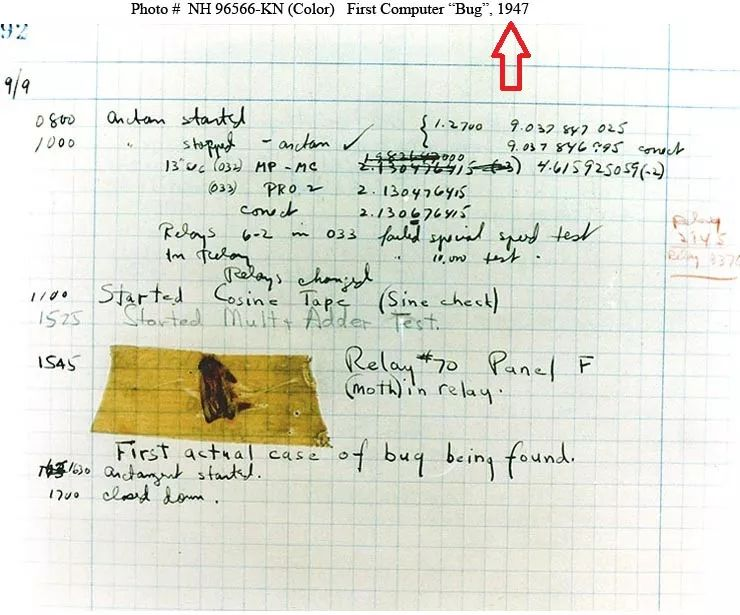

# 计算机的本质

当你是一个小孩时，你的父母教你算数，比如说他们问你：

```
1 + 1 
```

等于多少？你掰着你的手指算出了:

```
2
```

也就是说他们做编码，你做计算。现在交换一下角色，用电脑打开一个在线IDE，比如 [Jdoodle](https://www.jdoodle.com/)，选择Nodejs，然后在打开页面的左边写入

```
var sum = 1 + 1;

console.log(sum);

```
再点击下面的“Execute”,就会在下面的黑色框里面出现了`2`.在这里，你变成了编码者，而这个在线IDE变成了计算者。由此可见，“计算机”顾名思义是一种“计算”工具。

计算机可以很快地计算出`1+1`的值，它还能计算复杂的东西，比如：平方根。平方根在数学中是这样定义的：

```
x的平方根y是这样的一个数：y的平方等于x，且y大于或等于0
```

这个定义只告诉你平方根是什么，却没有告诉你如何去求取一个平方根。那么如何求一个平方根呢？公元一世纪亚历山大的Heron提出了一个 **连续取均值求平方根法**：

```
为了求出平方根：
1. 给出一个猜测值guess
2. 不断改进猜测值guess，改进的方法是：不断求猜测值guess与x/guess的平均值
3. 通过不断改进，直到它足够精确停止计算，比如说小于0.0001就停止下来
```

根据上面的步骤，你可以用笔在纸上算出某个数的平方根，这种方法的的缺点就是要做很多的重复的工作且容易出错。此时计算机就应运而生，它解决了笔算的重复和易错问题。上面的步骤，在计算机里面称为一个进程，什么是进程？进程就是可以完成一些任务的步骤的集合。那如何指导这类过程的执行呢？简单得说，怎么指导这类进程从某一个步骤到另一个步骤以完成设定的任务。笔算时，是人在控制着步骤的顺序以便进程的执行。在计算机里，是一类被称为程序的东西指导着进程的执行，而程序是用一些程序设计语言，通过符号表达式的形式精心编排而成。程序语言本质是一些规则模式，类似于人类语言，比如说中文、英语、数学语言、物理语言等等，程序语言也有很多种类，如Scheme、Python、C、C++、Java等等。

程序语言跟其它语言一样，是一种表达思想的形式化媒介。例如要表达上面的 **连续取均值求平方根法**，有三个明显的选择：

- 自然语言，例如：中文。自然语言是模糊两可的，不精确的，有时笨拙且冗长。

- 数学语言，跟自然语言刚好相反：它能用很少的几个符号来表达形式化的思想，但是数学语言往往是神秘高深的，如果没有特殊的训练，就几乎无法理解。

- 程序语言：它不仅可以通过一些简单的、易读的符号表达了数学的形式化思想，而且它弥补了自然语言的“不精确、冗长”的缺点。更重要的它能直接的体验：你可以观察它的行为，修改它，执行可以看到结果。

下面来看一下怎么用程序语言来表达上面所说的 **连续取均值求平方根法**：

=== "Scheme"
    ```
    ; 求 x 的平方根
    ; 1. 基本元素（包括基本数据和基本过程）
    ; (1) 0.0001、1、2、16-->基本的数据
    ; (2) +、-、*、/、abs、<、display-->基本过程
    ; 2. 组合方法
    ; (1) if --> 用于条件判断
    ; 3. 抽象方法
    ; (1) define --> 给某个东西命名

	(define (sqrt-approx x)
      ; (2) 不断改进猜测值 guess
	  (define (improve-guess guess)
		(/ (+ guess (/ x guess)) 2))
	  ; (3) 猜测值guess是否足够好？阈值是：0.0001
	  (define (good-enough? guess)
		(< (abs (- (* guess guess) x)) 0.0001))
	
	  (define (sqrt-iter guess)
		(if (good-enough? guess)
			guess ;返回结果
			(sqrt-iter (improve-guess guess))))
      ; (1) 给出一个猜测值1      
	  (sqrt-iter 1.0))

	; 测试16的平方根，输出：4.000000636692939
	(display (sqrt-approx 16)) 
	```

=== "Python"
	```
	# 求 x 的平方根
    # 1. 基本元素（包括基本数据和基本过程）
    # (1) 0.0001、1、2、16-->基本的数据
    # (2) +、-、*、/、=、abs、>、print-->基本过程
    # 2. 组合方法
    # (1) while --> 用于循环
    # 3. 抽象方法
    # (1) def --> 给某个东西命名
	def sqrt_approx(x):
		# (1) 给出一个猜测值1
		guess = 1
		
		# (3) 猜测值guess是否足够好？阈值是：0.0001
		while abs(guess*guess - x) > 0.0001:
			# (2) 不断改进猜测值 guess
			guess = (guess + x/guess) / 2
		
		# 返回结果
		return guess

	# 测试16的平方根，输出：4.000000636692939
	print(sqrt_approx(16)) 
	```    
	
=== "C"
	```
	#include <stdio.h>
	#include <math.h>

    /* 求 x 的平方根
    1. 基本元素（包括基本数据和基本过程）
    (1) 0.0001、1.0、2.0、16.0-->基本的数据
    (2) +、-、*、/、=、fabs、>、print-->基本过程
    2. 组合方法
    (1) while --> 用于循环
    3. 抽象方法
    (1) double；int --> 给某个东西命名以及定义为某种类型
    */
	double sqrt_approx(double x) {
        //(1) 给出一个猜测值：1，和一个"足够好的"阈值：0.0001
		double guess = 1.0;
		double epsilon = 0.0001;
        // (3) 猜测值guess是否足够好？
		while (fabs(guess*guess - x) > epsilon) {
            // (2) 不断改进猜测值 guess
			guess = (guess + x/guess) / 2.0;
		}
		
        // 返回结果
		return guess;
	}

	int main() {
        //测试16的平方根，输出：4.00001
		double x = 16.0;
		printf("%f", sqrt_approx(x)); 
		return 0;
	}
	```
	
=== "C++"
	```
	#include <iostream>
	#include <cmath>

    /* 求 x 的平方根
    1. 基本元素（包括基本数据和基本过程）
    (1) 0.0001、1.0、2.0、16.0-->基本的数据
    (2) +、-、*、/、=、fabs、>、cout-->基本过程
    2. 组合方法
    (1) while --> 用于循环
    3. 抽象方法
    (1) double；int --> 给某个东西命名以及定义为某种类型
    */
	double sqrt_approx(double x) {
        //(1) 给出一个猜测值：1，和一个"足够好的"阈值：0.0001
		double guess = 1.0;
		double epsilon = 0.0001;
		
        // (3) 猜测值guess是否足够好？
		while (std::fabs(guess*guess - x) > epsilon) {
            // (2) 不断改进猜测值 guess
			guess = (guess + x/guess) / 2.0;
		}
		
        // 返回结果
		return guess;
	}

	int main() {
        //测试16的平方根，输出：4
		double x = 16.0;
		std::cout << sqrt_approx(x) << std::endl; 
		return 0;
	}
	```	
	
=== "Java"
	```
	public class Main {
		/* 求 x 的平方根
        1. 基本元素（包括基本数据和基本过程）
        (1) 0.0001、1.0、2.0、16.0-->基本的数据
        (2) +、-、*、/、=、abs、>、println-->基本过程
        2. 组合方法
        (1) while --> 用于循环
        3. 抽象方法
        (1) double、void --> 给某个东西命名以及定义为某种类型
        */
		public static double sqrt_approx(double x) {
			//(1) 给出一个猜测值：1，和一个"足够好的"阈值：0.0001
			double guess = 1.0;
			double epsilon = 0.0001;
			
			// (3) 猜测值guess是否足够好？
			while (Math.abs(guess*guess - x) > epsilon) {
				// (2) 不断改进猜测值 guess
				guess = (guess + x/guess) / 2.0;
			}
			
			// 返回结果
			return guess;
		}
		
		public static void main(String[] args) {
			//测试16的平方根，输出：4.000000636692939
			double x = 16.0;
			System.out.println(sqrt_approx(x));
		}
	}
	```

=== "C#"
	```
	using System;

	public class MyClass {
		/* 求 x 的平方根
        1. 基本元素（包括基本数据和基本过程）
        (1) 0.0001、1.0、2.0、16.0-->基本的数据
        (2) +、-、*、/、=、Abs、>、WriteLine-->基本过程
        2. 组合方法
        (1) while --> 用于循环
        3. 抽象方法
        (1) double、void --> 给某个东西命名以及定义为某种类型
        */
		public static double sqrt_approx(double x) {
			//(1) 给出一个猜测值：1，和一个"足够好的"阈值：0.0001
			double guess = 1.0;
			double epsilon = 0.0001;
			
			// (3) 猜测值guess是否足够好？
			while (Math.Abs(guess*guess - x) > epsilon) {
				// (2) 不断改进猜测值 guess
				guess = (guess + x/guess) / 2.0;
			}
			
			// 返回结果
			return guess;
		}
		
		public static void Main(string[] args) {
			//测试16的平方根，输出：4.00000063669294
			double x = 16.0;
			Console.WriteLine(sqrt_approx(x)); 
		}
	}
	```	
	
=== "PHP"
	```
	<?php
		
	/* 求 x 的平方根
    1. 基本元素（包括基本数据和基本过程）
    (1) 0.0001、1.0、2.0、16.0-->基本的数据
    (2) +、-、*、/、=、abs、>、echo-->基本过程
    2. 组合方法
    (1) while --> 用于循环
    3. 抽象方法
    (1) $、function --> 给某个东西命名
    */
	function sqrt_approx($x) {
		//(1) 给出一个猜测值：1，和一个"足够好的"阈值：0.0001
		$guess = 1.0;
		$epsilon = 0.0001;
		
		// (3) 猜测值guess是否足够好？
		while (abs($guess*$guess - $x) > $epsilon) {
			// (2) 不断改进猜测值 guess
			$guess = ($guess + $x/$guess) / 2.0;
		}
		
		// 返回结果
		return $guess;
	}

	//测试16的平方根，输出：4.0000006366929
	$x = 16.0;
	echo sqrt_approx($x);

	?>
	```	

=== "JavaScript"
	```
	/* 求 x 的平方根
    1. 基本元素（包括基本数据和基本过程）
    (1) 0.0001、1.0、2.0、16.0-->基本的数据
    (2) +、-、*、/、=、abs、>、log-->基本过程
    2. 组合方法
    (1) while --> 用于循环
    3. 抽象方法
    (1) let、function --> 给某个东西命名
    */ 
	function sqrt_approx(x) {
		//(1) 给出一个猜测值：1，和一个"足够好的"阈值：0.0001
		let guess = 1.0;
		let epsilon = 0.0001;
		
		// (3) 猜测值guess是否足够好？
		while (Math.abs(guess*guess - x) > epsilon) {
			// (2) 不断改进猜测值 guess
			guess = (guess + x/guess) / 2.0;
		}
		
		// 返回结果
		return guess;
	}

	//测试16的平方根，输出：4.000000636692939
	let x = 16.0;
	console.log(sqrt_approx(x)); 
	```
	
=== "Go"
	```
	package main

	import (
		"fmt"
		"math"
	)

	/* 求 x 的平方根
    1. 基本元素（包括基本数据和基本过程）
    (1) 0.0001、1.0、2.0、16.0-->基本的数据
    (2) +、-、*、/、:=、Abs、>、Println-->基本过程
    2. 组合方法
    (1) while --> 用于循环
    3. 抽象方法
    (1) func、float64 --> 给某个东西命名以及定义为某种类型
    */  
	func sqrt_approx(x float64) float64 {
		//(1) 给出一个猜测值：1，和一个"足够好的"阈值：0.0001
		guess := 1.0
		epsilon := 0.0001
		// (3) 猜测值guess是否足够好？
		for math.Abs(guess*guess - x) > epsilon {
			// (2) 不断改进猜测值 guess
			guess = (guess + x/guess) / 2.0
		}
		// 返回结果
		return guess
	}

	func main() {
		//测试16的平方根，输出：4.000000636692939
		x := 16.0
		fmt.Println(sqrt_approx(x)) 
	}
	```

=== "Swift"
	```
	/* 求 x 的平方根
    1. 基本元素（包括基本数据和基本过程）
    (1) 0.0001、1.0、2.0、16.0-->基本的数据
    (2) +、-、*、/、=、abs、>、print-->基本过程
    2. 组合方法
    (1) while --> 用于循环
    3. 抽象方法
    (1) func、Double --> 给某个东西命名以及定义为某种类型
    (2) let-->给某个东西命名以及赋予某个值
    */ 
	func sqrt_approx(x: Double) -> Double {
		//(1) 给出一个猜测值：1，和一个"足够好的"阈值：0.0001
		var guess = 1.0
		let epsilon = 0.0001
		// (3) 猜测值guess是否足够好？
		while abs(guess*guess - x) > epsilon {
			// (2) 不断改进猜测值 guess
			guess = (guess + x/guess) / 2.0
		}
		// 返回结果
		return guess
	}
	//测试16的平方根，输出：4.000000636692939
	let x = 16.0
	print(sqrt_approx(x: x)) 
	```

=== "Kotlin"
	```
	/* 求 x 的平方根
    1. 基本元素（包括基本数据和基本过程）
    (1) 0.0001、1.0、2.0、16.0-->基本的数据
    (2) +、-、*、/、=、abs、>、println-->基本过程
    2. 组合方法
    (1) while --> 用于循环
    3. 抽象方法
    (1) fun、Double、var、val --> 给某个东西命名以及定义为某种类型
    */ 
	fun sqrt_approx(x: Double): Double {
		//(1) 给出一个猜测值：1，和一个"足够好的"阈值：0.0001
		var guess = 1.0
		val epsilon = 0.0001
		
		// (3) 猜测值guess是否足够好？
		while (Math.abs(guess*guess - x) > epsilon) {
			// (2) 不断改进猜测值 guess
			guess = (guess + x/guess) / 2.0
		}
		// 返回结果
		return guess
	}

	fun main() {
		//测试16的平方根，输出：4.000000636692939
		val x = 16.0
		println(sqrt_approx(x)) 
	}
	```
!!! 备注
    以上代码可以用`在线IDE`进行验证，比如 [Jdoodle](https://www.jdoodle.com/)   


从上面可知，程序不仅仅是一种表达思想的媒介，而且还能运行看到效果反馈。但是并不是说每一个程序都是准确无误。恰好相反，很多程序充满着错误，有些错误是往往导致不可挽回的损失。这些错误统称为"bug":

!!! quote
	1945年，一只小飞蛾钻进了计算机电路里，导致系统无法工作，一位名叫格蕾丝·赫柏的人把飞蛾拍死在工作日志上(见图1)，写道：就是这个bug(虫子)，害我们今天的工作无法完成——于是，bug一词成了电脑系统程序的专业术语，形容那些系统中的缺陷或问题


<figure markdown>
  
  <figcaption>图1</figcaption>
</figure>


一种语言区别于另一种语言，在于它们之间不同的规则模式。当有人要向你展示一门新程序语言时， 你应该问他：

- 这门语言使用哪些基本数据？
!!! quote
	什么是数据？数据是计算机这种虚拟环境里面的程序操作的一种东西，类似于物理世界里面衣服、房子、道路、桥梁、大山这种东西。而数据结构又是什么呢？数据结构是指在计算机里面组合数据和存储数据的一种方式，比如说在物理世界里，通过不同的方式组合砖块就会得到不同的房子，数据结构跟此类似。物理世界里面的东西有分类，数据也有着分类，一般分为：

	- 数值：整数、小数、有理数等等

	- 字符值：ascii 字符

	- 布尔值：对事实做判断：真或假

	- 函数：函数并没有什么特殊之处，它也不过是一个变量，会产生一个值。怎么传递？底层是指针传递

	- 对象：对象也是一个变量，是物理世界里面的物体的一种映射，怎么传递对象？指针传递或消息传递

=== "Scheme"
	```
	; 基本数据
	(display 3) ; 整数: 3
	(newline)
	(display 7.5) ; 小数: 7.5
	(newline)
	(display 'A) ;字符: A
	(newline)
	(display #t) ;布尔值: #t或者#f
	(newline)
	```

=== "Python"
	```
	# 基本数据
	print(3) #整数: 3
	print(7.5) #小数: 7.5
	print('A') #字符: A
	print(True) #布尔值：True或者False
	```

=== "C"
	```
	#include<stdio.h>

	int main() {
		// 基本数据
		printf("%d\n", 3); //整数: 3
		printf("%f\n", 7.5); //小数: 7.5
		printf("%c\n", 'A'); //字符: A
		printf("%d\n", (2 > 1)); //布尔值：1或0
	}
	```	

=== "C++"
	```
	#include <iostream>
	using namespace std;

	int main(){
		cout << 3 << endl; //整数: 3
		cout << 7.5 << endl; //小数: 7.5
		cout << 'A' << endl; //字符: A
		cout << (2 > 1) << endl; //布尔值：1或者0
	}
	```

=== "Java"
	```
	public class MyClass{

		public static void main(String[] args){
			//基本数据
			System.out.println(3); //整数: 3
			System.out.println(7.5); //小数: 7.5
			System.out.println('A'); //字符: A
			System.out.println(true); //布尔值: true或者false
		}
	}
	```

=== "C#"
	```
	using System;

	class Program
	{
		static void Main(string[] args)
		{
			Console.WriteLine(3); // 整数: 3
			Console.WriteLine(7.5); // 小数: 7.5
			Console.WriteLine('A'); // 字符: A
			Console.WriteLine(true); // 布尔值: true或者false
		}
	}
	```
	
=== "PHP"
	```
	<?php
		echo 3; // 整数: 3
		echo "\n";
		echo 7.5; // 小数: 7.5
		echo "\n";
		echo 'A'; // 字符: A
		echo "\n";
		echo true; // 布尔值: 1或者0
		echo "\n";
	?>
	```	
	
=== "JavaScript"
	```
	console.log(3); // 整数: 3
	console.log(7.5); // 小数: 7.5
	console.log('A'); // 字符: A
	console.log(true); // 布尔值: true或者false
	```	
	
=== "Go"
	```
	package main

	import "fmt"

	func main() {
		fmt.Println(3)         // 整数: 3
		fmt.Println(7.5)       // 小数: 7.5
		fmt.Printf("%c\n", 'A')       // 字符: A
		fmt.Println(true)      // 布尔值: true或者false
	}
	```	
	
=== "Swift"
	```
	print(3) // 整数: 3
	print(7.5) // 小数: 7.5
	print("A") // 字符: A
	print(true) // 布尔值: true或者false
	```
	
=== "Kotlin"
	```
	fun main() {
		println(3) // 整数: 3
		println(7.5) // 小数: 7.5
		println('A') // 字符: A
		println(true) // 布尔值: true或者false
	}
	```	

- 如何把数据组合在一起？
!!! quote
	组合数据的方式是(操作符 数据)

=== "Scheme"
	```
	; 基本运算
	(display (+ 6 2)) ;加法: +
	(newline)
	(display (- 6 2)) ;减法: -
	(newline)
	(display (* 6 2)) ;乘法: *
	(newline)
	(display (/ 6 2)) ;除法: /
	(newline)
	; 比较运算
	(display (> 6 2)) ;大于: >
	(newline)
	(display (= 6 2)) ;等于: =
	(newline)
	(display (< 6 2)) ;小于: <
	(newline)
	; 逻辑运算
	(display (and (> 2 1) (< 3 2)));与: and
	(newline) 
	(display (or (> 2 1) (< 3 2))); 或: or
	(newline)
	(display (not (> 2 1))); 非: not
	(newline)
	; 条件运算: cond、if, 以计算绝对值为例
	(define (abs-cond x) ; 条件: cond
	  (cond ((> x 0) x)
			((= x 0) 0)
			((< x 0) (- x))))

	(display (abs-cond 5)) ;5的绝对值
	(newline)
	
	(define (abs-if x) ; 条件: if
	  (if (< x 0)
		  (- x)
		  x))

	(display (abs-if -5)) ;-5的绝对值
	(newline)

	; 循环运算: 递归，以计算阶乘为例
	(define factorial
	  (lambda (n)
		(if (= n 1)
			1
			(* n (factorial (- n 1))))))

	(display (factorial 6))	;6的阶乘
	(newline)
	```

=== "Python"
	```
	# 基本运算
	print(6 + 2) # 加法: +
	print(6 - 2) # 减法: -
	print(6 * 2) # 乘法: *
	print(6 / 2) # 除法: /
	# 比较运算
	print(6 > 2) # 大于: >
	print(6 == 2)# 等于: =
	print(6 < 2) # 小于: <
	# 逻辑运算
	print((2 > 1) and (3 < 2)) # 与: and
	print((2 > 1) or (3 < 2)) # 或: or
	print(not (2 > 1)) # 非: not
	# 条件运算: if，以计算绝对值为例
	def abs(x):
		if x > 0:
			return x
		elif x == 0:
			return 0
		else:
			return -x

	print(abs(5)) # 5的绝对值
	# 循环运算: 以计算阶乘为例
	def factorial_recursion(n): #递归
		if n == 1:
			return 1
		else:
			return n * factorial_recursion(n - 1)

	def factorial_while(n): #while
		result = 1
		while n > 1:
			result *= n
			n -= 1
		return result

	def factorial_for(n): #for
		result = 1
		for i in range(1, n + 1):
			result *= i
		return result

	print(factorial_recursion(6)) # 6的阶乘
	print(factorial_while(6)) # 6的阶乘
	print(factorial_for(6)) # 6的阶乘
	```

=== "C"
	```
	#include <stdio.h>

	int main() {
		// 基本运算
		printf("%d\n", 6 + 2); // 加法: +
		printf("%d\n", 6 - 2); // 减法: -
		printf("%d\n", 6 * 2); // 乘法: *
		printf("%d\n", 6 / 2); // 除法: /
		// 比较运算
		printf("%d\n", 6 > 2); // 大于: >
		printf("%d\n", 6 == 2); // 等于: =
		printf("%d\n", 6 < 2); // 小于: <
		// 逻辑运算
		printf("%d\n", (2 > 1) && (3 < 2)); // 与: and
		printf("%d\n", (2 > 1) || (3 < 2)); // 或: or
		printf("%d\n", !(2 > 1)); // 非: not
		// 条件运算: if，以计算绝对值为例
		int abs(int x) {
			if (x > 0) {
				return x;
			} else if (x == 0) {
				return 0;
			} else {
				return -x;
			}
		}

		printf("%d\n", abs(5)); // 5的绝对值

		// 循环运算: 以计算阶乘为例
		
		int factorial_recursion(int n) {// 使用递归实现阶乘
			if (n == 1) {
				return 1;
			} else {
				return n * factorial_recursion(n - 1);
			}
		}

		int factorial_while(int n) {// 使用 while 循环实现阶乘
			int result = 1;
			while (n > 1) {
				result *= n;
				n -= 1;
			}
			return result;
		}

		int factorial_for(int n) {// 使用 for 循环实现阶乘
			int result = 1;
			for (int i = 1; i <= n; i++) {
				result *= i;
			}
			return result;
		}

		printf("%d\n", factorial_recursion(6)); // 6的阶乘
		printf("%d\n", factorial_while(6)); // 6的阶乘
		printf("%d\n", factorial_for(6)); // 6的阶乘

		return 0;
	}
	```	

=== "C++"
	```
	#include <iostream>

	using namespace std;

	// 定义 abs() 函数
	int abs(int x) {
		if (x > 0) {
			return x;
		} else if (x == 0) {
			return 0;
		} else {
			return -x;
		}
	}

	// 定义 factorial_recursion() 函数
	int factorial_recursion(int n) {
		if (n == 1) {
			return 1;
		} else {
			return n * factorial_recursion(n - 1);
		}
	}

	// 定义 factorial_while() 函数
	int factorial_while(int n) {
		int result = 1;
		while (n > 1) {
			result *= n;
			n -= 1;
		}
		return result;
	}

	// 定义 factorial_for() 函数
	int factorial_for(int n) {
		int result = 1;
		for (int i = 1; i <= n; i++) {
			result *= i;
		}
		return result;
	}

	int main() {
		// 基本运算
		cout << 6 + 2 << endl; // 加法: +
		cout << 6 - 2 << endl; // 减法: -
		cout << 6 * 2 << endl; // 乘法: *
		cout << 6 / 2 << endl; // 除法: /
		// 比较运算
		cout << (6 > 2) << endl; // 大于: >
		cout << (6 == 2) << endl; // 等于: =
		cout << (6 < 2) << endl; // 小于: <
		// 逻辑运算
		cout << ((2 > 1) && (3 < 2)) << endl; // 与: and
		cout << ((2 > 1) || (3 < 2)) << endl; // 或: or
		cout << !(2 > 1) << endl; // 非: not

		cout << abs(5) << endl; // 5的绝对值

		cout << factorial_recursion(6) << endl; // 6的阶乘
		cout << factorial_while(6) << endl; // 6的阶乘
		cout << factorial_for(6) << endl; // 6的阶乘

		return 0;
	}
	```	

=== "Java"
	```
	public class Main {
		
		public static void main(String[] args) {
			// 基本运算
			System.out.println(6 + 2); // 加法: +
			System.out.println(6 - 2); // 减法: -
			System.out.println(6 * 2); // 乘法: *
			System.out.println(6 / 2); // 除法: /
			// 比较运算
			System.out.println(6 > 2); // 大于: >
			System.out.println(6 == 2); // 等于: =
			System.out.println(6 < 2); // 小于: <
			// 逻辑运算
			System.out.println((2 > 1) && (3 < 2)); // 与: and
			System.out.println((2 > 1) || (3 < 2)); // 或: or
			System.out.println(!(2 > 1)); // 非: not
			// 条件运算
			System.out.println(abs(5)); // 5的绝对值
			//循环运算
			System.out.println(factorial_recursion(6)); // 6的阶乘
			System.out.println(factorial_while(6)); // 6的阶乘
			System.out.println(factorial_for(6)); // 6的阶乘
		}

		// 定义 abs() 函数
		public static int abs(int x) {
			if (x > 0) {
				return x;
			} else if (x == 0) {
				return 0;
			} else {
				return -x;
			}
		}

		// 定义 factorial_recursion() 函数
		public static int factorial_recursion(int n) {
			if (n == 1) {
				return 1;
			} else {
				return n * factorial_recursion(n - 1);
			}
		}

		// 定义 factorial_while() 函数
		public static int factorial_while(int n) {
			int result = 1;
			while (n > 1) {
				result *= n;
				n -= 1;
			}
			return result;
		}

		// 定义 factorial_for() 函数
		public static int factorial_for(int n) {
			int result = 1;
			for (int i = 1; i <= n; i++) {
				result *= i;
			}
			return result;
		}
	}
	```

=== "C#"
	```
	using System;

	class Program {
		// 定义 abs() 函数
		public static int abs(int x) {
			if (x > 0) {
				return x;
			} else if (x == 0) {
				return 0;
			} else {
				return -x;
			}
		}

		// 定义 factorial_recursion() 函数
		public static int factorial_recursion(int n) {
			if (n == 1) {
				return 1;
			} else {
				return n * factorial_recursion(n - 1);
			}
		}

		// 定义 factorial_while() 函数
		public static int factorial_while(int n) {
			int result = 1;
			while (n > 1) {
				result *= n;
				n -= 1;
			}
			return result;
		}

		// 定义 factorial_for() 函数
		public static int factorial_for(int n) {
			int result = 1;
			for (int i = 1; i <= n; i++) {
				result *= i;
			}
			return result;
		}

		static void Main(string[] args) {
			// 基本运算
			Console.WriteLine(6 + 2); // 加法: +
			Console.WriteLine(6 - 2); // 减法: -
			Console.WriteLine(6 * 2); // 乘法: *
			Console.WriteLine(6 / 2); // 除法: /
			// 比较运算
			Console.WriteLine(6 > 2); // 大于: >
			Console.WriteLine(6 == 2); // 等于: =
			Console.WriteLine(6 < 2); // 小于: <
			// 逻辑运算
			Console.WriteLine((2 > 1) && (3 < 2)); // 与: and
			Console.WriteLine((2 > 1) || (3 < 2)); // 或: or
			Console.WriteLine(!(2 > 1)); // 非: not
			// 条件运算
			Console.WriteLine(abs(5)); // 5的绝对值
			// 循环运算
			Console.WriteLine(factorial_recursion(6)); // 6的阶乘
			Console.WriteLine(factorial_while(6)); // 6的阶乘
			Console.WriteLine(factorial_for(6)); // 6的阶乘
		}
	}
	```

=== "PHP"
	```
	<?php
	// 定义 abs() 函数
	function abs_if($x) {
		if ($x > 0) {
			return $x;
		} else if ($x == 0) {
			return 0;
		} else {
			return -$x;
		}
	}

	// 定义 factorial_recursion() 函数
	function factorial_recursion($n) {
		if ($n == 1) {
			return 1;
		} else {
			return $n * factorial_recursion($n - 1);
		}
	}

	// 定义 factorial_while() 函数
	function factorial_while($n) {
		$result = 1;
		while ($n > 1) {
			$result *= $n;
			$n -= 1;
		}
		return $result;
	}

	// 定义 factorial_for() 函数
	function factorial_for($n) {
		$result = 1;
		for ($i = 1; $i <= $n; $i++) {
			$result *= $i;
		}
		return $result;
	}

	// 基本运算
	echo 6 + 2 . "\n"; // 加法: +
	echo 6 - 2 . "\n"; // 减法: -
	echo 6 * 2 . "\n"; // 乘法: *
	echo 6 / 2 . "\n"; // 除法: /
	// 比较运算
	echo (6 > 2) . "\n"; // 大于: >
	echo (6 == 2) . "\n"; // 等于: =
	echo (6 < 2) . "\n"; // 小于: <
	// 逻辑运算
	echo ((2 > 1) && (3 < 2)) . "\n"; // 与: and
	echo ((2 > 1) || (3 < 2)) . "\n"; // 或: or
	echo !(2 > 1) . "\n"; // 非: not
	// 条件运算
	echo abs_if(5) . "\n"; // 5的绝对值
	//循环运算
	echo factorial_recursion(6) . "\n"; // 6的阶乘
	echo factorial_while(6) . "\n"; // 6的阶乘
	echo factorial_for(6) . "\n"; // 6的阶乘
	?>
	```

=== "JavaScript"
	```
	// 定义 abs() 函数
	function abs(x) {
		if (x > 0) {
			return x;
		} else if (x === 0) {
			return 0;
		} else {
			return -x;
		}
	}

	// 定义 factorial_recursion() 函数
	function factorial_recursion(n) {
		if (n === 1) {
			return 1;
		} else {
			return n * factorial_recursion(n - 1);
		}
	}

	// 定义 factorial_while() 函数
	function factorial_while(n) {
		let result = 1;
		while (n > 1) {
			result *= n;
			n -= 1;
		}
		return result;
	}

	// 定义 factorial_for() 函数
	function factorial_for(n) {
		let result = 1;
		for (let i = 1; i <= n; i++) {
			result *= i;
		}
		return result;
	}

	// 基本运算
	console.log(6 + 2); // 加法: +
	console.log(6 - 2); // 减法: -
	console.log(6 * 2); // 乘法: *
	console.log(6 / 2); // 除法: /
	// 比较运算
	console.log(6 > 2); // 大于: >
	console.log(6 === 2); // 等于: =
	console.log(6 < 2); // 小于: <
	// 逻辑运算
	console.log((2 > 1) && (3 < 2)); // 与: and
	console.log((2 > 1) || (3 < 2)); // 或: or
	console.log(!(2 > 1)); // 非: not
	// 条件运算
	console.log(abs(5)); // 5的绝对值
	// 循环运算
	console.log(factorial_recursion(6)); // 6的阶乘
	console.log(factorial_while(6)); // 6的阶乘
	console.log(factorial_for(6)); // 6的阶乘
	```

=== "Go"
	```
	package main

	import "fmt"

	// 定义 abs() 函数
	func abs(x int) int {
		if x > 0 {
			return x
		} else if x == 0 {
			return 0
		} else {
			return -x
		}
	}

	// 定义 factorial_recursion() 函数
	func factorial_recursion(n int) int {
		if n == 1 {
			return 1
		} else {
			return n * factorial_recursion(n-1)
		}
	}

	// 定义 factorial_while() 函数
	func factorial_while(n int) int {
		result := 1
		for n > 1 {
			result *= n
			n -= 1
		}
		return result
	}

	// 定义 factorial_for() 函数
	func factorial_for(n int) int {
		result := 1
		for i := 1; i <= n; i++ {
			result *= i
		}
		return result
	}

	func main() {
		// 基本运算
		fmt.Println(6 + 2) // 加法: +
		fmt.Println(6 - 2) // 减法: -
		fmt.Println(6 * 2) // 乘法: *
		fmt.Println(6 / 2) // 除法: /
		// 比较运算
		fmt.Println(6 > 2) // 大于: >
		fmt.Println(6 == 2) // 等于: =
		fmt.Println(6 < 2) // 小于: <
		// 逻辑运算
		fmt.Println((2 > 1) && (3 < 2)) // 与: and
		fmt.Println((2 > 1) || (3 < 2)) // 或: or
		fmt.Println(!(2 > 1)) // 非: not
		// 条件运算
		fmt.Println(abs(5)) // 5的绝对值
		// 循环运算
		fmt.Println(factorial_recursion(6)) // 6的阶乘
		fmt.Println(factorial_while(6)) // 6的阶乘
		fmt.Println(factorial_for(6)) // 6的阶乘
	}
	```

=== "Swift"
	```
	// 定义 abs() 函数
	func abs(_ x: Int) -> Int {
		if x > 0 {
			return x
		} else if x == 0 {
			return 0
		} else {
			return -x
		}
	}

	// 定义 factorial_recursion() 函数
	func factorial_recursion(_ n: Int) -> Int {
		if n == 1 {
			return 1
		} else {
			return n * factorial_recursion(n - 1)
		}
	}

	// 定义 factorial_while() 函数
	func factorial_while(_ n: Int) -> Int {
		var result = 1
		var i = n
		while i > 1 {
			result *= i
			i -= 1
		}
		return result
	}

	// 定义 factorial_for() 函数
	func factorial_for(_ n: Int) -> Int {
		var result = 1
		for i in 1...n {
			result *= i
		}
		return result
	}

	// 基本运算
	print(6 + 2) // 加法: +
	print(6 - 2) // 减法: -
	print(6 * 2) // 乘法: *
	print(6 / 2) // 除法: /
	// 比较运算
	print(6 > 2) // 大于: >
	print(6 == 2) // 等于: =
	print(6 < 2) // 小于: <
	// 逻辑运算
	print((2 > 1) && (3 < 2)) // 与: and
	print((2 > 1) || (3 < 2)) // 或: or
	print(!(2 > 1)) // 非: not
	// 条件运算
	print(abs(5)) // 5的绝对值
	// 循环运算
	print(factorial_recursion(6)) // 6的阶乘
	print(factorial_while(6)) // 6的阶乘
	print(factorial_for(6)) // 6的阶乘
	```

=== "Kotlin"
	```
	// 定义 abs() 函数
	fun abs(x: Int): Int {
		if (x > 0) {
			return x
		} else if (x == 0) {
			return 0
		} else {
			return -x
		}
	}

	// 定义 factorial_recursion() 函数
	fun factorial_recursion(n: Int): Int {
		if (n == 1) {
			return 1
		} else {
			return n * factorial_recursion(n - 1)
		}
	}

	// 定义 factorial_while() 函数
	fun factorial_while(n: Int): Int {
		var result = 1
		var i = n
		while (i > 1) {
			result *= i
			i -= 1
		}
		return result
	}

	// 定义 factorial_for() 函数
	fun factorial_for(n: Int): Int {
		var result = 1
		for (i in 1..n) {
			result *= i
		}
		return result
	}

	fun main() {
		// 基本运算
		println(6 + 2) // 加法: +
		println(6 - 2) // 减法: -
		println(6 * 2) // 乘法: *
		println(6 / 2) // 除法: /
		// 比较运算
		println(6 > 2) // 大于: >
		println(6 == 2) // 等于: =
		println(6 < 2) // 小于: <
		// 逻辑运算
		println((2 > 1) && (3 < 2)) // 与: and
		println((2 > 1) || (3 < 2)) // 或: or
		println(!(2 > 1)) // 非: not
		// 条件运算
		println(abs(5)) // 5的绝对值
		// 循环运算
		println(factorial_recursion(6)) // 6的阶乘
		println(factorial_while(6)) // 6的阶乘
		println(factorial_for(6)) // 6的阶乘
	}
	```


- 怎么给某个东西命名，并将它当作单元去操作？
!!! quote
	知道事物各部分的名称或者表达式各部分的名称很重要，每个“魔法师”都会告诉你，如果你能叫出一个“精灵”的名字，你就有控制它的能力，所以你得知道这些名字，以便之后的讨论。这个名字就是变量，使用变量的方便之处在于，不必记住并重复写出这个变量所指向的那个东西的实现细节。可以给三种东西命名：

	- 基本数据

	- 组合式

	- 函数

	- 类和对象

=== "Scheme"
	```
	; 给基本数据命名
	(define pi 3.14)
	(display pi)
	(newline)
	; 给组合式命名
	(define A (* 3 5))
	(display A)
	(newline)
	; 给函数命名
	(define square
	  (lambda (x) (* x x)))
	(display (square 5))
	(newline)
	; 给类和对象命名，比如有理数

	(define make-rat ;构造有理数
	  (lambda (n d)
		(cons n d)))

	(define numer ;分子
	  (lambda (x)
		(car x)))

	(define denom ;分母
	  (lambda (x)
		(cdr x)))
		
	(define (add-rat x y) ;有理数相加
	  (make-rat (+ (* (numer x) (denom y))
				   (* (numer y) (denom x)))
				(* (denom x) (denom y))))	

	(define (print-rat x) ;打印有理数
	  (display (numer x))
	  (display "/")
	  (display (denom x))
	  (newline))

	(define x (make-rat 3 4));构造一个有理数：3/4
	(define y (make-rat 2 5));构造一个有理数：2/5
	(print-rat (add-rat x y));打印有理数3/4和2/5：23/20
	```
	
=== "Python"
	```
	# 给基本数据命名
	pi = 3.14
	print(pi)

	# 给组合式命名
	A = 3 * 5
	print(A)

	# 给函数命名
	def square(x):
		return x * x

	print(square(5))

	# 给类和对象命名，比如有理数，采用“胶水技术”
	def make_rat(n, d): #构造有理数
		return (n, d)

	def numer(x): #分子
		return x[0]

	def denom(x): #分母
		return x[1]

	def add_rat(x, y): #两个有理数相加
		return make_rat(numer(x) * denom(y) + numer(y) * denom(x), denom(x) * denom(y))

	def print_rat(x): #打印有理数
		print(numer(x), "/", denom(x))

	x = make_rat(3, 4)  # 构造一个有理数：3/4
	y = make_rat(2, 5)  # 构造一个有理数：2/5
	print_rat(add_rat(x, y))  # 打印有理数3/4和2/5：23/20

	# 给类和对象命名，比如有理数，采用“对象思想”
	class Rational:
		def __init__(self, n, d):#构造有理数
			self.numer = n #分子
			self.denom = d #分母

		def __add__(self, other): #两个有理数相加
			return Rational(self.numer * other.denom + other.numer * self.denom, self.denom * other.denom)

		def __str__(self): #打印有理数
			return f"{self.numer}/{self.denom}"

	x = Rational(3, 4) # 构造一个有理数：3/4
	y = Rational(2, 5) # 构造一个有理数：2/5
	print(x + y) # 打印有理数3/4和2/5：23/20
	```
	
=== "C"
	```
	#include <stdio.h>

	int main() {
		// 给基本数据命名
		float pi = 3.14;
		printf("%f\n", pi);
		
		// 给组合式命名
		int A = 3 * 5;
		printf("%d\n", A);
		
		// 给函数命名
		int square(int x) {
			return x * x;
		}
		printf("%d\n", square(5));

		// 给类和对象命名，比如有理数
		struct Rational {
			int numer; // 分子
			int denom; // 分母
		};

		struct Rational add_rat(struct Rational x, struct Rational y) { // 有理数相加
			return (struct Rational) {x.numer * y.denom + y.numer * x.denom, x.denom * y.denom};
		}

		void print_rat(struct Rational x) { // 打印有理数
			printf("%d/%d\n", x.numer, x.denom);
		}

		struct Rational x = {3, 4}; // 构造一个有理数：3/4
		struct Rational y = {2, 5}; // 构造一个有理数：2/5
		print_rat(add_rat(x, y)); // 打印有理数3/4和2/5：23/20

		return 0;
	}
	```
	
=== "C++"
	```
	#include <iostream>

	using namespace std;

	// 给函数命名
	int square(int x) {
		return x * x;
	}

	// 给类和对象命名，采用“胶水技术”
	struct Rational1 {
		int n;
		int d;
	};

	Rational1 make_rat1(int n, int d) { // 构造有理数
		Rational1 r = {n, d};
		return r;
	}

	int numer1(Rational1 x) { // 分子
		return x.n;
	}

	int denom1(Rational1 x) { // 分母
		return x.d;
	}

	Rational1 add_rat1(Rational1 x, Rational1 y) { // 有理数相加
		return make_rat1(numer1(x) * denom1(y) + numer1(y) * denom1(x), denom1(x) * denom1(y));
	}

	void print_rat1(Rational1 x) { // 打印有理数
		cout << x.n << "/" << x.d << endl;
	}


	// 给类和对象命名，采用“对象思想”
	class Rational2 {
		public:
			Rational2(int n, int d): numer(n), denom(d) {} // 构造有理数
			Rational2 operator+(const Rational2& other) const { // 有理数相加
				return Rational2(numer * other.denom + other.numer * denom, denom * other.denom);
			}
			friend ostream& operator<<(ostream& os, const Rational2& r) { // 打印有理数
				os << r.numer << "/" << r.denom;
				return os;
			}
		private:
			int numer; // 分子
			int denom; // 分母
	};

	int main() {
		// 给基本数据命名
		float pi = 3.14;
		cout << pi << endl;
		
		// 给组合式命名
		int A = 3 * 5;
		cout << A << endl;
		// 给函数命名
		cout << square(5) << endl;
		
		// 给类和对象命名，采用“胶水技术”
		Rational1 x1 = make_rat1(3, 4); // 构造一个有理数：3/4
		Rational1 y1 = make_rat1(2, 5); // 构造一个有理数：2/5
		print_rat1(add_rat1(x1, y1)); // 打印有理数3/4和2/5：23/20

		// 给类和对象命名，采用“对象思想”
		Rational2 x2{3, 4}; // 构造一个有理数：3/4
		Rational2 y2{2, 5}; // 构造一个有理数：2/5
		cout << x2 + y2 << endl; // 打印有理数3/4和2/5：23/20

		return 0;
	}
	```
	
=== "Java"
	```
	public class Program {
		
		public static void main(String[] args) {
			// 给基本数据命名
			float pi = 3.14f;
			System.out.println(pi);

			// 给组合式命名
			int A = 3 * 5;
			System.out.println(A);

			// 调用square函数
			System.out.println(square(5));

			// 给类和对象命名，比如有理数，采用“对象思想”
			class Rational {
				private int numer; // 分子
				private int denom; // 分母

				public Rational(int n, int d) {
					numer = n;
					denom = d;
				}

				// 两个有理数相加
				public Rational add(Rational other) {
					int n = numer * other.denom + other.numer * denom;
					int d = denom * other.denom;
					return new Rational(n, d);
				}

				// 打印有理数
				public String toString() {
					return numer + "/" + denom;
				}
			}

			Rational x = new Rational(3, 4); // 构造一个有理数：3/4
			Rational y = new Rational(2, 5); // 构造一个有理数：2/5
			System.out.println(x.add(y)); // 打印有理数3/4和2/5：23/20
		}
		
		//给函数命名
		public static int square(int x) {
			return x * x;
		}
	}
	```
	
=== "C#"
	```
	using System;

	class Program {
		
		static void Main() {
			// 给基本数据命名
			float pi = 3.14f;
			Console.WriteLine(pi);

			// 给组合式命名
			int A = 3 * 5;
			Console.WriteLine(A);

			//调用Square
			Console.WriteLine(Square(5));

			//实例化有理数Rational
			Rational x = new Rational(3, 4); // 构造一个有理数：3/4
			Rational y = new Rational(2, 5); // 构造一个有理数：2/5
			Console.WriteLine(x.Add(y)); // 打印有理数3/4和2/5：23/20
		}
		
		// 给函数命名
		static int Square(int x) {
			return x * x;
		}
		
		
		// 给类和对象命名，比如有理数，采用“对象思想”
		class Rational {
			private int numer; // 分子
			private int denom; // 分母

			public Rational(int n, int d) {
				numer = n;
				denom = d;
			}

			// 两个有理数相加
			public Rational Add(Rational other) {
				int n = numer * other.denom + other.numer * denom;
				int d = denom * other.denom;
				return new Rational(n, d);
			}

			// 打印有理数
			public override string ToString() {
				return numer + "/" + denom;
			}
		}
	}
	```
	
=== "PHP"
	```
	<?php
		// 给基本数据命名
		$pi = 3.14;
		echo $pi . "\n";
		
		// 给组合式命名
		$A = 3 * 5;
		echo $A . "\n";
		
		// 给函数命名
		function square($x) {
			return $x * $x;
		}
		echo square(5) . "\n";
		
		// 给类和对象命名，比如有理数，采用“胶水技术”
		function make_rat($n, $d) { // 构造有理数
			return array($n, $d);
		}
		
		function numer($x) { // 分子
			return $x[0];
		}
		
		function denom($x) { // 分母
			return $x[1];
		}
		
		function add_rat($x, $y) { // 两个有理数相加
			$n = numer($x) * denom($y) + numer($y) * denom($x);
			$d = denom($x) * denom($y);
			return make_rat($n, $d);
		}
		
		function print_rat($x) { // 打印有理数
			echo numer($x) . "/" . denom($x) . "\n";
		}
		
		$x = make_rat(3, 4); // 构造一个有理数：3/4
		$y = make_rat(2, 5); // 构造一个有理数：2/5
		print_rat(add_rat($x, $y)); // 打印有理数3/4和2/5：23/20
		
		// 给类和对象命名，比如有理数，采用“对象思想”
		class Rational {
			private $numer; // 分子
			private $denom; // 分母
		
			public function __construct($n, $d) { // 构造有理数
				$this->numer = $n;
				$this->denom = $d;
			}
		
			// 两个有理数相加
			public function add($other) {
				$n = $this->numer * $other->denom + $other->numer * $this->denom;
				$d = $this->denom * $other->denom;
				return new self($n, $d);
			}
		
			// 打印有理数
			public function __toString() {
				return $this->numer . "/" . $this->denom;
			}
		}
		
		$x = new Rational(3, 4); // 构造一个有理数：3/4
		$y = new Rational(2, 5); // 构造一个有理数：2/5
		echo $x->add($y) . "\n"; // 打印有理数3/4和2/5：23/20
	?>
	```

=== "JavaScript"
	```
	// 给基本数据命名
	var pi = 3.14;
	console.log(pi);

	// 给组合式命名
	var A = 3 * 5;
	console.log(A);

	// 给函数命名
	function square(x) {
	  return x * x;
	}
	console.log(square(5));

	// 给类和对象命名，比如有理数，采用“胶水技术”
	function make_rat(n, d) { // 构造有理数
	  return { numer: n, denom: d };
	}

	function numer(x) { // 分子
	  return x.numer;
	}

	function denom(x) { // 分母
	  return x.denom;
	}

	function add_rat(x, y) { // 两个有理数相加
	  var n = numer(x) * denom(y) + numer(y) * denom(x);
	  var d = denom(x) * denom(y);
	  return make_rat(n, d);
	}

	function print_rat(x) { // 打印有理数
	  console.log(numer(x) + "/" + denom(x));
	}

	var x = make_rat(3, 4); // 构造一个有理数：3/4
	var y = make_rat(2, 5); // 构造一个有理数：2/5
	print_rat(add_rat(x, y)); // 打印有理数3/4和2/5：23/20

	// 给类和对象命名，比如有理数，采用“对象思想”
	function Rational(n, d) {
	  this.numer = n; // 分子
	  this.denom = d; // 分母
	}

	// 两个有理数相加
	Rational.prototype.add = function (other) {
	  var n = this.numer * other.denom + other.numer * this.denom;
	  var d = this.denom * other.denom;
	  return new Rational(n, d);
	};

	// 打印有理数
	Rational.prototype.toString = function () {
	  return this.numer + "/" + this.denom;
	};

	var r1 = new Rational(3, 4); // 构造一个有理数：3/4
	var r2 = new Rational(2, 5); // 构造一个有理数：2/5
	console.log(r1.add(r2).toString()); // 打印有理数3/4和2/5：23/20
	```
	
=== "Go"
	```
	package main

	import "fmt"


	// 给类和对象命名，比如有理数，采用结构体
	type Rational struct {
		numer int // 分子
		denom int // 分母
	}

	// 构造有理数
	func make_rat(n int, d int) Rational {
		return Rational{numer: n, denom: d}
	}

	// 分子
	func numer(x Rational) int {
		return x.numer
	}

	// 分母
	func denom(x Rational) int {
		return x.denom
	}

	// 两个有理数相加
	func add_rat(x Rational, y Rational) Rational {
		n := numer(x)*denom(y) + numer(y)*denom(x)
		d := denom(x) * denom(y)
		return make_rat(n, d)
	}

	// 打印有理数
	func print_rat(x Rational) {
		fmt.Printf("%d/%d\n", numer(x), denom(x))
	}

	// 平方函数
	func square(x int) int {
		return x * x
	}

	func main() {
		// 给基本数据命名
		var pi float64 = 3.14
		fmt.Println(pi)

		// 给组合式命名
		var A int = 3 * 5
		fmt.Println(A)

		// 调用函数square
		fmt.Println(square(5))
		
		//测试有理数
		x := make_rat(3, 4) // 构造一个有理数：3/4
		y := make_rat(2, 5) // 构造一个有理数：2/5
		print_rat(add_rat(x, y)) // 打印有理数3/4和2/5：23/20
	}
	```
	
=== "Swift"
	```
	import Foundation

	// 给基本数据命名
	let pi: Float = 3.14
	print(pi)

	// 给组合式命名
	let A: Int = 3 * 5
	print(A)

	// 调用函数square
	print(square(x:5))

	// 给类和对象命名，比如有理数，采用结构体
	struct Rational {
		var numer: Int // 分子
		var denom: Int // 分母
	}

	// 构造有理数
	func make_rat(n: Int, d: Int) -> Rational {
		return Rational(numer: n, denom: d)
	}

	// 分子
	func numer(x: Rational) -> Int {
		return x.numer
	}

	// 分母
	func denom(x: Rational) -> Int {
		return x.denom
	}

	// 两个有理数相加
	func add_rat(x: Rational, y: Rational) -> Rational {
		let n = numer(x: x) * denom(x: y) + numer(x: y) * denom(x: x)
		let d = denom(x: x) * denom(x: y)
		return make_rat(n: n, d: d)
	}

	// 打印有理数
	func print_rat(x: Rational) {
		print("\(numer(x: x))/\(denom(x: x))")
	}

	var x = make_rat(n: 3, d: 4) // 构造一个有理数：3/4
	var y = make_rat(n: 2, d: 5) // 构造一个有理数：2/5
	print_rat(x: add_rat(x: x, y: y)) // 打印有理数3/4和2/5：23/20

	// 平方函数
	func square(x: Int) -> Int {
		return x * x
	}
	```
	
=== "Kotlin"
	```
	import kotlin.math.*

	fun main() {
		// 给基本数据命名
		var pi = 3.14
		println(pi)

		// 给组合式命名
		var A = 3 * 5
		println(A)

		// 给函数命名
		fun square(x: Int) = x * x
		println(square(5))

		// 给类和对象命名，比如有理数，采用数据类
		data class Rational(val numer: Int, val denom: Int)

		// 分子
		fun numer(x: Rational) = x.numer

		// 分母
		fun denom(x: Rational) = x.denom

		// 两个有理数相加
		fun add_rat(x: Rational, y: Rational): Rational {
			val n = numer(x) * denom(y) + numer(y) * denom(x)
			val d = denom(x) * denom(y)
			return Rational(n, d)
		}

		// 打印有理数
		fun print_rat(x: Rational) {
			println("${numer(x)}/${denom(x)}")
		}

		var x = Rational(3, 4) // 构造一个有理数：3/4
		var y = Rational(2, 5) // 构造一个有理数：2/5
		print_rat(add_rat(x, y)) // 打印有理数3/4和2/5：23/20
	}
	```


