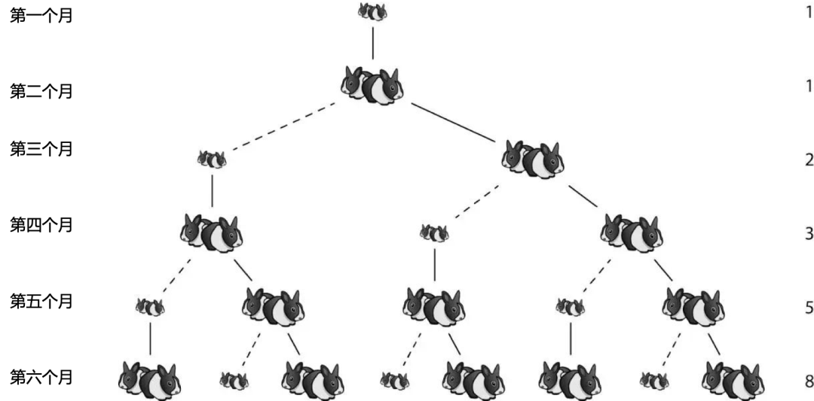

# 递归和循环

!!! quote "俄罗斯套娃"

	<div class="result" markdown>

    { align=left width=100 }

    递归就像俄罗斯套娃一样，一个娃娃可以包含着另一个娃娃，而另一个娃娃又可以包含着更小的娃娃。递归函数也是如此，一个函数可以调用另一个函数，而另一个函数又可以调用更小的函数。递归的本质是将一个大问题分解为一个或多个小问题，然后通过解决小问题来解决大问题。递归函数通常具有基本情况和递归情况两种情况，基本情况是递归结束的条件，而递归情况是继续递归的条件。

    </div>

## 布尔值和分支：abs

!!! quote 决策

	布尔值可以看作是人类对某个事实或情况的判断，程序语言中的 if 语句就是根据这种判断来做出决策的工具，它会根据布尔值的真假来执行不同的代码路径。类似地，人们在生活中也会根据某些判断来做出不同的决策。例如“天气是否晴朗”（布尔值）。如果天气晴朗（布尔真值）就出门散步（代码路径1），否则（布尔假值）就呆在家里（代码路径2）。

=== "Scheme"
	```
	; 定义一个函数abs，用于计算x的绝对值
	(define (abs x)
	  ; 如果x大于等于0，则返回x
	  (if (>= x 0)
		  x
		  ; 否则返回-x（即x的相反数）
		  (- x)))

	; 输出abs(-5)的值，即5
	(display (abs -5))
	(newline)

	; 输出abs(6)的值，即6
	(display (abs 6))
	(newline)

	; 定义一个函数abs-v2，用于计算x的绝对值
	(define (abs-v2 x)
	  ; 对x进行三种情况的判断
	  (cond ((> x 0) x)      ; 如果x大于0，则返回x
			((= x 0) 0)     ; 如果x等于0，则返回0
			((< x 0) (- x)))) ; 如果x小于0，则返回-x（即x的相反数）

	; 输出abs-v2(-7)的值，即7
	(display (abs-v2 -7))
	(newline)

	; 输出abs-v2(8)的值，即8
	(display (abs-v2 8))
	(newline)
	```

## 阶乘的递归版本

=== "Scheme"
	```
	; 阶乘的递归版本
	(define (factorial n)
	  (if (= n 1)
		  1
		  (* n (factorial (- n 1)))))

	; 6的阶乘结果：720
	(factorial 6)

	; 6的阶乘程序的递归形状
	;(factorial 6)
	;(* 6 (factorial 5))
	;(* 6 (* 5 (factorial 4)))
	;(* 6 (* 5 (* 4 (factorial 3))))
	;(* 6 (* 5 (* 4 (* 3 (factorial 2)))))
	;(* 6 (* 5 (* 4 (* 3 (* 2 (factorial 1))))))
	;(* 6 (* 5 (* 4 (* 3 (* 2 1)))))
	;(* 6 (* 5 (* 4 (* 3 2))))
	;(* 6 (* 5 (* 4 6)))
	;(* 6 (* 5 24))
	;(* 6 120)
	;720
	```	

## 阶乘的循环版本

=== "Scheme"
	```
	; 阶乘的循环(迭代)版本
	(define (factorial-v2 n)
	  (define (iter product counter)
		(if (> counter n)
			product
			(iter (* counter product)
				  (+ counter 1))))
	  (iter 1 1))

	; 6的阶乘结果:720
	(factorial-v2 6)

	; 6的阶乘程序的循环形状
	;(factorial 6)
	;(fact-iter 1 1 6)
	;(fact-iter 1 2 6)
	;(fact-iter 2 3 6)
	;(fact-iter 6 4 6)
	;(fact-iter 24 5 6)
	;(fact-iter 120 6 6)
	;(fact-iter 720 7 6)
	;720
	```

## 斐波那契数：fib

#### 树形递归版本

!!! quote "兔子繁殖"

	<div class="result" markdown>

    { align=right width=300 }

    斐波纳契在1202年所著、1228年修订再版的《算法之书》中提出了一个著名的兔子问题：

	假设一对初生兔子一个月到成熟期，一对成熟兔子每月生一对兔子，并且一年内没有发生死亡。那么，由一对初生兔子开始，一年以后可以繁殖多少对兔子？

	依照上述兔子的繁殖规则，是这样的:

	第一个月：只有1对小兔子
	第二个月：小兔子还没成年，还是1对小兔子
	第三个月：兔子成年生1对小兔子，此时有2对兔子
	第四个月：成年兔子又生了1对兔子，加上自己及上月生的小兔子，共有3对兔子
	第五个月：成年兔子又生了1对兔子，第三月生的小兔子已经长成年且生了1对小兔子，加上本身两只兔子及上月生的兔子，共5对兔子
	...

	抽象来看是下面这种序列：
	
	```
	0 1 1 2 3 5 8 13 21 34 55 ...
	0 1 2 3 4 5 6 7  8  9  10 ... 
	```

    </div>
	
=== "Scheme"
	```
	; 定义斐波那契数列函数
	(define (fib n)
	  ; 如果 n 等于 0,返回 0
	  (cond ((= n 0) 0)
			; 如果 n 等于 1,返回 1
			((= n 1) 1)
			; 否则返回斐波那契数列的前两项之和
			(else (+ (fib (- n 1))
					 (fib (- n 2))))))

	; 计算斐波那契数列的第 4 项
	(fib 4)

	;斐波那契数列的第 4 项的形状
	;
	;          fib4       
	;       fib3  fib 2
	;   fib2 fib1 fib1 fib0
	;   fib1 fib0  1    0
	;     1   0
	```

#### 迭代版本(动态规划)

=== "Scheme"
	```
	; 定义斐波那契数列函数
	(define (fib-v2 n)
	  ; 定义迭代函数 iter,a 和 b 为当前斐波那契数列的前两项,count 为计数器
	  (define (iter a b count)
		; 如果 count 为 0,返回 b
		(if (= count 0)
			b
			; 否则递归调用 iter 函数,更新 a 和 b 的值,并将 count 减1
			(iter (+ a b) a (- count 1))))
	  ; 调用 iter 函数,将 a 和 b 分别初始化为 1 和 0,count 初始化为 4
	  (iter 1 0 4))

	; 计算斐波那契数列的第 4 项
	(fib-v2 4)

	;斐波那契数列的第 4 项的形状

	;fib(4)
	;(iter 1 1 3)
	;(iter 2 1 2)
	;(iter 3 2 1)
	;(iter 5 3 0)
	;3
	```