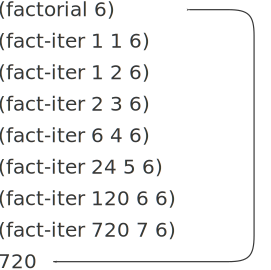

# 1.2.1 Linear Recursion and Iteration (线性的递归和迭代)
We begin by considering the factorial function, defined by<br>
首先考虑由下面表达式定义的阶乘函数：

$$n! = n \cdot (n - 1) \cdot (n - 2) \cdots 3 \cdot 2 \cdot 1.$$

There are many ways to compute factorials. One way is to make use of the observation that n! is equal to n times (n−1)! for any positive integer n: <br>
计算阶乘的方式有许多种，一种最简单方式就是利用下述认识: 对于一个正整数n, n!就等于n乘以(n-1)!:

$$n! = n \cdot [(n - 1) \cdot (n - 2) \cdots 3 \cdot 2 \cdot 1] = n \cdot (n - 1)!.$$

Thus, we can compute n! by computing (n−1)! and multiplying the result by n. If we add the stipulation that 1! is equal to 1, this observation translates directly into a procedure:<br>
这样，我们就能通过算出(n-1)!，并将其结果乘以n的方式计算出n!。如果再注意到1!就是1，这些认识就可以直接翻译成一个过程了：

```
(define (factorial n)
  (if (= n 1) 
      1 
      (* n (factorial (- n 1)))))
```

We can use the substitution model of 1.1.5 to watch this procedure in action computing 6!, as shown in Figure 1.3.<br>
我们可以利用1.1.5节介绍的代换模型，观看这一过程在计算6!时表现出的行为，如图1-3所示。

<figure markdown>
  
  <figcaption>Figure 1.3: A linear recursive process for computing 6!.</figcaption>
  <figcaption>图1-3 计算6!的线性递归过程.</figcaption>
</figure>

Now let’s take a different perspective on computing factorials. We could describe a rule for computing n! by specifying that we first multiply 1 by 2, then multiply the result by 3, then by 4, and so on until we reach n. More formally, we maintain a running product, together with a counter that counts from 1 up to n. We can describe the computation by saying that the counter and the product simultaneously change from one step to the next according to the rule<br>
现在让我们采用另一种不同的观点来计算阶乘。我们可以将计算阶乘n!的规则描述为：先乘起1和2,而后将得到的结果乘以3,而后再乘以4,这样下去直到达到n。更形式地说，我 们要维持着一个变动中的乘积product, 以及一个从1到n的计数器counter, 这一计算过程可以描述为counter和product的如下变化，从一步到下一步，它们都按照下面规则改变：

```
product ← counter * product
counter ← counter + 1
```
and stipulating that n! is the value of the product when the counter exceeds n.<br>
可以看到，n!也就是计数器counter超过n时乘积product的值。

Once again, we can recast our description as a procedure for computing factorials:<br>
我们又可以将这描述重构为一个计算阶乘的过程：

```
(define (factorial n) 
  (fact-iter 1 1 n))

(define (fact-iter product counter max-count)
  (if (> counter max-count)
      product
      (fact-iter (* counter product)
                 (+ counter 1)
                 max-count)))
```

As before, we can use the substitution model to visualize the process of computing 6!, as shown in Figure 1.4.<br>
与前面一样，我们也可以应用替换模型来查看6!的计算过程，如图1-4所示。

<figure markdown>
  
  <figcaption>Figure 1.4: A linear iterative process for computing 6!.</figcaption>
  <figcaption>图1-3 计算6!的线性迭代过程.</figcaption>
</figure>


Compare the two processes. From one point of view, they seem hardly different at all. Both compute the same mathematical function on the same domain, and each requires a number of steps proportional to n to compute n!. Indeed, both processes even carry out the same sequence of multiplications, obtaining the same sequence of partial products. On the other hand, when we consider the “shapes” of the two processes, we find that they evolve quite differently.<br>
现在对这两个计算过程做一个比较。从一个角度看，它们并没有很大差异：两者计算的都是同一个定义域里的同一个数学函数，都需要使用与n正比的步骤数目去计算出n!。确实，这两个计算过程甚至采用了同样的乘运算序列，得到了同样的部分乘积序列。但在另一方面，如果我们考虑这两个计算过程的“形状”，就会发现它们的进展情况大不相同。

Consider the first process. The substitution model reveals a shape of expansion followed by contraction, indicated by the arrow in Figure 1.3. The expansion occurs as the process builds up a chain of deferred operations (in this case, a chain of multiplications). The contraction occurs as the operations are actually performed. This type of process, characterized by a chain of deferred operations, is called a recursive process. Carrying out this process requires that the interpreter keep track of the operations to be performed later on. In the computation of n!, the length of the chain of deferred multiplications, and hence the amount of information needed to keep track of it, grows linearly with n(is proportional to n), just like the number of steps. Such a process is called a linear recursive process.<br>
考虑第一个计算过程。代换模型揭示出一种先逐步展开而后收缩的形状，如图1-3中的箭 头所示。在展开阶段里，这一计算过程构造起一个推迟进行的操作所形成的链条(在这里是一个乘法的链条),收缩阶段表现为这些运算的实际执行。这种类型的计算过程由一个推迟执 行的运算链条刻画，称为一个递归计算过程。要执行这种计算过程，解释器就需要维护好那些以后将要执行的操作的轨迹。在计算阶乘n!时，推迟执行的乘法链条的长度也就是为保存其轨迹需要保存的信息量，这个长度随着n值而线性增长(正比于n), 就像计算中的步骤数目一样。这样的计算过程称为一个线性递归过程。

By contrast, the second process does not grow and shrink. At each step, all we need to keep track of, for any n, are the current values of the variables product, counter, and max-count. We call this an iterative process. In general, an iterative process is one whose state can be summarized by a fixed number of state variables, together with a fixed rule that describes how the state variables should be updated as the process moves from state to state and an (optional) end test that specifies conditions under which the process should terminate. In computing n!, the number of steps required grows linearly with n. Such a process is called a linear iterative process.<br>
与之相对应，第二个计算过程里并没有任何增长或者收缩。对于任何一个n,在计算过程中的每一步，在我们需要保存轨迹里，所有的东西就是变量product、counter和max-count的当前值。我们称这种过程为一个迭代计算过程。 一般来说，迭代计算过程就是那种其状态可以用固定数目的状态变量描述的计算过程；而与此同时，又存在着一套固定的规则，描述了计算过程在从一个状态到下一状态转换时，这些变量的更新方式；还有一个(可能有的)结束检测，它描述这一计算过程应该终止的条件。在计算n!时，所需的计算步骤随着n线性增长，这种过程称为线性迭代过程。

The contrast between the two processes can be seen in another way. In the iterative case, the program variables provide a complete description of the state of the process at any point. If we stopped the computation between steps, all we would need to do to resume the computation is to supply the interpreter with the values of the three program variables. Not so with the recursive process. In this case there is some additional “hidden” information, maintained by the interpreter and not contained in the program variables, which indicates “where the process is” in negotiating the chain of deferred operations. The longer the chain, the more information must be maintained.<br>
我们还可以从另一个角度来看这两个过程之间的对比。在迭代的情况里，在计算过程中的任何一点，那几个程序变量都提供了有关计算状态的一个完整描述。如果我们令上述计算在某两个步骤之间停下来，要想重新唤醒这一计算，只需要为解释器提供有关这三个变量的值。而对于递归计算过程而言，这里还存在着另外的一些“隐含”信息，它们并未保存在程序变量里，而是由解释器维持着，指明了在所推迟的运算所形成的链条里的漫游中，“这一计算过程处在何处”。这个链条越长，需要保存的信息也就越多。

In contrasting iteration and recursion, we must be careful not to confuse the notion of a recursive process with the notion of a recursive procedure. When we describe a procedure as recursive, we are referring to the syntactic fact that the procedure definition refers (either directly or indirectly) to the procedure itself. But when we describe a process as following a pattern that is, say, linearly recursive, we are speaking about how the process evolves, not about the syntax of how a procedure is written. It may seem disturbing that we refer to a recursive procedure such as fact-iter as generating an iterative process. However, the process really is iterative: Its state is captured completely by its three state variables, and an interpreter need keep track of only three variables in order to execute the process.<br>
在做迭代与递归之间的比较时，我们必须当心，不要搞混了递归计算过程的概念和递归过程的概念。当我们说一个过程是递归的时候，论述的是一个语法形式上的事实，说明这个过程的定义中(直接或者间接地)引用了该过程本身。在说某一计算过程具有某种模式时 (例如，线性递归),我们说的是这一计算过程的进展方式，而不是相应过程书写上的语法形式。当我们说某个递归过程(例如fact-iter)将产生出一个迭代的计算过程时，可能会使人感到不舒服。然而这一计算过程确实是迭代的，因为它的状态能由其中的三个状态变量完全刻画，解释器在执行这一计算过程时，只需要保持这三个变量的轨迹就足够了。

One reason that the distinction between process and procedure may be confusing is that most implementations of common languages (including Ada, Pascal, and C) are designed in such a way that the interpretation of any recursive procedure consumes an amount of memory that grows with the number of procedure calls, even when the process described is, in principle, iterative. As a consequence, these languages can describe iterative processes only by resorting to special-purpose “looping constructs” such as do, repeat, until, for, and while. The implementation of Scheme we shall consider in Chapter 5 does not share this defect. It will execute an iterative process in constant space, even if the iterative process is described by a recursive procedure. An implementation with this property is called tail-recursive. With a tail-recursive implementation, iteration can be expressed using the ordinary procedure call mechanism, so that special iteration constructs are useful only as syntactic sugar.<br>
区分计算过程和写出来的过程可能使人感到困惑，其中的一个原因在于各种常见语言 (包括Ada、Pascal和C)的大部分实现的设计中，对于任何递归过程的解释，所需要消耗的存储量总与过程调用的数目成正比，即使它所描述的计算过程从原理上看是迭代的。作为这一事实的后果，要在这些语言里描述迭代过程，就必须借助于特殊的“循环结构”,如do repeat、until、for和while等等。我们将在第5章里考察的Scheme的实现则没有这一缺陷，它将总能在常量空间中执行迭代型计算过程，即使这一计算是用一个递归过程描述的。 具有这一特性的实现称为尾递归的。有了一个尾递归的实现，我们就可以利用常规的过程调用机制表述迭代，这也会使各种复杂的专用迭代结构变成不过是一些语法糖衣了。

Exercise 1.9: Each of the following two procedures defines a method for adding two positive integers in terms of the procedures inc, which increments its argument by 1, and dec, which decrements its argument by 1.<br>
练习1.9  下面几个过程各定义了一种加起两个正整数的方法，它们都基于过程inc(它将参数增加1)和dec(它将参数减少1)。

```
(define (+ a b)
  (if (= a 0) 
      b 
      (inc (+ (dec a) b))))

(define (+ a b)
  (if (= a 0) 
      b 
      (+ (dec a) (inc b))))
```

Using the substitution model, illustrate the process generated by each procedure in evaluating (+ 4 5). Are these processes iterative or recursive?<br>
请用代换模型展示这两个过程在求值(+ 4  5)时所产生的计算过程。这些计算过程是递归的或者迭代的吗?

Exercise 1.10: The following procedure computes a mathematical function called Ackermann’s function.<br>
练习1.10: 下面过程计算一个称为Ackermann函数的数学函数：

```
(define (A x y)
  (cond ((= y 0) 0)
        ((= x 0) (* 2 y))
        ((= y 1) 2)
        (else (A (- x 1)
                 (A x (- y 1))))))
```

What are the values of the following expressions?<br>
下面各表达式的值是什么?

```
(A 1 10)
(A 2 4)
(A 3 3)
```

Consider the following procedures, where A is the procedure defined above:<br>
请考虑下面的过程，其中的A就是上面定义的过程：

```
(define (f n) (A 0 n))
(define (g n) (A 1 n))
(define (h n) (A 2 n))
(define (k n) (* 5 n n))
```

Give concise mathematical definitions for the functions computed by the procedures f, g, and h for positive integer values of n. For example, (k n) computes $5n^2$.<br>
请给出过程f、g和h对给定整数值n所计算的函数的数学定义。例如，(k  n)计算的是$5n^2$。


