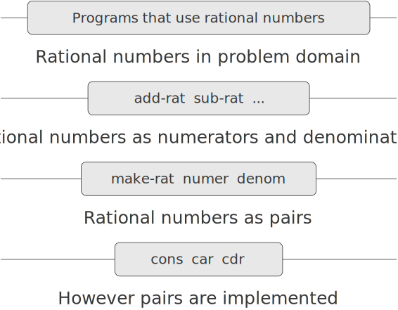

# 2.1.2  Abstraction Barriers
Before continuing with more examples of compound data and data abstraction, let us consider some of the issues raised by the rational-number example. We defined the rational-number operations in terms of a constructor `make-rat` and selectors `numer` and `denom`. In general, the underlying idea of data abstraction is to identify for each type of data object a basic set of operations in terms of which all manipulations of data objects of that type will be expressed, and then to use only those operations in manipulating the data.

We can envision the structure of the rational-number system as shown in figure [2.1](#Figure2.1). The horizontal lines represent abstraction barriers that isolate different ''levels'' of the system. At each level, the barrier separates the programs (above) that use the data abstraction from the programs (below) that implement the data abstraction. Programs that use rational numbers manipulate them solely in terms of the procedures supplied ''for public use'' by the rational-number package: `add-rat`, `sub-rat`, `mul-rat`, `div-rat`, and `equal-rat?`. These, in turn, are implemented solely in terms of the constructor and selectors `make-rat`, `numer`, and `denom`, which themselves are implemented in terms of pairs. The details of how pairs are implemented are irrelevant to the rest of the rational-number package so long as pairs can be manipulated by the use of `cons`, `car`, and `cdr`. In effect, procedures at each level are the interfaces that define the abstraction barriers and connect the different levels.

<div id="Figure2.1" markdown>
<figure markdown>
  
  <figcaption markdown>
  Figure 2.1:  Data-abstraction barriers in the rational-number package.
  </figcaption>
</figure>
</div>

This simple idea has many advantages. One advantage is that it makes programs much easier to maintain and to modify. Any complex data structure can be represented in a variety of ways with the primitive data structures provided by a programming language. Of course, the choice of representation influences the programs that operate on it; thus, if the representation were to be changed at some later time, all such programs might have to be modified accordingly. This task could be time-consuming and expensive in the case of large programs unless the dependence on the representation were to be confined by design to a very few program modules.

For example, an alternate way to address the problem of reducing rational numbers to lowest terms is to perform the reduction whenever we access the parts of a rational number, rather than when we construct it. This leads to different constructor and selector procedures:

```
(define (make-rat n d)
  (cons n d))
(define (numer x)
  (let ((g (gcd (car x) (cdr x))))
    (/ (car x) g)))
(define (denom x)
  (let ((g (gcd (car x) (cdr x))))
    (/ (cdr x) g)))
```

The difference between this implementation and the previous one lies in when we compute the `gcd`. If in our typical use of rational numbers we access the numerators and denominators of the same rational numbers many times, it would be preferable to compute the `gcd` when the rational numbers are constructed. If not, we may be better off waiting until access time to compute the `gcd`. In any case, when we change from one representation to the other, the procedures `add-rat`, `sub-rat`, and so on do not have to be modified at all.

Constraining the dependence on the representation to a few interface procedures helps us design programs as well as modify them, because it allows us to maintain the flexibility to consider alternate implementations. To continue with our simple example, suppose we are designing a rational-number package and we can't decide initially whether to perform the `gcd` at construction time or at selection time. The data-abstraction methodology gives us a way to defer that decision without losing the ability to make progress on the rest of the system.

<div id="Exercise2.2" markdown>

Exercise 2.2.  Consider the problem of representing line segments in a plane. Each segment is represented as a pair of points: a starting point and an ending point. Define a constructor `make-segment` and selectors `start-segment` and `end-segment` that define the representation of segments in terms of points. Furthermore, a point can be represented as a pair of numbers: the x coordinate and the y coordinate. Accordingly, specify a constructor `make-point` and selectors `x-point` and `y-point` that define this representation. Finally, using your selectors and constructors, define a procedure `midpoint-segment` that takes a line segment as argument and returns its midpoint (the point whose coordinates are the average of the coordinates of the endpoints). To try your procedures, you'll need a way to print points:

```
(define (print-point p)
  (newline)
  (display "(")
  (display (x-point p))
  (display ",")
  (display (y-point p))
  (display ")"))
```
</div> 

<div id="Exercise2.3">

Exercise 2.3.  Implement a representation for rectangles in a plane. (Hint: You may want to make use of exercise [2.2](#Exercise2.2).) In terms of your constructors and selectors, create procedures that compute the perimeter and the area of a given rectangle. Now implement a different representation for rectangles. Can you design your system with suitable abstraction barriers, so that the same perimeter and area procedures will work using either representation?
</div>