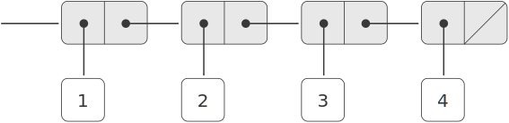

# 2.2.1  Representing Sequences

<div id="Figure2.4" markdown>

<figure markdown>
  
  <figcaption>Figure 2.4:  The sequence 1, 2, 3, 4 represented as a chain of pairs.</figcaption>
</figure>

</div>

One of the useful structures we can build with pairs is a *sequence* -- an ordered collection of data objects. There are, of course, many ways to represent sequences in terms of pairs. One particularly straightforward representation is illustrated in figure [2.4](#Figure2.4), where the sequence 1, 2, 3, 4 is represented as a chain of pairs. The `car` of each pair is the corresponding item in the chain, and the `cdr` of the pair is the next pair in the chain. The `cdr` of the final pair signals the end of the sequence by pointing to a distinguished value that is not a pair, represented in box-and-pointer diagrams as a diagonal line and in programs as the value of the variable `nil`. The entire sequence is constructed by nested `cons` operations:

```
(cons 1
      (cons 2
            (cons 3
                  (cons 4 nil))))
```

Such a sequence of pairs, formed by nested `cons`es, is called a *list*, and Scheme provides a primitive called `list` to help in constructing lists.[^1] The above sequence could be produced by `(list 1 2 3 4)`. In general,

```
(list <a1> <a2> ... <an>)
```

is equivalent to

```
(cons <a1> (cons <a2> (cons ... (cons <an> nil) ...)))
```

Lisp systems conventionally print lists by printing the sequence of elements, enclosed in parentheses. Thus, the data object in figure [2.4](#Figure2.4) is printed as `(1 2 3 4)`:

```
(define one-through-four (list 1 2 3 4))

one-through-four
(1 2 3 4)
```

Be careful not to confuse the expression `(list 1 2 3 4)` with the list `(1 2 3 4)`, which is the result obtained when the expression is evaluated. Attempting to evaluate the expression `(1 2 3 4)` will signal an error when the interpreter tries to apply the procedure `1` to arguments `2, 3`, and `4`.

We can think of `car` as selecting the first item in the list, and of `cdr` as selecting the sublist consisting of all but the first item. Nested applications of `car` and `cdr` can be used to extract the second, third, and subsequent items in the list.[^2] The constructor `cons` makes a list like the original one, but with an additional item at the beginning.

```
(car one-through-four)
1

(cdr one-through-four)
(2 3 4)
(car (cdr one-through-four))
2

(cons 10 one-through-four)
(10 1 2 3 4)

(cons 5 one-through-four)
(5 1 2 3 4)
```

The value of `nil`, used to terminate the chain of pairs, can be thought of as a sequence of no elements, the *empty list*. The word *nil* is a contraction of the Latin word *nihil*, which means ''nothing.''[^3]

## List operations
The use of pairs to represent sequences of elements as lists is accompanied by conventional programming techniques for manipulating lists by successively ''cdring down'' the lists. For example, the procedure `list-ref` takes as arguments a list and a number ${n}$ and returns the $n^{\mathrm{th}}$ item of the list. It is customary to number the elements of the list beginning with 0. The method for computing `list-ref` is the following:

- For n = 0, `list-ref` should return the `car` of the list.

- Otherwise, `list-ref` should return the ${(n - 1)}$ st item of the `cdr` of the list.

```
(define (list-ref items n)
  (if (= n 0)
      (car items)
      (list-ref (cdr items) (- n 1))))
(define squares (list 1 4 9 16 25))

(list-ref squares 3)
16
```

Often we `cdr` down the whole list. To aid in this, Scheme includes a primitive predicate `null?`, which tests whether its argument is the empty list. The procedure `length`, which returns the number of items in a list, illustrates this typical pattern of use:

```
(define (length items)
  (if (null? items)
      0
      (+ 1 (length (cdr items)))))
(define odds (list 1 3 5 7))

(length odds)
4
```

The `length` procedure implements a simple recursive plan. The reduction step is:

- The `length` of any list is 1 plus the `length` of the `cdr` of the list.

This is applied successively until we reach the base case:

- The `length` of the empty list is 0.

We could also compute length in an iterative style:

```
(define (length items)
  (define (length-iter a count)
    (if (null? a)
        count
        (length-iter (cdr a) (+ 1 count))))
  (length-iter items 0))
```

Another conventional programming technique is to ''cons up'' an answer list while `cdr`ing down a list, as in the procedure `append`, which takes two lists as arguments and combines their elements to make a new list:

```
(append squares odds)
(1 4 9 16 25 1 3 5 7)

(append odds squares)
(1 3 5 7 1 4 9 16 25)
```

`Append` is also implemented using a recursive plan. To `append` lists `list1` and `list2`, do the following:

- If `list1` is the empty list, then the result is just `list2`.

- Otherwise, `append` the `cdr` of `list1` and `list2`, and `cons` the `car` of `list1` onto the result:

```
(define (append list1 list2)
  (if (null? list1)
      list2
      (cons (car list1) (append (cdr list1) list2))))
```

<div id="Exercise2.17" markdown>

Exercise 2.17.  Define a procedure last-pair that returns the list that contains only the last element of a given (nonempty) list:

```
(last-pair (list 23 72 149 34))
(34)
```

</div>

<div id="Exercise2.18" markdown>

Exercise 2.18.  Define a procedure `reverse` that takes a list as argument and returns a list of the same elements in reverse order:

```
(reverse (list 1 4 9 16 25))
(25 16 9 4 1)
```

</div>

<div id="Exercise2.19" markdown>

Exercise 2.19.  Consider the change-counting program of section [1.2.2]. It would be nice to be able to easily change the currency used by the program, so that we could compute the number of ways to change a British pound, for example. As the program is written, the knowledge of the currency is distributed partly into the procedure `first-denomination` and partly into the procedure `count-change` (which knows that there are five kinds of U.S. coins). It would be nicer to be able to supply a list of coins to be used for making change.

We want to rewrite the procedure `cc` so that its second argument is a list of the values of the coins to use rather than an integer specifying which coins to use. We could then have lists that defined each kind of currency:

```
(define us-coins (list 50 25 10 5 1))
(define uk-coins (list 100 50 20 10 5 2 1 0.5))
```

We could then call `cc` as follows:

```
(cc 100 us-coins)
292
```

To do this will require changing the program `cc` somewhat. It will still have the same form, but it will access its second argument differently, as follows:

```
(define (cc amount coin-values)
  (cond ((= amount 0) 1)
        ((or (< amount 0) (no-more? coin-values)) 0)
        (else
         (+ (cc amount
                (except-first-denomination coin-values))
            (cc (- amount
                   (first-denomination coin-values))
                coin-values)))))
```

Define the procedures `first-denomination`, `except-first-denomination`, and `no-more?` in terms of primitive operations on list structures. Does the order of the list `coin-values` affect the answer produced by `cc?` Why or why not?

</div>

<div id="Exercise2.20" markdown>

Exercise 2.20.  The procedures `+`, `*`, and `list` take arbitrary numbers of arguments. One way to define such procedures is to use `define` with *dotted-tail notation*. In a procedure definition, a parameter list that has a dot before the last parameter name indicates that, when the procedure is called, the initial parameters (if any) will have as values the initial arguments, as usual, but the final parameter's value will be a *list* of any remaining arguments. For instance, given the definition

```
(define (f x y . z) <body>)
```

the procedure `f` can be called with two or more arguments. If we evaluate

```
(f 1 2 3 4 5 6)
```

then in the body of `f`, `x` will be 1, `y` will be 2, and `z` will be the list `(3 4 5 6)`. Given the definition

```
(define (g . w) <body>)
```

the procedure `g` can be called with zero or more arguments. If we evaluate

```
(g 1 2 3 4 5 6)
```

then in the body of `g`, `w` will be the list `(1 2 3 4 5 6)`.[^3]

Use this notation to write a procedure `same-parity` that takes one or more integers and returns a list of all the arguments that have the same even-odd parity as the first argument. For example,

```
(same-parity 1 2 3 4 5 6 7)
(1 3 5 7)

(same-parity 2 3 4 5 6 7)
(2 4 6)
```

</div>

## Mapping over lists
One extremely useful operation is to apply some transformation to each element in a list and generate the list of results. For instance, the following procedure scales each number in a list by a given factor:

```
(define (scale-list items factor)
  (if (null? items)
      nil
      (cons (* (car items) factor)
            (scale-list (cdr items) factor))))
(scale-list (list 1 2 3 4 5) 10)
(10 20 30 40 50)
```

We can abstract this general idea and capture it as a common pattern expressed as a higher-order procedure, just as in section [1.3]. The higher-order procedure here is called `map. Map` takes as arguments a procedure of one argument and a list, and returns a list of the results produced by applying the procedure to each element in the list:[^4]

```
(define (map proc items)
  (if (null? items)
      nil
      (cons (proc (car items))
            (map proc (cdr items)))))
(map abs (list -10 2.5 -11.6 17))
(10 2.5 11.6 17)
(map (lambda (x) (* x x))
     (list 1 2 3 4))
(1 4 9 16)
```

Now we can give a new definition of `scale-list` in terms of `map`:

```
(define (scale-list items factor)
  (map (lambda (x) (* x factor))
       items))
```

`Map` is an important construct, not only because it captures a common pattern, but because it establishes a higher level of abstraction in dealing with lists. In the original definition of `scale-list`, the recursive structure of the program draws attention to the element-by-element processing of the list. Defining `scale-list` in terms of `map` suppresses that level of detail and emphasizes that scaling transforms a list of elements to a list of results. The difference between the two definitions is not that the computer is performing a different process (it isn't) but that we think about the process differently. In effect, `map` helps establish an abstraction barrier that isolates the implementation of procedures that transform lists from the details of how the elements of the list are extracted and combined. Like the barriers shown in figure [2.1], this abstraction gives us the flexibility to change the low-level details of how sequences are implemented, while preserving the conceptual framework of operations that transform sequences to sequences. Section [2.2.3] expands on this use of sequences as a framework for organizing programs.

<div id="Exercise2.21" markdown>

Exercise 2.21.  The procedure `square-list` takes a list of numbers as argument and returns a list of the squares of those numbers.

```
(square-list (list 1 2 3 4))
(1 4 9 16)
```

Here are two different definitions of `square-list`. Complete both of them by filling in the missing expressions:

```
(define (square-list items)
  (if (null? items)
      nil
      (cons <??> <??>)))
(define (square-list items)
  (map <??> <??>))
```

</div>

<div id="Exercise2.22" markdown>

Exercise 2.22.  Louis Reasoner tries to rewrite the first `square-list` procedure of exercise [2.21](#Exercise2.21) so that it evolves an iterative process:

```
(define (square-list items)
  (define (iter things answer)
    (if (null? things)
        answer
        (iter (cdr things) 
              (cons (square (car things))
                    answer))))
  (iter items nil))
```

Unfortunately, defining `square-list` this way produces the answer list in the reverse order of the one desired. Why?

Louis then tries to fix his bug by interchanging the arguments to `cons`:

```
(define (square-list items)
  (define (iter things answer)
    (if (null? things)
        answer
        (iter (cdr things)
              (cons answer
                    (square (car things))))))
  (iter items nil))
```

This doesn't work either. Explain.

</div>

<div id="Exercise2.23" markdown>

Exercise 2.23.  The procedure `for-each` is similar to `map`. It takes as arguments a procedure and a list of elements. However, rather than forming a list of the results, `for-each` just applies the procedure to each of the elements in turn, from left to right. The values returned by applying the procedure to the elements are not used at all `-- for-each` is used with procedures that perform an action, such as printing. For example,

```
(for-each (lambda (x) (newline) (display x))
          (list 57 321 88))
57
321
88
```

The value returned by the call to `for-each` (not illustrated above) can be something arbitrary, such as true. Give an implementation of `for-each`.

</div>

[^1]:
    In this book, we use list to mean a chain of pairs terminated by the end-of-list marker. In contrast, the term `list structure` refers to any data structure made out of pairs, not just to lists.

[^2]:
    Since nested applications of `car` and `cdr` are cumbersome to write, Lisp dialects provide abbreviations for them -- for instance,

    ```
    (cadr ⟨arg⟩) = (car (cdr ⟨arg⟩))
    ```

    The names of all such procedures start with `c` and end with `r`. Each `a` between them stands for a `car` operation and each `d` for a `cdr` operation, to be applied in the same order in which they appear in the name. The names `car` and `cdr` persist because simple combinations like `cadr` are pronounceable.

[^3]:
    To define f and g using lambda we would write
    ```
    (define f (lambda (x y . z) <body>))
    (define g (lambda w <body>))
    ```
[^4]:
    Scheme standardly provides a `map` procedure that is more general than the one described here. This more general `map` takes a procedure of n arguments, together with n lists, and applies the procedure to all the first elements of the lists, all the second elements of the lists, and so on, returning a list of the results. For example:

    ```
    (map + (list 1 2 3) (list 40 50 60) (list 700 800 900))
    (741 852 963)

    (map (lambda (x y) (+ x (* 2 y)))
        (list 1 2 3)
        (list 4 5 6))
    (9 12 15)
    ```

[1.2.2]: {{ config.extra.homepage_sicp }}/chapter_1/chapter_1_2/1.2.2/

[1.3]: {{ config.extra.homepage_sicp }}/chapter_1/chapter_1_3/

[2.1]: {{ config.extra.homepage_sicp }}/chapter_2/chapter_2_1/2.1.2/#Figure2.1

[2.2.3]: {{ config.extra.homepage_sicp }}/chapter_2/chapter_2_3/2.2.3