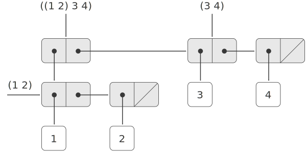
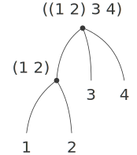

# 2.2.2  Hierarchical Structures(层次性结构)
The representation of sequences in terms of lists generalizes naturally to represent sequences whose elements may themselves be sequences. For example, we can regard the object `((1 2) 3 4)` constructed by<br>
将表作为序列的表示方式，可以很自然地推广到表示那些元素本身也是序列的序列。举例来说，我们可以认为对象`((1 2) 3 4)`是通过下面方式构造出来的：

```
(cons (list 1 2) (list 3 4))
```

as a list of three items, the first of which is itself a list, `(1 2)`. Indeed, this is suggested by the form in which the result is printed by the interpreter. Figure [2.5](#Figure2.5) shows the representation of this structure in terms of pairs.<br>
这是一个包含三个项的表，其中的第一项本身又是表`(1 2)`。这一情况也由解释器的打印形式所肯定。图[2.5](#Figure2.5)用序对的语言展示出这一结构的表示形式。

<div id="Figure2.5" markdown>

<figure markdown>
  
  <figcaption>Figure 2.5:  Structure formed by (cons (list 1 2) (list 3 4)).</figcaption>
</figure>

</div>

Another way to think of sequences whose elements are sequences is as *trees*. The elements of the sequence are the branches of the tree, and elements that are themselves sequences are subtrees. Figure [2.6](#Figure2.6) shows the structure in figure [2.5](#Figure2.5) viewed as a tree.<br>
认识这种元素本身也是序列的序列的另一种方式，是把它们看作树。序列里的元素就是树的分支，而那些本身也是序列的元素就形成了树中的子树。图[2.6](#Figure2.6)显示的是将图[2.5](#Figure2.5)的结构看作树的情况。

<div id="Figure2.5" markdown>

<figure markdown>
  
  <figcaption>Figure 2.6:  The list structure in figure 2.5 viewed as a tree.</figcaption>
</figure>

</div>

Recursion is a natural tool for dealing with tree structures, since we can often reduce operations on trees to operations on their branches, which reduce in turn to operations on the branches of the branches, and so on, until we reach the leaves of the tree. As an example, compare the `length` procedure of section [2.2.1] with the `count-leaves` procedure, which returns the total number of leaves of a tree:<br>
递归是处理树结构的一种很自然的工具，因为我们常常可以将对于树的操作归结为对它们的分支的操作，再将这种操作归结为对分支的分支的操作，如此下去，直至达到了树的叶子。作为例子，请比较一下[2.2.1]节的`length`过程和下面的`count-leaves`过程，这个过程统计出一棵树中树叶的数目：

```
(define x (cons (list 1 2) (list 3 4)))

(length x)
3
(count-leaves x)
4

(list x x)
(((1 2) 3 4) ((1 2) 3 4))

(length (list x x))
2

(count-leaves (list x x))
8
```

To implement `count-leaves`, recall the recursive plan for computing `length`:<br>
为了实现`count-leaves`,可以先回忆一下`length`的递归方案：

- `Length` of a list `x` is 1 plus `length` of the `cdr` of `x`.<br>
表`x`的`length`是`x`的`cdr`的`length`加一。

- `Length` of the empty list is 0.<br>
空表的`Length`是0。

`Count-leaves` is similar. The value for the empty list is the same:<br>
`count-leaves`的递归方案与此类似，对于空表的值也相同：

- Count-leaves of the empty list is 0.<br>
空表的`count-leaves`是0,

But in the reduction step, where we strip off the `car` of the list, we must take into account that the `car` may itself be a tree whose leaves we need to count. Thus, the appropriate reduction step is<br>
但是在递归步骤中，当我们去掉一个表的`car`时，就必须注意这一`car`本身也可能是树，其树叶也需要考虑。这样，正确的归约步骤应该是：

- `Count-leaves` of a tree `x` is `count-leaves` of the `car` of `x` plus `count-leaves` of the `cdr` of `x`.<br>
对于树`x`的`count-leaves`应该是`x`的`car`的`count-leaves`与`x`的`cdr`的`count-leaves`之和。

Finally, by taking cars we reach actual leaves, so we need another base case:<br>
最后，在通过`car`达到一个实际的树叶时，我们还需要另一种基本情况：

- `Count-leaves` of a leaf is 1.<br>
一个树叶的`count-leaves`是1。

To aid in writing recursive procedures on trees, Scheme provides the primitive predicate `pair?`, which tests whether its argument is a pair. Here is the complete procedure:[^1]<br>
为了有助于写出树上的各种递归，Scheme提供了基本过程`pair?`,它检查其参数是否为序对。下面就是我们完成的过程[^1]:

```
(define (count-leaves x)
  (cond ((null? x) 0)  
        ((not (pair? x)) 1)
        (else (+ (count-leaves (car x))
                 (count-leaves (cdr x))))))
```

<div id="Exercise2.24" markdown>

Exercise 2.24.  Suppose we evaluate the expression `(list 1 (list 2 (list 3 4)))`. Give the result printed by the interpreter, the corresponding box-and-pointer structure, and the interpretation of this as a tree (as in figure [2.6](#Figure2.6)).<br>
练习2.24 假定现在要求值表达式`(list 1(list 2(list 34)))`,请给出由解释器打印出的结果，给出与之对应的盒子指针结构，并将它解释为一棵树(参见图[2.6](#Figure2.6))。

</div>

<div id="Exercise2.25" markdown>

Exercise 2.25.  Give combinations of `cars` and `cdrs` that will pick 7 from each of the following lists:<br>
练习2.25 给出能够从下面各表中取出7的`car`和`cdr`组合：

```
(1 3 (5 7) 9)

((7))

(1 (2 (3 (4 (5 (6 7))))))
```

</div>

<div id="Exercise2.26" markdown>

Exercise 2.26.  Suppose we define `x` and `y` to be two lists:<br>
练习2.26 假定已将`x`和`y`定义为如下的两个表：

```
(define x (list 1 2 3))
(define y (list 4 5 6))
```

What result is printed by the interpreter in response to evaluating each of the following expressions:<br>
解释器对于下面各个表达式将打印出什么结果：

```
(append x y)

(cons x y)

(list x y)
```

</div>

<div id="Exercise2.27">

Exercise 2.27.  Modify your `reverse` procedure of exercise [2.18] to produce a `deep-reverse` procedure that takes a list as argument and returns as its value the list with its elements reversed and with all sublists deep-reversed as well. For example,<br>
练习2.27  修改练习[2.18]中所做的`reverse`过程，得到一个`deep-reverse`过程。它以一个表为参数，返回另一个表作为值，结果表中的元素反转过来，其中的子树也反转。例如：

```
(define x (list (list 1 2) (list 3 4)))

x
((1 2) (3 4))

(reverse x)
((3 4) (1 2))

(deep-reverse x)
((4 3) (2 1))
```

</div>

<div id="Exercise2.28" markdown>

Exercise 2.28.  Write a procedure `fringe` that takes as argument a tree (represented as a list) and returns a list whose elements are all the leaves of the tree arranged in left-to-right order. For example,<br>
练习2.28  写一个过程`fringe`,它以一个树(表示为表)为参数，返回一个表，表中的元素是这棵树的所有树叶，按照从左到右的顺序。例如：

```
(define x (list (list 1 2) (list 3 4)))

(fringe x)
(1 2 3 4)

(fringe (list x x))
(1 2 3 4 1 2 3 4)
```

</div>

<div id="Exercise2.29" markdown>

Exercise 2.29.  A binary mobile consists of two branches, a left branch and a right branch. Each branch is a rod of a certain length, from which hangs either a weight or another binary mobile. We can represent a binary mobile using compound data by constructing it from two branches (for example, using `list`):<br>
练习2.29  一个二叉活动体由两个分支组成，一个是左分支，另一个是右分支。每个分支是一个具有确定长度的杆，上面或者吊着一个重量，或者吊着另一个二叉活动体。我们可以用复合数据对象表示这种二叉活动体，将它通过其两个分支构造起来(例如，使用`list`):

```
(define (make-mobile left right)
  (list left right))
```

A branch is constructed from a `length` (which must be a number) together with a `structure`, which may be either a number (representing a simple weight) or another mobile:<br>
分支可以从一个`length`(它应该是一个数)再加上一个`structure`构造出来，这个`structure`或者是一个数(表示一个简单重量),或者是另一个活动体：

```
(define (make-branch length structure)
  (list length structure))
```

a.  Write the corresponding selectors `left-branch` and `right-branch`, which return the branches of a mobile, and `branch-length` and `branch-structure`, which return the components of a branch.<br>
请写出相应的选择函数`left-branch`和`right-branch`,它们分别返回活动体的两个分支。还有`branch-length`和`branch-structure`,它们返回一个分支上的成分。

b.  Using your selectors, define a procedure `total-weight` that returns the total weight of a mobile.<br>
用你的选择函数定义过程`total-weight`,它返回一个活动体的总重量。

c.  A mobile is said to be balanced if the torque applied by its top-left branch is equal to that applied by its top-right branch (that is, if the length of the left rod multiplied by the weight hanging from that rod is equal to the corresponding product for the right side) and if each of the submobiles hanging off its branches is balanced. Design a predicate that tests whether a binary mobile is balanced.<br>
一个活动体称为是平衡的，如果其左分支的力矩等于其右分支的力矩(也就是说，如果其左杆的长度乘以吊在杆上的重量，等于这个活动体右边的同样乘积),而且在其每个分支上吊着的子活动体也都平衡。请设计一个过程，它能检查一个二叉活动体是否平衡。

d.  Suppose we change the representation of mobiles so that the constructors are<br>
假定我们改变活动体的表示，采用下面构造方式：

```
(define (make-mobile left right)
  (cons left right))
(define (make-branch length structure)
  (cons length structure))
```

How much do you need to change your programs to convert to the new representation?
</div>

## Mapping over trees(对树的映射)
Just as `map` is a powerful abstraction for dealing with sequences, `map` together with recursion is a powerful abstraction for dealing with trees. For instance, the `scale-tree` procedure, analogous to `scale-list` of section [2.2.1], takes as arguments a numeric factor and a tree whose leaves are numbers. It returns a tree of the same shape, where each number is multiplied by the factor. The recursive plan for `scale-tree` is similar to the one for `count-leaves`:<br>
`map`是处理序列的一种强有力抽象，与此类似，`map`与递归的结合也是处理树的一种强有力抽象。举例来说，可以有与[2.2.1]节的`scale-list`类似的`scale-tree`过程，以一个数值因子和一棵叶子为数值的树作为参数，返回一棵具有同样形状的树，树中的每个数值都乘以了这个因子。对于`scale-tree`的递归方案也与`count-leaves`的类似；

```
(define (scale-tree tree factor)
  (cond ((null? tree) nil)
        ((not (pair? tree)) (* tree factor))
        (else (cons (scale-tree (car tree) factor)
                    (scale-tree (cdr tree) factor)))))
(scale-tree (list 1 (list 2 (list 3 4) 5) (list 6 7))
            10)
(10 (20 (30 40) 50) (60 70))
```

Another way to implement `scale-tree` is to regard the tree as a sequence of sub-trees and use `map`. We map over the sequence, scaling each sub-tree in turn, and return the list of results. In the base case, where the tree is a leaf, we simply multiply by the factor:<br>
实现`scale-tree`的另一种方法是将树看成子树的序列，并对它使用`map`。我们在这种序列上做映射，依次对各棵子树做缩放，并返回结果的表。对于基础情况，也就是当被处理的树是树叶时，就直接用因子去乘它：

```
(define (scale-tree tree factor)
  (map (lambda (sub-tree)
         (if (pair? sub-tree)
             (scale-tree sub-tree factor)
             (* sub-tree factor)))
       tree))
```

Many tree operations can be implemented by similar combinations of sequence operations and recursion.<br>
对于树的许多操作可以采用类似方式，通过序列操作和递归的组合实现。

<div id="Exercise2.30" markdown>

Exercise 2.30.  Define a procedure `square-tree` analogous to the `square-list` procedure of exercise [2.21]. That is, square-list should behave as follows:<br>
练习2.30  请定义一个与练习[2.21]中`square-list`过程类似的`square-tree`过程。也就是说，它应该具有下面的行为：

```
(square-tree
 (list 1
       (list 2 (list 3 4) 5)
       (list 6 7)))
(1 (4 (9 16) 25) (36 49))
```

Define `square-tree` both directly (i.e., without using any higher-order procedures) and also by using `map` and recursion.<br>
请以两种方式定义`square-tree`,直接定义(即不使用任何高阶函数),以及使用`map`和递归定义。

</div>

<div id="Exercise2.31" markdown>

Exercise 2.31.  Abstract your answer to exercise [2.30](#Exercise2.30) to produce a procedure `tree-map` with the property that `square-tree` could be defined as<br>
练习2.31  将你在练习[2.30](#Exercise2.30)做出的解答进一步抽象，做出一个过程，使它的性质保证能以下面形式定义`square-tree`:

```
(define (square-tree tree) (tree-map square tree))
```

</div>

<div id="Exercise2.32" markdown>

Exercise 2.32.  We can represent a set as a list of distinct elements, and we can represent the set of all subsets of the set as a list of lists. For example, if the set is `(1 2 3)`, then the set of all subsets is `(() (3) (2) (2 3) (1) (1 3) (1 2) (1 2 3))`. Complete the following definition of a procedure that generates the set of subsets of a set and give a clear explanation of why it works:<br>
练习2.32  我们可以将一个集合表示为一个元素互不相同的表，因此就可以将一个集合的所有子集表示为表的表。例如，假定集合为`(1 2 3)`,它的所有子集的集合就是`(() (3) (2) (2 3) (1) (1 3) (1 2) (1 2 3))`。请完成下面的过程定义，它生成出一个集合的所有子集的集合。请解释它为什么能完成这一工作。


```
(define (subsets s)
  (if (null? s)
      (list nil)
      (let ((rest (subsets (cdr s))))
        (append rest (map <??> rest)))))
```
</div>

[^1]:
    The order of the first two clauses in the `cond` matters, since the empty list satisfies `null?` and also is not a pair.<br>
    在这个定义里，`cond`的前两个子句的顺序非常重要，因为空表将满足`nu11?`,而它同时又不是序对。


[2.2.1]: {{ config.extra.homepage_sicp }}/chapter_2/chapter_2_2/2.2.1/

[2.18]: {{ config.extra.homepage_sicp }}/chapter_2/chapter_2_2/2.2.1/#Exercise2.18

[2.21]: {{ config.extra.homepage_sicp }}/chapter_2/chapter_2_2/2.2.1/#Exercise2.21