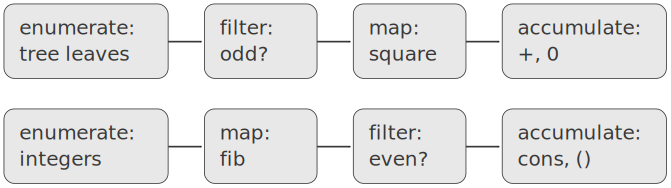
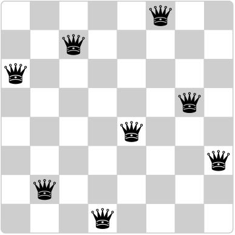

# 2.2.3  Sequences as Conventional Interfaces
In working with compound data, we've stressed how data abstraction permits us to design programs without becoming enmeshed in the details of data representations, and how abstraction preserves for us the flexibility to experiment with alternative representations. In this section, we introduce another powerful design principle for working with data structures -- the use of conventional interfaces.

In section [1.3] we saw how program abstractions, implemented as higher-order procedures, can capture common patterns in programs that deal with numerical data. Our ability to formulate analogous operations for working with compound data depends crucially on the style in which we manipulate our data structures. Consider, for example, the following procedure, analogous to the `count-leaves` procedure of section [2.2.2], which takes a tree as argument and computes the sum of the squares of the leaves that are odd:

```
(define (sum-odd-squares tree)
  (cond ((null? tree) 0)  
        ((not (pair? tree))
         (if (odd? tree) (square tree) 0))
        (else (+ (sum-odd-squares (car tree))
                 (sum-odd-squares (cdr tree))))))
```

On the surface, this procedure is very different from the following one, which constructs a list of all the even Fibonacci numbers `Fib(k)`, where `k` is less than or equal to a given integer `n`:

```
(define (even-fibs n)
  (define (next k)
    (if (> k n)
        nil
        (let ((f (fib k)))
          (if (even? f)
              (cons f (next (+ k 1)))
              (next (+ k 1))))))
  (next 0))
```

Despite the fact that these two procedures are structurally very different, a more abstract description of the two computations reveals a great deal of similarity. The first program

- enumerates the leaves of a tree;
- filters them, selecting the odd ones;
- squares each of the selected ones; and
- accumulates the results using +, starting with 0.

The second program

- enumerates the integers from 0 to ${n}$;
- computes the Fibonacci number for each integer;
- filters them, selecting the even ones; and
- accumulates the results using `cons`, starting with the empty list.

A signal-processing engineer would find it natural to conceptualize these processes in terms of signals flowing through a cascade of stages, each of which implements part of the program plan, as shown in figure [2.7]. In `sum-odd-squares`, we begin with an enumerator, which generates a ''signal'' consisting of the leaves of a given tree. This signal is passed through a filter, which eliminates all but the odd elements. The resulting signal is in turn passed through a map, which is a ''transducer'' that applies the `square` procedure to each element. The output of the map is then fed to an accumulator, which combines the elements using `+`, starting from an initial 0. The plan for `even-fibs` is analogous.

<div id="Figure2.7" markdown>

<figure markdown>
  
  <figcaption>Figure 2.7:  The signal-flow plans for the procedures `sum-odd-squares` (top) and `even-fibs` (bottom) reveal the commonality between the two programs.</figcaption>
</figure>

</div>

Unfortunately, the two procedure definitions above fail to exhibit this signal-flow structure. For instance, if we examine the `sum-odd-squares` procedure, we find that the enumeration is implemented partly by the `null?` and `pair?` tests and partly by the tree-recursive structure of the procedure. Similarly, the accumulation is found partly in the tests and partly in the addition used in the recursion. In general, there are no distinct parts of either procedure that correspond to the elements in the signal-flow description. Our two procedures decompose the computations in a different way, spreading the enumeration over the program and mingling it with the map, the filter, and the accumulation. If we could organize our programs to make the signal-flow structure manifest in the procedures we write, this would increase the conceptual clarity of the resulting code.

## Sequence Operations
The key to organizing programs so as to more clearly reflect the signal-flow structure is to concentrate on the ''signals'' that flow from one stage in the process to the next. If we represent these signals as lists, then we can use list operations to implement the processing at each of the stages. For instance, we can implement the mapping stages of the signal-flow diagrams using the map procedure from section [2.2.1]:

```
(map square (list 1 2 3 4 5))
(1 4 9 16 25)
```

Filtering a sequence to select only those elements that satisfy a given predicate is accomplished by

```
(define (filter predicate sequence)
  (cond ((null? sequence) nil)
        ((predicate (car sequence))
         (cons (car sequence)
               (filter predicate (cdr sequence))))
        (else (filter predicate (cdr sequence)))))
```

For example,

```
(filter odd? (list 1 2 3 4 5))
(1 3 5)
```

Accumulations can be implemented by

```
(define (accumulate op initial sequence)
  (if (null? sequence)
      initial
      (op (car sequence)
          (accumulate op initial (cdr sequence)))))
(accumulate + 0 (list 1 2 3 4 5))
15
(accumulate * 1 (list 1 2 3 4 5))
120
(accumulate cons nil (list 1 2 3 4 5))
(1 2 3 4 5)
```

All that remains to implement signal-flow diagrams is to enumerate the sequence of elements to be processed. For `even-fibs`, we need to generate the sequence of integers in a given range, which we can do as follows:

```
(define (enumerate-interval low high)
  (if (> low high)
      nil
      (cons low (enumerate-interval (+ low 1) high))))
(enumerate-interval 2 7)
(2 3 4 5 6 7)
```

To enumerate the leaves of a tree, we can use[^1]

```
(define (enumerate-tree tree)
  (cond ((null? tree) nil)
        ((not (pair? tree)) (list tree))
        (else (append (enumerate-tree (car tree))
                      (enumerate-tree (cdr tree))))))
(enumerate-tree (list 1 (list 2 (list 3 4)) 5))
(1 2 3 4 5)
```

Now we can reformulate `sum-odd-squares` and `even-fibs` as in the signal-flow diagrams. For `sum-odd-squares`, we enumerate the sequence of leaves of the tree, filter this to keep only the odd numbers in the sequence, square each element, and sum the results:

```
(define (sum-odd-squares tree)
  (accumulate +
              0
              (map square
                   (filter odd?
                           (enumerate-tree tree)))))
```

For `even-fibs`, we enumerate the integers from 0 to ${n}$, generate the Fibonacci number for each of these integers, filter the resulting sequence to keep only the even elements, and accumulate the results into a list:

```
(define (even-fibs n)
  (accumulate cons
              nil
              (filter even?
                      (map fib
                           (enumerate-interval 0 n)))))
```

The value of expressing programs as sequence operations is that this helps us make program designs that are modular, that is, designs that are constructed by combining relatively independent pieces. We can encourage modular design by providing a library of standard components together with a conventional interface for connecting the components in flexible ways.

Modular construction is a powerful strategy for controlling complexity in engineering design. In real signal-processing applications, for example, designers regularly build systems by cascading elements selected from standardized families of filters and transducers. Similarly, sequence operations provide a library of standard program elements that we can mix and match. For instance, we can reuse pieces from the `sum-odd-squares` and `even-fibs` procedures in a program that constructs a list of the squares of the first ${n + 1}$ Fibonacci numbers:

```
(define (list-fib-squares n)
  (accumulate cons
              nil
              (map square
                   (map fib
                        (enumerate-interval 0 n)))))
(list-fib-squares 10)
(0 1 1 4 9 25 64 169 441 1156 3025)
```

We can rearrange the pieces and use them in computing the product of the odd integers in a sequence:

```
(define (product-of-squares-of-odd-elements sequence)
  (accumulate *
              1
              (map square
                   (filter odd? sequence))))
(product-of-squares-of-odd-elements (list 1 2 3 4 5))
225
```

We can also formulate conventional data-processing applications in terms of sequence operations. Suppose we have a sequence of personnel records and we want to find the salary of the highest-paid programmer. Assume that we have a selector salary that returns the salary of a record, and a predicate `programmer?` that tests if a record is for a programmer. Then we can write

```
(define (salary-of-highest-paid-programmer records)
  (accumulate max
              0
              (map salary
                   (filter programmer? records))))
```

These examples give just a hint of the vast range of operations that can be expressed as sequence operations.[^2]

Sequences, implemented here as lists, serve as a conventional interface that permits us to combine processing modules. Additionally, when we uniformly represent structures as sequences, we have localized the data-structure dependencies in our programs to a small number of sequence operations. By changing these, we can experiment with alternative representations of sequences, while leaving the overall design of our programs intact. We will exploit this capability in section [3.5], when we generalize the sequence-processing paradigm to admit infinite sequences.

<div id="Exercise2.33" markdown>

Exercise 2.33.  Fill in the missing expressions to complete the following definitions of some basic list-manipulation operations as accumulations:

```
(define (map p sequence)
  (accumulate (lambda (x y) <??>) nil sequence))
(define (append seq1 seq2)
  (accumulate cons <??> <??>))
(define (length sequence)
  (accumulate <??> 0 sequence))
```
</div>

<div id="Exercise2.34" markdown>

Exercise 2.34.  Evaluating a polynomial in ${x}$ at a given value of ${x}$ can be formulated as an accumulation. We evaluate the polynomial

$$ a_n x^n + a_{n-1} x^{n-1} + \dots + a_1 x + a_0 $$

using a well-known algorithm called *Horner's rule*, which structures the computation as

$$ (\dots (a_n x + a_{n-1}) x + \dots + a_1) x + a_0. $$

In other words, we start with ${a_n}$, multiply by ${x}$, add ${a_{n-1}}$, multiply by ${x}$, and so on, until we reach ${a_0}$.[^3] Fill in the following template to produce a procedure that evaluates a polynomial using Horner's rule. Assume that the coefficients of the polynomial are arranged in a sequence, from ${a_0}$ through ${a_n}$.

```
(define (horner-eval x coefficient-sequence)
  (accumulate (lambda (this-coeff higher-terms) <??>)
              0
              coefficient-sequence))
```

For example, to compute ${1 + 3x + 5x^3 + x^5}$ at ${x = 2}$ you would evaluate

```
(horner-eval 2 (list 1 3 0 5 0 1))
```

</div>

<div id="Exercise2.35" markdown>

Exercise 2.35.  Redefine count-leaves from section [2.2.2] as an accumulation:

```
(define (count-leaves t)
  (accumulate <??> <??> (map <??> <??>)))
```

</div>

<div id="Exercise2.36" markdown>

Exercise 2.36.  The procedure `accumulate-n` is similar to `accumulate` except that it takes as its third argument a sequence of sequences, which are all assumed to have the same number of elements. It applies the designated accumulation procedure to combine all the first elements of the sequences, all the second elements of the sequences, and so on, and returns a sequence of the results. For instance, if `s` is a sequence containing four sequences, `((1 2 3) (4 5 6) (7 8 9) (10 11 12))`, then the value of `(accumulate-n + 0 s)` should be the sequence `(22 26 30)`. Fill in the missing expressions in the following definition of `accumulate-n`:

```
(define (accumulate-n op init seqs)
  (if (null? (car seqs))
      nil
      (cons (accumulate op init <??>)
            (accumulate-n op init <??>))))
```
</div>

<div id="Exercise2.37" markdown>

Exercise 2.37.  Suppose we represent vectors ${v = (v_i)}$ as sequences of numbers, and matrices ${m = (m_{ij})}$ as sequences of vectors (the rows of the matrix). For example, the matrix

$$ 
\left(\matrix{	1 & 2 & 3 & 4 \cr
		4 & 5 & 6 & 6 \cr
		6 & 7 & 8 & 9 \cr }\right) $$

is represented as the sequence `((1 2 3 4) (4 5 6 6) (6 7 8 9))`. With this representation, we can use sequence operations to concisely express the basic matrix and vector operations. These operations (which are described in any book on matrix algebra) are the following:

$$ 
\begin{aligned}
\text{(dot-product v w)}& \text{ returns the sum}\Sigma_i v_i w_i;  \\
\text{(matrix-*-vector m v)}& \text{ returns the vector t},  \\
&\text{where}t_i=\Sigma_j m_{ij}v_j; \\
\text{(matrix-*-matrix m n)}& \text{ returns the matrix p},  \\
&\text{where}p_{ij}=\Sigma_k m_{ik}n_{kj}; \\
\text{(transpose m)}& \text{ returns the matrix n},  \\
&\text{where}n_{ij}=m_{ji}.
\end{aligned}
 $$

We can define the dot product as[^4]

```
(define (dot-product v w)
  (accumulate + 0 (map * v w)))
```

Fill in the missing expressions in the following procedures for computing the other matrix operations. (The procedure `accumulate-n` is defined in exercise [2.36](#Exercise2.36).)

```
(define (matrix-*-vector m v)
  (map <??> m))
(define (transpose mat)
  (accumulate-n <??> <??> mat))
(define (matrix-*-matrix m n)
  (let ((cols (transpose n)))
    (map <??> m)))
```
</div>

<div id="Exercise2.38" markdown>

Exercise 2.38.  The `accumulate` procedure is also known as `fold-right`, because it combines the first element of the sequence with the result of combining all the elements to the right. There is also a `fold-left`, which is similar to `fold-right`, except that it combines elements working in the opposite direction:

```
(define (fold-left op initial sequence)
  (define (iter result rest)
    (if (null? rest)
        result
        (iter (op result (car rest))
              (cdr rest))))
  (iter initial sequence))
```

What are the values of

```
(fold-right / 1 (list 1 2 3))
(fold-left / 1 (list 1 2 3))
(fold-right list nil (list 1 2 3))
(fold-left list nil (list 1 2 3))
```

Give a property that `op` should satisfy to guarantee that `fold-right` and `fold-left` will produce the same values for any sequence.

</div>

<div id="Exercise2.39" markdown>

Exercise 2.39.   Complete the following definitions of `reverse` (exercise [2.18]) in terms of `fold-right` and `fold-left` from exercise [2.38](#Exercise2.38):

```
(define (reverse sequence)
  (fold-right (lambda (x y) <??>) nil sequence))
(define (reverse sequence)
  (fold-left (lambda (x y) <??>) nil sequence))
```
</div>

## Nested Mappings
We can extend the sequence paradigm to include many computations that are commonly expressed using nested loops.[^5] Consider this problem: Given a positive integer ${n}$, find all ordered pairs of distinct positive integers ${i}$ and ${j}$, where ${1 \le j < i \le n}$, such that ${i + j}$ is prime. For example, if ${n}$ is 6, then the pairs are the following:

$$
\begin{array}{c|cccccccc}i&2&3&4&4&5&6&6\\ j&1&2&1&3&2&1&5\\ \hline i+j&3&5&5&7&7&7&11\end{array}
$$

A natural way to organize this computation is to generate the sequence of all ordered pairs of positive integers less than or equal to ${n}$, filter to select those pairs whose sum is prime, and then, for each pair ${(i, j)}$ that passes through the filter, produce the triple ${(i, j, i + j)}$.

Here is a way to generate the sequence of pairs: For each integer ${i \le n}$, enumerate the integers ${j < i}$, and for each such ${i}$ and ${j}$ generate the pair ${(i, j)}$. In terms of sequence operations, we map along the sequence `(enumerate-interval 1 n)`. For each ${i}$ in this sequence, we map along the sequence `(enumerate-interval 1 (- i 1))`. For each ${j}$ in this latter sequence, we generate the pair `(list i j)`. This gives us a sequence of pairs for each ${i}$. Combining all the sequences for all the ${i}$ (by accumulating with `append`) produces the required sequence of pairs:[^6]

```
(accumulate append
            nil
            (map (lambda (i)
                   (map (lambda (j) (list i j))
                        (enumerate-interval 1 (- i 1))))
                 (enumerate-interval 1 n)))
```

The combination of mapping and accumulating with `append` is so common in this sort of program that we will isolate it as a separate procedure:

```
(define (flatmap proc seq)
  (accumulate append nil (map proc seq)))
```

Now filter this sequence of pairs to find those whose sum is prime. The filter predicate is called for each element of the sequence; its argument is a pair and it must extract the integers from the pair. Thus, the predicate to apply to each element in the sequence is

```
(define (prime-sum? pair)
  (prime? (+ (car pair) (cadr pair))))
```

Finally, generate the sequence of results by mapping over the filtered pairs using the following procedure, which constructs a triple consisting of the two elements of the pair along with their sum:

```
(define (make-pair-sum pair)
  (list (car pair) (cadr pair) (+ (car pair) (cadr pair))))
```

Combining all these steps yields the complete procedure:

```
(define (prime-sum-pairs n)
  (map make-pair-sum
       (filter prime-sum?
               (flatmap
                (lambda (i)
                  (map (lambda (j) (list i j))
                       (enumerate-interval 1 (- i 1))))
                (enumerate-interval 1 n)))))
```

Nested mappings are also useful for sequences other than those that enumerate intervals. Suppose we wish to generate all the permutations of a set ${S;}$ that is, all the ways of ordering the items in the set. For instance, the permutations of ${\{1, 2, 3\}}$ are ${\{1, 2, 3\}}$, ${\{1, 3, 2\}}$, ${\{2, 1, 3\}}$, ${\{2, 3, 1\}},$, ${\{3, 1, 2\}}$, and ${\{3, 2, 1\}}$. Here is a plan for generating the permutations of ${S}$: For each item ${x}$ in ${S}$, recursively generate the sequence of permutations of ${S - x}$,[^7] and adjoin ${x}$ to the front of each one. This yields, for each ${x}$ in ${S}$, the sequence of permutations of ${S}$ that begin with ${x}$. Combining these sequences for all ${x}$ gives all the permutations of ${S}$:[^8]

```
(define (permutations s)
  (if (null? s)                    ; empty set?
      (list nil)                   ; sequence containing empty set
      (flatmap (lambda (x)
                 (map (lambda (p) (cons x p))
                      (permutations (remove x s))))
               s)))
```

Notice how this strategy reduces the problem of generating permutations of S to the problem of generating the permutations of sets with fewer elements than ${S}$. In the terminal case, we work our way down to the empty list, which represents a set of no elements. For this, we generate `(list nil)`, which is a sequence with one item, namely the set with no elements. The `remove` procedure used in `permutations` returns all the items in a given sequence except for a given item. This can be expressed as a simple filter:

```
(define (remove item sequence)
  (filter (lambda (x) (not (= x item)))
          sequence))
```

<div id="Exercise2.40" markdown>

Exercise 2.40.  Define a procedure `unique-pairs` that, given an integer ${n}$, generates the sequence of pairs ${(i, j)}$ with ${1 \le j < i \le n}$. Use `unique-pairs` to simplify the definition of `prime-sum-pairs` given above.

</div>

<div id="Exercise2.41" markdown>

Exercise 2.41.  Write a procedure to find all ordered triples of distinct positive integers ${i}$, ${j}$, and ${k}$ less than or equal to a given integer ${n}$ that sum to a given integer ${s}$.

</div>

<div id="Exercise2.42" markdown>

Exercise 2.42.  

<div id="Figure2.8" markdown>

<figure markdown>
  
  <figcaption>Figure 2.8:  A solution to the eight-queens puzzle.</figcaption>
</figure>

</div>

The ''eight-queens puzzle'' asks how to place eight queens on a chessboard so that no queen is in check from any other (i.e., no two queens are in the same row, column, or diagonal). One possible solution is shown in figure [2.8](#Figure2.8). One way to solve the puzzle is to work across the board, placing a queen in each column. Once we have placed ${k - 1}$ queens, we must place the $k^{\mathrm{th}}$ queen in a position where it does not check any of the queens already on the board. We can formulate this approach recursively: Assume that we have already generated the sequence of all possible ways to place ${k - 1}$ queens in the first ${k - 1}$ columns of the board. For each of these ways, generate an extended set of positions by placing a queen in each row of the $k^{\mathrm{th}}$ column. Now filter these, keeping only the positions for which the queen in the $k^{\mathrm{th}}$ column is safe with respect to the other queens. This produces the sequence of all ways to place k queens in the first ${k}$ columns. By continuing this process, we will produce not only one solution, but all solutions to the puzzle.

We implement this solution as a procedure `queens`, which returns a sequence of all solutions to the problem of placing ${n}$ queens on an ${n \times n}$ chessboard. `Queens` has an internal procedure `queen-cols` that returns the sequence of all ways to place queens in the first ${k}$ columns of the board.

```
(define (queens board-size)
  (define (queen-cols k)  
    (if (= k 0)
        (list empty-board)
        (filter
         (lambda (positions) (safe? k positions))
         (flatmap
          (lambda (rest-of-queens)
            (map (lambda (new-row)
                   (adjoin-position new-row k rest-of-queens))
                 (enumerate-interval 1 board-size)))
          (queen-cols (- k 1))))))
  (queen-cols board-size))
```

In this procedure `rest-of-queens` is a way to place ${k - 1}$ queens in the first ${k - 1}$ columns, and `new-row` is a proposed row in which to place the queen for the $k^{\mathrm{th}}$ column. Complete the program by implementing the representation for sets of board positions, including the procedure `adjoin-position`, which adjoins a new row-column position to a set of positions, and `empty-board`, which represents an empty set of positions. You must also write the procedure `safe?`, which determines for a set of positions, whether the queen in the kth column is safe with respect to the others. (Note that we need only check whether the new queen is safe -- the other queens are already guaranteed safe with respect to each other.)

</div>

<div id="Exercise2.43" markdown>

Exercise 2.43.  Louis Reasoner is having a terrible time doing exercise [2.42](#Exercise2.42). His `queens` procedure seems to work, but it runs extremely slowly. (Louis never does manage to wait long enough for it to solve even the ${6\times6}$ case.) When Louis asks Eva Lu Ator for help, she points out that he has interchanged the order of the nested mappings in the `flatmap`, writing it as

```
(flatmap
 (lambda (new-row)
   (map (lambda (rest-of-queens)
          (adjoin-position new-row k rest-of-queens))
        (queen-cols (- k 1))))
 (enumerate-interval 1 board-size))
```

Explain why this interchange makes the program run slowly. Estimate how long it will take Louis's program to solve the eight-queens puzzle, assuming that the program in exercise [2.42](#Exercise2.42) solves the puzzle in time ${T}$.

</div>

[^1]: 
    This is, in fact, precisely the `fringe` procedure from exercise [2.28]. Here we've renamed it to emphasize that it is part of a family of general sequence-manipulation procedures.

[^2]:
    Richard Waters (1979) developed a program that automatically analyzes traditional Fortran programs, viewing them in terms of maps, filters, and accumulations. He found that fully 90 percent of the code in the Fortran Scientific Subroutine Package fits neatly into this paradigm. One of the reasons for the success of Lisp as a programming language is that lists provide a standard medium for expressing ordered collections so that they can be manipulated using higher-order operations. The programming language APL owes much of its power and appeal to a similar choice. In APL all data are represented as arrays, and there is a universal and convenient set of generic operators for all sorts of array operations.

[^3]:
    According to Knuth (1981), this rule was formulated by W. G. Horner early in the nineteenth century, but the method was actually used by Newton over a hundred years earlier. Horner's rule evaluates the polynomial using fewer additions and multiplications than does the straightforward method of first computing ${a_n x^n}$, then adding ${a_{n-1}x^{n-1}}$, and so on. In fact, it is possible to prove that any algorithm for evaluating arbitrary polynomials must use at least as many additions and multiplications as does Horner's rule, and thus Horner's rule is an optimal algorithm for polynomial evaluation. This was proved (for the number of additions) by A. M. Ostrowski in a 1954 paper that essentially founded the modern study of optimal algorithms. The analogous statement for multiplications was proved by V. Y. Pan in 1966. The book by Borodin and Munro (1975) provides an overview of these and other results about optimal algorithms.

[^4]:
    This definition uses the extended version of `map` described in footnote [12].

[^5]:
    This approach to nested mappings was shown to us by David Turner, whose languages KRC and Miranda provide elegant formalisms for dealing with these constructs. The examples in this section (see also exercise [2.42]) are adapted from Turner 1981. In section [3.5.3], we'll see how this approach generalizes to infinite sequences.

[^6]:
    We're representing a pair here as a list of two elements rather than as a Lisp pair. Thus, the ''pair'' (i,j) is represented as `(list i j)`, not `(cons i j)`.

[^7]:
    The set ${S - x}$ is the set of all elements of ${S}$, excluding ${x}$.

[^8]:
    Semicolons in Scheme code are used to introduce comments. Everything from the semicolon to the end of the line is ignored by the interpreter. In this book we don't use many comments; we try to make our programs self-documenting by using descriptive names.

[1.3]: {{ config.extra.homepage_sicp }}/chapter_1/chapter_1_3/

[2.2.2]: {{ config.extra.homepage_sicp }}/chapter_2/chapter_2_2/2.2.2

[2.2.1]: {{ config.extra.homepage_sicp }}/chapter_2/chapter_2_2/2.2.1

[2.28]: {{ config.extra.homepage_sicp }}/chapter_2/chapter_2_2/2.2.2/#Exercise2.28

[3.5]: {{ config.extra.homepage_sicp }}/chapter_3/chapter_3_5/

[12]: {{ config.extra.homepage_sicp }}/chapter_2/chapter_2_2/2.2.4/#Footnote12

[2.18]: {{ config.extra.homepage_sicp }}/chapter_2/chapter_2_2/2.2.1/#Exercise2.18

[2.42]: {{ config.extra.homepage_sicp }}/chapter_2/chapter_2_2/2.2.3/#Exercise2.42

[3.5.3]: {{ config.extra.homepage_sicp }}/chapter_3/chapter_3_5/3.5.3