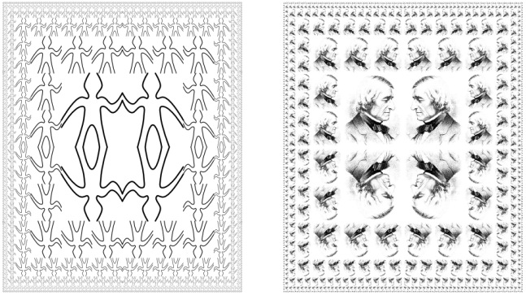
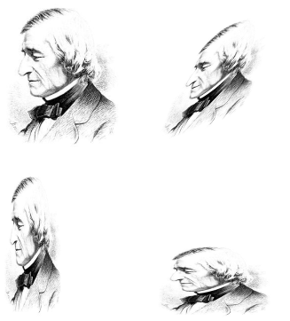
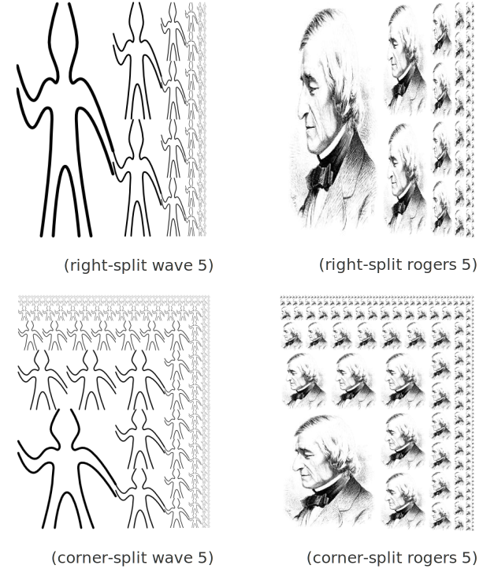

# 2.2.4  Example: A Picture Language (实例：一个图形语言)
This section presents a simple language for drawing pictures that illustrates the power of data abstraction and closure, and also exploits higher-order procedures in an essential way. The language is designed to make it easy to experiment with patterns such as the ones in figure [2.9](#Figure2.9), which are composed of repeated elements that are shifted and scaled.[^1] In this language, the data objects being combined are represented as procedures rather than as list structure. Just as `cons`, which satisfies the closure property, allowed us to easily build arbitrarily complicated list structure, the operations in this language, which also satisfy the closure property, allow us to easily build arbitrarily complicated patterns.<br>
本节将介绍一种用于画图形的简单语言，以展示数据抽象和闭包的威力，其中也以一种非常本质的方式使用了高阶过程。这一语言的设计就是为了很容易地做出一些模式，例如图[2.9](#Figure2.9)中所示的那类图形，它们是由某些元素的重复出现而构成的，这些元素可以变形或者改变大小[^1]。在这个语言里，数据元素的组合都用过程表示，而不是用表结构表示。就像`cons`满足一种闭包性质，使我们能构造出任意复杂的表结构一样，这一语言中的操作也满足闭包性质，使我们很容易构造出任意复杂的模式。

<div id="Figure2.9" markdown>

<figure markdown>
  
  <figcaption>Figure 2.9:  Designs generated with the picture language.</figcaption>
</figure>

</div>

## The picture language(图形语言)
When we began our study of programming in section [1.1], we emphasized the importance of describing a language by focusing on the language's primitives, its means of combination, and its means of abstraction. We'll follow that framework here.<br>
在[1.1]节里开始研究程序设计时我们就强调说，在描述一种语言时，应该将注意力集中到语言的基本原语、它的组合手段以及它的抽象手段，这是最重要的。这里的工作也将按照同样的框架进行。

Part of the elegance of this picture language is that there is only one kind of element, called a painter. A painter draws an image that is shifted and scaled to fit within a designated parallelogram-shaped frame. For example, there's a primitive painter we'll call `wave` that makes a crude line drawing, as shown in figure [2.10](#Figure2.10). The actual shape of the drawing depends on the frame -- all four images in figure [2.10](#Figure2.10) are produced by the same `wave` painter, but with respect to four different frames. Painters can be more elaborate than this: The primitive painter called `rogers` paints a picture of MIT's founder, William Barton Rogers, as shown in figure [2.11](#Figure2.11).[^2] The four images in figure [2.11](#Figure2.11) are drawn with respect to the same four frames as the wave images in figure [2.10](#Figure2.10).<br>
这一图形语言的优美之处，部分就在于语言中只有一种元素，称为画家(painter)。一个画家将画出一个图像，这种图像可以变形或者改变大小，以便能正好放到某个指定的平行四边形框架里。举例来说，这里有一个称为`wave`的基本画家，它能做出如图[2.10](#Figure2.10)所示的折线画，而所做出图画的实际形状依赖于具体的框架——图[2.10](#Figure2.10)里的四个图像都是由同一个画家`wave`产生的，但却是相对于四个不同的框架。有些画家比它更精妙：称为`rogers`的基本画家能画出MIT的创始人William Barton Rogers的画像，如图[2.11](#Figure2.11)所示"。图[2.11](#Figure2.11)里的四个图像是相对于与图[2.10](#Figure2.10)中`wave`形象同样的四个框架画出来的。


To combine images, we use various operations that construct new painters from given painters. For example, the `beside` operation takes two painters and produces a new, compound painter that draws the first painter's image in the left half of the frame and the second painter's image in the right half of the frame. Similarly, `below` takes two painters and produces a compound painter that draws the first painter's image below the second painter's image. Some operations transform a single painter to produce a new painter. For example, `flip-vert` takes a painter and produces a painter that draws its image upside-down, and `flip-horiz` produces a painter that draws the original painter's image left-to-right reversed.<br>
为了组合起有关的图像，我们要用一些可以从给定画家构造出新画家的操作。例如，操作`beside`从两个画家出发，产生一个复合型画家，它将第一个画家的图像画在框架中左边的一半里，将第二个画家的图像画在框架里右边一半里。与此类似，`below`从两个画家出发产生一个组合型画家，将第一个画家的图像画在第二个画家的图像之下。有些操作将一个画家转换为另一个新画家。例如，`flip-vert`从一个画家出发，产生一个将该画家所画图像上下颠倒画出的画家，而`flip-horiz`产生的画家将原画家的图像左右反转后画出。


<div id="Figure2.10" markdown>

<figure markdown>
  
  <figcaption>Figure 2.10:  Images produced by the wave painter, with respect to four different frames. The frames, shown with dotted lines, are not part of the images.</figcaption>
</figure>

</div>

<div id="Figure2.11" markdown>
<figure markdown>
  
  <figcaption markdown>
  Figure 2.11:  Images of William Barton Rogers, founder and first president of MIT, painted with respect to the same four frames as in figure [2.10](#Figure2.10) (original image reprinted with the permission of the MIT Museum).
  </figcaption>
</figure>
</div> 

Figure [2.12](#Figure2.12) shows the drawing of a painter called `wave4` that is built up in two stages starting from wave:<br>
图[2.12](#Figure2.12)说明了从wave出发，经过两步做出一个名为`wave4`的画家的方式：

```
(define wave2 (beside wave (flip-vert wave)))
(define wave4 (below wave2 wave2))
```

<div id="Figure2.12" markdown>

<figure markdown>
  
  <figcaption markdown>
  Figure 2.12:  Creating a complex figure, starting from the wave painter of figure [2.10](#Figure2.10).
  </figcaption>
</figure>
</div>
      
In building up a complex image in this manner we are exploiting the fact that painters are closed under the language's means of combination. The `beside` or `below` of two painters is itself a painter; therefore, we can use it as an element in making more complex painters. As with building up list structure using `cons`, the closure of our data under the means of combination is crucial to the ability to create complex structures while using only a few operations.<br>
在按这种方法构造复杂的图像时，我们利用了一个事实：画家在有关语言的组合方式下是封闭的：两个画家的`beside`或者`below`还是画家，因此还可以用它们作为元素去构造更复杂的画家。就像用`cons`构造起各种表结构一样，我们所用的数据在组合方式下的闭包性质非常重要，因为这使我们能用不多几个操作构造出各种复杂的结构。

Once we can combine painters, we would like to be able to abstract typical patterns of combining painters. We will implement the painter operations as Scheme procedures. This means that we don't need a special abstraction mechanism in the picture language: Since the means of combination are ordinary Scheme procedures, we automatically have the capability to do anything with painter operations that we can do with procedures. For example, we can abstract the pattern in `wave4` as<br>
一旦能做画家的组合之后，我们就希望能抽象出典型的画家组合模式，以便将这种组合操作实现为一些Scheme过程。这也意味着我们并不需要这种图形语言里包含任何特殊的抽象机制，因为组合的方式就是采用普通的Scheme过程。这样，对于画家，我们就自动有了能够做原来可以对过程做的所有事情。例如，我们可以将`wave4`中的模式抽象出来：

```
(define (flipped-pairs painter)
  (let ((painter2 (beside painter (flip-vert painter))))
    (below painter2 painter2)))
```

and define `wave4` as an instance of this pattern:<br>
并将`wave4`重新定义为这种权式的实例：

```
(define wave4 (flipped-pairs wave))
```

We can also define recursive operations. Here's one that makes painters split and branch towards the right as shown in figures [2.13](#Figure2.13) and  [2.14](#Figure2.14):<br>
我们也可以定义递归操作。下面就是一个这样的操作，它在图形的右边做分割和分支，就像在图[2.13](#Figure2.13)和图[2.14](#Figure2.14)中显示的那样：

```
(define (right-split painter n)
  (if (= n 0)
      painter
      (let ((smaller (right-split painter (- n 1))))
        (beside painter (below smaller smaller)))))
```
<div id="Figure2.13" markdown>

<figure markdown>
  
  <figcaption>Figure 2.13:  Recursive plans for right-split and corner-split.</figcaption>
</figure>

</div>  

We can produce balanced patterns by branching upwards as well as towards the right (see exercise [2.44](#Exercise2.44) and figures [2.13](#Figure2.13) and  [2.14](#Figure2.14)):<br>
通过同时在图形中向上和向右分支，我们可以产生出一种平衡的模式(见练习[2.44](#Exercise2.44)、图[2.13](#Figure2.13)和图[2.14](#Figure2.14)):

```
(define (corner-split painter n)
  (if (= n 0)
      painter
      (let ((up (up-split painter (- n 1)))
            (right (right-split painter (- n 1))))
        (let ((top-left (beside up up))
              (bottom-right (below right right))
              (corner (corner-split painter (- n 1))))
          (beside (below painter top-left)
                  (below bottom-right corner))))))
```

<div id="Figure2.14" markdown>

<figure markdown>
  
  <figcaption markdown>Figure 2.14:  The recursive operations `right-split` and `corner-split` applied to the painters `wave` and `rogers`. Combining four `corner-split` figures produces symmetric `square-limit` designs as shown in figure [2.9](#Figure2.9).</figcaption>
</figure>

</div>  

By placing four copies of a `corner-split` appropriately, we obtain a pattern called `square-limit`, whose application to `wave` and `rogers` is shown in figure [2.9](#Figure2.9):<br>
将某个`corner-split`的4个拷贝适当地组合起来，我们就可以得到一种称为`square-limit`的模式，将它应用于`wave`和`rogers`的效果见图[2.9](#Figure2.9)。

```
(define (square-limit painter n)
  (let ((quarter (corner-split painter n)))
    (let ((half (beside (flip-horiz quarter) quarter)))
      (below (flip-vert half) half))))
```

<div id="Exercise2.44" markdown>

Exercise 2.44.  Define the procedure `up-split` used by `corner-split`. It is similar to `right-split`, except that it switches the roles of `below` and `beside`.<br>
练习2.44  请定义出`corner-split`里使用的过程`up-split`,它与`right-split`类似，除在其中交换了`below`和`beside`的角色之外。

</div>

## Higher-order operations(高阶操作)
In addition to abstracting patterns of combining painters, we can work at a higher level, abstracting patterns of combining painter operations. That is, we can view the painter operations as elements to manipulate and can write means of combination for these elements -- procedures that take painter operations as arguments and create new painter operations.<br>
除了可以获得组合画家的抽象模式之外，我们同样可以在高阶上工作，抽象出画家的各种组合操作的模式。也就是说，可以把画家操作看成是操控和描写这些元素的组合方法的元素——写出一些过程，它们以画家操作作为参数，创建出各种新的画家操作。

For example, `flipped-pairs` and `square-limit` each arrange four copies of a painter's image in a square pattern; they differ only in how they orient the copies. One way to abstract this pattern of painter combination is with the following procedure, which takes four one-argument painter operations and produces a painter operation that transforms a given painter with those four operations and arranges the results in a square. `Tl`, `tr`, `bl`, and `br` are the transformations to apply to the top left copy, the top right copy, the bottom left copy, and the bottom right copy, respectively.<br>
举例来说，`flipped-pairs`和`square-limit`两者都将一个画家的四个拷贝安排在一个正方形的模式中，它们之间的差异仅仅在这些拷贝的旋转角度。抽象出这种画家组合模式的一种方式是定义下面的过程，它基于四个单参数的画家操作，产生出一个画家操作，这一操作里将用这四个操作去变换一个给定的画家，并将得到的结果放入一个正方形里。`t1`、`tr`、`bl`和`br`分别是应用于左上角、右上角、左下角和右下角的四个拷贝的变换：

```
(define (square-of-four tl tr bl br)
  (lambda (painter)
    (let ((top (beside (tl painter) (tr painter)))
          (bottom (beside (bl painter) (br painter))))
      (below bottom top))))
```

Then `flipped-pairs` can be defined in terms of `square-of-four` as follows:[^3]<br>
操作`flipped-pairs`可以基于`square-of-four`定义如下[^3]

```
(define (flipped-pairs painter)
  (let ((combine4 (square-of-four identity flip-vert
                                  identity flip-vert)))
    (combine4 painter)))
```

and `square-limit` can be expressed as[^4]<br>
而`square-limit`可以描述为[^4]

```
(define (square-limit painter n)
  (let ((combine4 (square-of-four flip-horiz identity
                                  rotate180 flip-vert)))
    (combine4 (corner-split painter n))))
```

<div id="Exercise2.45" markdown>

Exercise 2.45.  `Right-split` and `up-split` can be expressed as instances of a general splitting operation. Define a procedure `split` with the property that evaluating<br>
练习2.45  可以将`right-split`和`up-split`表述为某种广义划分操作的实例。请定义一个过程`split`,使它具有如下性质，求值：

```
(define right-split (split beside below))
(define up-split (split below beside))
```

produces procedures `right-split` and `up-split` with the same behaviors as the ones already defined.<br>
产生能够出过程`right-split`和`up-split`,其行为与前面定义的过程一样。
</div>

## Frames(框架)
Before we can show how to implement painters and their means of combination, we must first consider frames. A frame can be described by three vectors -- an origin vector and two edge vectors. The origin vector specifies the offset of the frame's origin from some absolute origin in the plane, and the edge vectors specify the offsets of the frame's corners from its origin. If the edges are perpendicular, the frame will be rectangular. Otherwise the frame will be a more general parallelogram.<br>
在我们进一步弄清楚如何实现画家及其组合方式之前，还必须首先考虑框架的问题。一个框架可以用三个向量描述：一个基准向量和两个角向量。基准向量描述的是框架基准点相对于平面上某个绝对基准点的偏移量，角向量描述了框架的角相对于框架基准点的偏移量。如果两个角向量正交，这个框架就是一个矩形。否则它就是一个一般的平行四边形。

Figure [2.15](#Figure2.15) shows a frame and its associated vectors. In accordance with data abstraction, we need not be specific yet about how frames are represented, other than to say that there is a constructor `make-frame`, which takes three vectors and produces a frame, and three corresponding selectors `origin-frame`, `edge1-frame`, and `edge2-frame` (see exercise [2.47](#Exercise2.47)).<br>
图[2.15](#Figure2.15)显示的是一个框架和与之相关的三个向量。根据数据抽象原理，我们现在完全不必去说清楚框架的具体表示方式，而只需要说明，存在着一个构造函数`make-frame`,它能
从三个向量出发做出一个框架。与之对应的选择函数是`origin-frame`、`edgel-frame`和
`edge2-frame`(见练习[2.47](#Exercise2.47))。

<div id="Figure2.15" markdown>

<figure markdown>
  
  <figcaption>Figure 2.15:  A frame is described by three vectors -- an origin and two edges.</figcaption>
</figure>

</div> 

We will use coordinates in the unit square ${(0 \le x, y \le 1)}$ to specify images. With each frame, we associate a frame coordinate map, which will be used to shift and scale images to fit the frame. The map transforms the unit square into the frame by mapping the vector ${ {\bf v} = (x, y) }$ to the vector sum<br>
我们将用单位正方形 ${(0 \le x, y \le 1)}$ 里的坐标去描述图像。对于每个框架，我们要为它关联一个框架坐标映射，借助它完成有关图像的位移和伸缩，使之能够适配于这个框架。这一映射的功能就是把单位正方形变换到相应框架，所采用的方法也就是将向量 ${ {\bf v} = (x, y) }$ 映射到下面的向量和：

$$ {\rm Origin(Frame)} + x \cdot {\rm Edge_1(Frame)} + y \cdot {\rm Edge_2(Frame)}. $$

For example, (0,0) is mapped to the origin of the frame, (1,1) to the vertex diagonally opposite the origin, and (0.5,0.5) to the center of the frame. We can create a frame's coordinate map with the following procedure:[^5]<br>
例如，点(0,0)将被映射到给定框架的原点，(1,1)被映射到与原点对角的那个点，而(0.5,
0.5)被映射到给定框架的中心点。我们可以通过下面过程建立起框架的坐标映射：[^5]

```
(define (frame-coord-map frame)
  (lambda (v)
    (add-vect
     (origin-frame frame)
     (add-vect (scale-vect (xcor-vect v)
                           (edge1-frame frame))
               (scale-vect (ycor-vect v)
                           (edge2-frame frame))))))
```

Observe that applying `frame-coord-map` to a frame returns a procedure that, given a vector, returns a vector. If the argument vector is in the unit square, the result vector will be in the frame. For example,<br>
请注意看，这里将`frame-coord-map`应用于一个框架的结果是返回了一个过程，它对于每个给定的向量返回另一个向量。如果参数向量位于单位正方形里，得到的对应结果向量也将位于相应的框架里。例如：

```
((frame-coord-map a-frame) (make-vect 0 0))
```

returns the same vector as<br>
返回的向量如下：

```
(origin-frame a-frame)
```

<div id="Exercise2.46" markdown>

Exercise 2.46.  A two-dimensional vector ${\bf v}$ running from the origin to a point can be represented as a pair consisting of an ${x}$-coordinate and a ${y}$-coordinate. Implement a data abstraction for vectors by giving a constructor make-vect and corresponding selectors `xcor-vect` and `ycor-vect`. In terms of your selectors and constructor, implement procedures `add-vect`, `sub-vect`, and `scale-vect` that perform the operations vector addition, vector subtraction, and multiplying a vector by a scalar:<br>
练习2.46  从原点出发的一个两维向量 ${\bf v}$ 可以用一个由x坐标和y坐标构成的序对表示。请为这样的向量实现一个数据抽象：给出一个构造函数`make-vect`,以及对应的选择函数`xcor-vect`和`ycor-vect`。借助于你给出的构造函数和选择函数，实现过程`add-vect`、`sub-vect`和`scale-vect`,它们能完成向量加法、向量减法和向量的伸缩。

$$ 
\eqalign{
	(x_1, y_1) + (x_2, y_2) 	&= (x_1 + x_2, y_1 + y_2), \cr
	(x_1, y_1) - (x_2, y_2) 	&= (x_1 - x_2, y_1 - y_2), \cr
	s \cdot (x, y) 			&= (sx, sy). \cr }
$$

</div>

<div id="Exercise2.47" markdown>

Exercise 2.47.  Here are two possible constructors for frames:<br>
练习2.47 下面是实现框架的两个可能的过程函数：

```
(define (make-frame origin edge1 edge2)
  (list origin edge1 edge2))

(define (make-frame origin edge1 edge2)
  (cons origin (cons edge1 edge2)))
```

For each constructor supply the appropriate selectors to produce an implementation for frames.<br>
请为每个构造函数提供适当的选择函数，为框架做出相应的实现。

</div>

## Painters(画家)
A painter is represented as a procedure that, given a frame as argument, draws a particular image shifted and scaled to fit the frame. That is to say, if `p` is a painter and `f` is a frame, then we produce `p`'s image in `f` by calling `p` with `f` as argument.<br>
一个画家被表示为一个过程，给了它一个框架作为实际参数，它就能通过适当的位移和伸缩，画出一幅与这个框架匹配的图像。也就是说，如果`p`是一个画家而`f`是一个框架，通过以`f`作为实际参数调用`p`,就能产生出`f`中`p`的图像。

The details of how primitive painters are implemented depend on the particular characteristics of the graphics system and the type of image to be drawn. For instance, suppose we have a procedure `draw-line` that draws a line on the screen between two specified points. Then we can create painters for line drawings, such as the `wave` painter in figure [2.10](#Figure2.10), from lists of line segments as follows:[^6]<br>
基本画家的实现细节依赖于特定图形系统的各种特性和被画图像的种类。例如，假定现在有了一个过程`draw-line`,它能在屏幕上两个给定点之间画出一条直线，那么我们就可以利用它创建一个画折线图的画家，例如从通过下面的线段表创建出图[2.10](#Figure2.10)的`wave`画家：

```
(define (segments->painter segment-list)
  (lambda (frame)
    (for-each
     (lambda (segment)
       (draw-line
        ((frame-coord-map frame) (start-segment segment))
        ((frame-coord-map frame) (end-segment segment))))
     segment-list)))
```

The segments are given using coordinates with respect to the unit square. For each segment in the list, the painter transforms the segment endpoints with the frame coordinate map and draws a line between the transformed points.<br>
这里所给出的线段都用相对于单位正方形的坐标描述，对于表中的每个线段，这个画家将根据框架坐标映射，对线段的各个端点做变换，而后在两个端点之间画一条直线。

Representing painters as procedures erects a powerful abstraction barrier in the picture language. We can create and intermix all sorts of primitive painters, based on a variety of graphics capabilities. The details of their implementation do not matter. Any procedure can serve as a painter, provided that it takes a frame as argument and draws something scaled to fit the frame.[^7]<br>
将画家表示为过程，就在这一图形语言中竖立起一道强有力的抽象屏障。这就使我们可以创建和混用基于各种图形能力的各种类型的基本画家。任何过程只要能取一个框架作为参数，画出某些可以伸缩后适合这个框架的东西，它就可以作为一个画家[^7]。

<div id="Exercise2.48" markdown>

Exercise 2.48.  A directed line segment in the plane can be represented as a pair of vectors -- the vector running from the origin to the start-point of the segment, and the vector running from the origin to the end-point of the segment. Use your vector representation from exercise [2.46](#Exercise2.46) to define a representation for segments with a constructor `make-segment` and selectors `start-segment` and `end-segment`.<br>
练习2.48 平面上的一条直线段可以用一对向量表示——从原点到线段起点的向量，以及从原点到线段终点的向量。请用你在练习[2.46](#Exercise2.46)做出的向量表示定义一种线段表示，其中用构造函数`make-segment`以及选择函数`start-segment`和`end-segment`.

</div>

<div id="Exercise2.49" markdown>

Exercise 2.49.  Use `segments->painter` to define the following primitive painters:<br>
练习2.49 利用`segments->painter`定义下面的基本画家：

a.  The painter that draws the outline of the designated frame.<br>
画出给定框架边界的画家。

b.  The painter that draws an ''X'' by connecting opposite corners of the frame.<br>
通过连接框架两对角画出一个大叉子的画家。

c. The painter that draws a diamond shape by connecting the midpoints of the sides of the frame.<br>
通过连接框架各边的中点画出一个菱形的画家。

d. The `wave` painter.<br>
画家`wave`。

</div>

## Transforming and combining painters(画家的变换和组合)
An operation on painters (such as `flip-vert` or `beside`) works by creating a painter that invokes the original painters with respect to frames derived from the argument frame. Thus, for example, `flip-vert` doesn't have to know how a painter works in order to flip it -- it just has to know how to turn a frame upside down: The flipped painter just uses the original painter, but in the inverted frame.<br>
各种对画家的操作(例如`flip-vert`或者`beside`)的功能就是创建另一个画家，这其中涉及到原来的画家，还涉及到根据参数框架派生出的某些框架。举例来说，`flip-vert`在反转画家时完全不必知道它们究竟如何工作，它只需知道怎样将一个框架上下颠倒就足够了。产生出的画家使用的仍是原来的画家，只不过是让它在一个颠倒的框架里工作。

Painter operations are based on the procedure `transform-painter`, which takes as arguments a painter and information on how to transform a frame and produces a new painter. The transformed painter, when called on a frame, transforms the frame and calls the original painter on the transformed frame. The arguments to `transform-painter` are points (represented as vectors) that specify the corners of the new frame: When mapped into the frame, the first point specifies the new frame's origin and the other two specify the ends of its edge vectors. Thus, arguments within the unit square specify a frame contained within the original frame.<br>
对于画家的操作都基于一个过程`transform-painter`,它以一个画家以及有关怎样变换框架和生成画家的信息作为参数。对一个框架调用这样的变换去产生画家，实际完成的是对这个框架的一个变换，并基于变换后的框架去调用原来的画家。`transform-painter`的参数是一些点(用向量表示),它们描述了新框架的各个角。在用于做框架变换时，第一个点描述的是新框架的原点，另外两个点描述的是新框架的两个边向量的终点。这样，位于单位正方形里的参数描述的就是一个包含在原框架里面的框架。

```
(define (transform-painter painter origin corner1 corner2)
  (lambda (frame)
    (let ((m (frame-coord-map frame)))
      (let ((new-origin (m origin)))
        (painter
         (make-frame new-origin
                     (sub-vect (m corner1) new-origin)
                     (sub-vect (m corner2) new-origin)))))))
```

Here's how to flip painter images vertically:<br>
从下面可以看到如何给出反转画家的定义：

```
(define (flip-vert painter)
  (transform-painter painter
                     (make-vect 0.0 1.0)   ; new origin
                     (make-vect 1.0 1.0)   ; new end of edge1
                     (make-vect 0.0 0.0))) ; new end of edge2
```

Using `transform-painter`, we can easily define new transformations. For example, we can define a painter that shrinks its image to the upper-right quarter of the frame it is given:<br>
利用`transform-painter`很容易定义各种新的变换。例如，我们可以定义出一个画家，它将自己的图像收缩到给定框架右上的四分之一区域里：

```
(define (shrink-to-upper-right painter)
  (transform-painter painter
                     (make-vect 0.5 0.5)
                     (make-vect 1.0 0.5)
                     (make-vect 0.5 1.0)))
```

Other transformations rotate images counterclockwise by 90 degrees[^8]<br>
另一个变换将图形按照逆时针方向旋转90度[^8]

```
(define (rotate90 painter)
  (transform-painter painter
                     (make-vect 1.0 0.0)
                     (make-vect 1.0 1.0)
                     (make-vect 0.0 0.0)))
```

or squash images towards the center of the frame:[^9]
或者将图像向中心收缩

```
(define (squash-inwards painter)
  (transform-painter painter
                     (make-vect 0.0 0.0)
                     (make-vect 0.65 0.35)
                     (make-vect 0.35 0.65)))
```

Frame transformation is also the key to defining means of combining two or more painters. The `beside` procedure, for example, takes two painters, transforms them to paint in the left and right halves of an argument frame respectively, and produces a new, compound painter. When the compound painter is given a frame, it calls the first transformed painter to paint in the left half of the frame and calls the second transformed painter to paint in the right half of the frame:<br>
框架变换也是定义两个或者更多画家的组合的关键。例如，`beside`过程以两个画家为参数，分别将它们变换为在参数框架的左半边和右半边画图，这样就产生出一个新的复合型画家。当我们给了这一画家一个框架后，它首先调用其变换后的第一个画家在框架的左半边画图，而后调用变换后的第二个画家在框架的右半边画图：

```
(define (beside painter1 painter2)
  (let ((split-point (make-vect 0.5 0.0)))
    (let ((paint-left
           (transform-painter painter1
                              (make-vect 0.0 0.0)
                              split-point
                              (make-vect 0.0 1.0)))
          (paint-right
           (transform-painter painter2
                              split-point
                              (make-vect 1.0 0.0)
                              (make-vect 0.5 1.0))))
      (lambda (frame)
        (paint-left frame)
        (paint-right frame)))))
```

Observe how the painter data abstraction, and in particular the representation of painters as procedures, makes `beside` easy to implement. The `beside` procedure need not know anything about the details of the component painters other than that each painter will draw something in its designated frame.<br>
请特别注意，这里的画家数据抽象，特别是将画家用过程表示，怎样使`beside`的实现变得如此简单。这里的`beside`过程完全不必了解作为其成分的各个画家的任何东西，它只需知道这些画家能够在指定框架里画出一些东西就够了。

<div id="Exercise2.50" markdown>

Exercise 2.50.  Define the transformation `flip-horiz,` which flips painters horizontally, and transformations that rotate painters counterclockwise by 180 degrees and 270 degrees.<br>
练习2.50 请定义变换`flip-horiz`,它能在水平方向上反转画家。再定义出对画家做反时针方向上180度和270度旋转的变换。

</div>

<div id="Exercise2.51" markdown>

Exercise 2.51.  Define the `below` operation for painters. `Below` takes two painters as arguments. The resulting painter, given a frame, draws with the first painter in the bottom of the frame and with the second painter in the top. Define `below` in two different ways -- first by writing a procedure that is analogous to the `beside` procedure given above, and again in terms of `beside` and suitable rotation operations (from exercise [2.50](#Exercise2.50)).<br>
练习2.51 定义对画家的`below`操作，它以两个画家为参数。在给定了一个框架后，由`below`得到的画家将要求第一个画家在框架的下部画图，要求第二个画家在框架的上部画图。请按两种方式定义`below`:首先写出一个类似于上面`beside`的过程；另一个则直接通过`beside`和适当的旋转操作(来自练习[2.50](#Exercise2.50))完成有关工作。

</div>

## Levels of language for robust design(强健设计的语言层次)
The picture language exercises some of the critical ideas we've introduced about abstraction with procedures and data. The fundamental data abstractions, painters, are implemented using procedural representations, which enables the language to handle different basic drawing capabilities in a uniform way. The means of combination satisfy the closure property, which permits us to easily build up complex designs. Finally, all the tools for abstracting procedures are available to us for abstracting means of combination for painters.<br>
在上述的图形语言中，我们演习了前面介绍的有关过程和数据抽象的关键思想。其中的基本数据抽象和画家都用过程表示实现，这就使该语言能以一种统一方式去处理各种本质上完全不同的画图能力。实现组合的方法也满足闭包性质，使我们很容易构造起各种复杂的设计。最后，用于做过程抽象的所有工具，现在也都可用作组合画家的抽象手段。

We have also obtained a glimpse of another crucial idea about languages and program design. This is the approach of stratified design, the notion that a complex system should be structured as a sequence of levels that are described using a sequence of languages. Each level is constructed by combining parts that are regarded as primitive at that level, and the parts constructed at each level are used as primitives at the next level. The language used at each level of a stratified design has primitives, means of combination, and means of abstraction appropriate to that level of detail.<br>
我们也对程序设计的另一个关键概念有了一点认识，这就是分层设计的问题。这一概念说的是，一个复杂的系统应该通过一系列的层次构造出来，为了描述这些层次，需要使用一系列的语言。构造各个层次的方式，就是设法组合起作为这一层次中部件的各种基本元素，而这样构造出的部件又可以作为另一个层次里的基本元素。在分层设计中，每个层次上所用的语言都提供了一些基本元素、组合手段，还有对该层次中的适当细节做抽象的手段。

Stratified design pervades the engineering of complex systems. For example, in computer engineering, resistors and transistors are combined (and described using a language of analog circuits) to produce parts such as and-gates and or-gates, which form the primitives of a language for digital-circuit design.[^10] These parts are combined to build processors, bus structures, and memory systems, which are in turn combined to form computers, using languages appropriate to computer architecture. Computers are combined to form distributed systems, using languages appropriate for describing network interconnections, and so on.<br>
在复杂系统的工程中广泛使用这种分层设计方法。例如，在计算机工程里，电阻和晶体管被组合起来(用模拟电路的语言),产生出一些部件，例如与门、或门等等；这些门电路又被作为数字电路设计的语言中的基本元素[^10]。将这类部件组合起来，构成了处理器、总线和存储系统，随即，又通过它们的组合构造出各种计算机，此时采用的是适合于描述计算机体系结构的语言。计算机的组合可以进一步构成分布式系统，采用的是适合描述网络互联的语言。我们还可以这样做下去。

As a tiny example of stratification, our picture language uses primitive elements (primitive painters) that are created using a language that specifies points and lines to provide the lists of line segments for `segments->painter`, or the shading details for a painter like `rogers`. The bulk of our description of the picture language focused on combining these primitives, using geometric combiners such as `beside` and `below`. We also worked at a higher level, regarding `beside` and `below` as primitives to be manipulated in a language whose operations, such as `square-of-four`, capture common patterns of combining geometric combiners.<br>
作为分层设计的一个小例子，我们的图形语言用了一些基本元素(基本画家),它们是基于描述点和直线的语言建立起来，为`segments->painter`提供线段表，或者为`rogers`之类提供着色能力。前面关于这一图形语言的描述，主要是集中在这些基本元素的组合方面，采用的是`beside`和`below`一类的几何组合手段。我们也在更高的层次上工作，将`beside`和`below`作为基本元素，在一个具有`square-of-four`一类操作的语言中处理它们，这些操作抓住了一些将几何组合手段组合起来的常见模式。

Stratified design helps make programs robust, that is, it makes it likely that small changes in a specification will require correspondingly small changes in the program. For instance, suppose we wanted to change the image based on `wave` shown in figure [2.9](#Figure2.9). We could work at the lowest level to change the detailed appearance of the `wave` element; we could work at the middle level to change the way `corner-split` replicates the `wave`; we could work at the highest level to change how `square-limit` arranges the four copies of the corner. In general, each level of a stratified design provides a different vocabulary for expressing the characteristics of the system, and a different kind of ability to change it.<br>
分层设计有助于使程序更加强健，也就是说，使我们更有可能在给定规范发生一些小改变时，只需对程序做少量的修改。例如，假定我们希望改变图[2.9](#Figure2.9)所示的基于`wave`的图像，我们就可以在最低的层次上工作，直接去修改`wave`元素的表现细节；也可以在中间层次上工作，改变`corner-split`里重复使用`wave`的方式；也可以在最高的层次上工作，改变对图形中各个角上4个副本的安排。一般来说，分层结构中的每个层次都为表述系统的特征提供了一套独特词汇，以及一套修改这一系统的方式。

<div id="Exercise2.52" markdown>

Exercise 2.52.  Make changes to the square limit of `wave` shown in figure [2.9](#Figure2.9) by working at each of the levels described above. In particular:<br>
练习2.52 在上面描述的各个层次上工作，修改图[2.9](#Figure2.9)中所示的方块的限制。特别是：

a.  Add some segments to the primitive `wave` painter of exercise  [2.49](#Exercise2.49) (to add a smile, for example).<br>
给练习[2.49](#Exercise2.49)的基本`wave`画家加入某些线段(例如，加上一个笑脸)。

b.  Change the pattern constructed by `corner-split` (for example, by using only one copy of the `up-split` and `right-split` images instead of two).<br>
修改`corner-split`的构造模式(例如，只用`up-split`和`right-split`的图像的各一个副本，而不是两个)。

c.  Modify the version of `square-limit` that uses `square-of-four` so as to assemble the corners in a different pattern. (For example, you might make the big Mr. Rogers look outward from each corner of the square.)<br>
修改`square-limit`,换一种使用`square-of-four`的方式，以另一种不同模式组合起各个角区(例如，你可以让大的`Rogers`先生从正方形的每个角向外看)。

</div>

[^1]: 
    The picture language is based on the language Peter Henderson created to construct images like M.C. Escher's ''Square Limit'' woodcut (see Henderson 1982). The woodcut incorporates a repeated scaled pattern, similar to the arrangements drawn using the `square-limit` procedure in this section.<br>
    这一图形语言是基于Peter Henderson所创建的，用于构造类似于M.C. Escher的版画“方形的极限”中那样的形象(见Henderson 1982)的一种语言。Escher的版画由一种重复的变尺度模式构成，很像本节中用`square-limit`过程排出的图画。

[^2]: 
    William Barton Rogers (1804-1882) was the founder and first president of MIT. A geologist and talented teacher, he taught at William and Mary College and at the University of Virginia. In 1859 he moved to Boston, where he had more time for research, worked on a plan for establishing a ''polytechnic institute,'' and served as Massachusetts's first State Inspector of Gas Meters.<br>
    William Barton Rogers(1804-1882)是MIT的创始人和第一任校长。他曾作为地质学家和才华横溢的教师，在William and Mary(威廉和玛丽)学院和弗吉尼亚大学任教。1859年他搬到了波士顿，在那里他可以有更多的时间去从事研究工作，可以着手他的一个创建“综合性技术学院”的计划。此时他还是马萨诸塞第一任的煤气表的州检查员。

    When MIT was established in 1861, Rogers was elected its first president. Rogers espoused an ideal of ''useful learning'' that was different from the university education of the time, with its overemphasis on the classics, which, as he wrote, ''stand in the way of the broader, higher and more practical instruction and discipline of the natural and social sciences.'' This education was likewise to be different from narrow trade-school education. In Rogers's words:<br>
    在1861年MIT创建时，Rogers被选为第一任校长。Rogers推崇一种“学以致用”的思想，这与当时流行的有关大学教育的观点载然不同。当时在大学里人们过于强调经典，正如Rogers所写的，那些东西“阻碍了更广泛、更深入和更实际的自然科学和社会科学的教育和训练”。Rogers认为这一教育方式也应该与职业学校式的教育截然不同，用他的话说：
    !!! quote

        The world-enforced distinction between the practical and the scientific worker is utterly futile, and the whole experience of modern times has demonstrated its utter worthlessness.<br>
        强制性地区分实践工作者和科学工作者是完全无益的，当代的所有经验已经证明这种区分也是完全没有价值的。
    Rogers served as president of MIT until 1870, when he resigned due to ill health. In 1878 the second president of MIT, John Runkle, resigned under the pressure of a financial crisis brought on by the Panic of 1873 and strain of fighting off attempts by Harvard to take over MIT. Rogers returned to hold the office of president until 1881.<br>
    Rogers作为MIT的校长一直到1870年，是年他因为健康原因而退休。到了1878年，MIT的第二任校长John Runkle由于1873年的金融大恐慌带来的财政危机的压力，以及哈佛企图攫取MIT的斗争压力而退休，Rogers重新回到校长办公室，一直工作到1881年。

    Rogers collapsed and died while addressing MIT's graduating class at the commencement exercises of 1882. Runkle quoted Rogers's last words in a memorial address delivered that same year:<br>
    Rogers在1882年给MIT毕业班举行的毕业典礼的致辞中倒下去世。Runkle在同年举行的纪念会致辞中引用了Rogers最后的话：
    !!! quote

        ''As I stand here today and see what the Institute is, ... I call to mind the beginnings of science. I remember one hundred and fifty years ago Stephen Hales published a pamphlet on the subject of illuminating gas, in which he stated that his researches had demonstrated that 128 grains of bituminous coal -- ''<br>
        “当我今天站在这里环顾校园时，……我看到了料学的开始。我记得在150年以前，StephenHales出版了一本小册子，讨论照明用气的课题，在书中他写到，他的研究表明了128谷(英美重量单位。县签会64.8基克——译者注)烟煤……"

        ''Bituminous coal,'' these were his last words on earth. Here he bent forward, as if consulting some notes on the table before him, then slowly regaining an erect position, threw up his hands, and was translated from the scene of his earthly labors and triumphs to ``the tomorrow of death,'' where the mysteries of life are solved, and the disembodied spirit finds unending satisfaction in contemplating the new and still unfathomable mysteries of the infinite future.<br>
        “烟煤。”这就是他留在这个世界上的最后一个词。当时他逐渐地向前倾下去，就像是要在他面前的来子上查着什么注记，而后他又懂慢地恢复到直立状态、举起了他的双手，慢慢地，从他那尘世劳作和胜利的喜悦患觉转变为“死亡的明天”,在那里生命的奇迹结束了，而脱离了肉体的灵魂则向往着那无方未来中全新的永远深不可测的类秘，并从中将到无尽的满足。
    In the words of Francis A. Walker (MIT's third president):<br>
    用Francis A.Walker(MIT的第三任校长)的话说：
    !!! quote
        
        All his life he had borne himself most faithfully and heroically, and he died as so good a knight would surely have wished, in harness, at his post, and in the very part and act of public duty.<br>
        他的整个一生都证明了他是最正直和最勇敢的人，他的死也像一个时士所最希望的那样，穿着战袍，站在自己的岗位上。履行着他对于社会的职贵

[^3]: 
    Equivalently, we could write<br>
    我们也可以等价地将其写为：
    ```
    (define flipped-pairs
        (square-of-four identity flip-vert identity flip-vert))
    ```

[^4]: 
    `Rotate180` rotates a painter by 180 degrees (see exercise [2.50](#Exercise2.50)). Instead of `rotate180` we could say `(compose flip-vert flip-horiz)`, using the `compose` procedure from exercise [1.42].<br>
    rotate180将一个画家旋转180度(见练习[2.50](#Exercise2.50))。不用rotate180,我们也可以利用练习[1.42]的`compose`过程，写`(compose flip-vert flip-horiz)`。

[^5]: 
    `Frame-coord-map` uses the vector operations described in exercise [2.46](#Exercise2.46) below, which we assume have been implemented using some representation for vectors. Because of data abstraction, it doesn't matter what this vector representation is, so long as the vector operations behave correctly.<br>
    过程`frame-coord-map`用到了练习[2.46](#Exercise2.46)里讨论的向量操作，现在假定它们已经在某种向量表示上实现好了。由于这里采用了数据抽象，只要这些向量操作的行为是正确的，采用什么样的具体向量表示方式都没有关系。

[^6]: 
    `Segments->painter` uses the representation for line segments described in exercise [2.48](#Exercise2.48) below. It also uses the `for-each `procedure described in exercise [2.23].<br>
    画家segments->painter用到了练习[2.48](#Exercise2.48)里描述的线段表示，还用到练习[2.23]里描述的`for-each`过程。

[^7]: 
    For example, the `rogers` painter of figure [2.11](#Figure2.11) was constructed from a gray-level image. For each point in a given frame, the `rogers` painter determines the point in the image that is mapped to it under the frame coordinate map, and shades it accordingly. By allowing different types of painters, we are capitalizing on the abstract data idea discussed in section [2.1.3], where we argued that a rational-number representation could be anything at all that satisfies an appropriate condition. Here we're using the fact that a painter can be implemented in any way at all, so long as it draws something in the designated frame. Section [2.1.3] also showed how pairs could be implemented as procedures. Painters are our second example of a procedural representation for data.<br>
    举例来说，图[2.11](#Figure2.11)里的`rogers`画家是用一个灰度图像创建的，对于给定框架中的每个点，`rogers`画家都将在图像中确定一个点，它应该在有关的框架坐标映射下映射到框架中的这个点，而且涂灰这个点。通过允许不同种类的画家，我们大大发扬了[2.1.3]节中讨论的抽象数据的思想，在那里提出说一种有理数表示可以是任何的东西，只要它能满足适当的条件。这里利用的事实就是，一个画家可以以任何方式实现，只要它能在指定的框架里画出一些东西来。[2.1.3]节还说明了如何将序对实现为过程。画家也是我们用过程表示数据的又一个例子.


[^8]: 
    `Rotate90` is a pure rotation only for square frames, because it also stretches and shrinks the image to fit into the rotated frame.<br>
    变换`rotate90`只有对正方形框架工作才是真正的旋转，因为它还要拉伸或者压缩图像去适应框架

[^9]: 
    The diamond-shaped images in figures [2.10](#Figure2.10) and [2.11](#Figure2.11) were created with squash-inwards applied to `wave` and `rogers`.<br>
    图[2.10](#Figure2.10)和图[2.11](#Figure2.11)里的菱形图形就是通过将`squash-inwards`作用于`wave`和`rogers`而得到的。

[^10]: Section [3.3.4] describes one such language.

[1.1]: {{ config.extra.homepage_sicp }}/chapter_1/chapter_1_1/

[1.42]: {{ config.extra.homepage_sicp }}/chapter_1/chapter_1_3/1.3.4/#Exercise1.42

[2.23]: {{ config.extra.homepage_sicp }}/chapter_2/chapter_2_2/2.2.1/#Exercise2.23

[2.1.3]: {{ config.extra.homepage_sicp }}/chapter_2/chapter_2_1/2.1.3/

[3.3.4]: {{ config.extra.homepage_sicp }}/chapter_3/chapter_3_3/3.3.4/