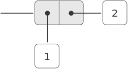
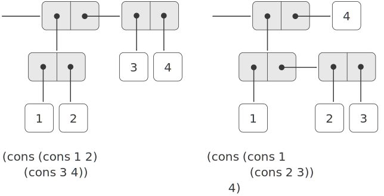

# 2.2  Hierarchical Data and the Closure Property(层次性数据和闭包性质)
As we have seen, pairs provide a primitive ''glue'' that we can use to construct compound data objects. Figure [2.2](#Figure2.2) shows a standard way to visualize a pair -- in this case, the pair formed by `(cons 1 2)`. In this representation, which is called **box-and-pointer notation**, each object is shown as a pointer to a box. The box for a primitive object contains a representation of the object. For example, the box for a number contains a numeral. The box for a pair is actually a double box, the left part containing (a pointer to) the `car` of the pair and the right part containing the `cdr`. 
正如在前面已经看到的，序对为我们提供了一种用于构造复合数据的基本“粘接剂”。图[2.2](#Figure2.2)展示的是一种以形象的形式看序对的标准方式，其中的序对是通过`(cons 1 2)`形成的。在这种称为 **盒子和指针表示方式** 中，每个对象表示为一个指向盒子的指针。与基本对象相对应的盒子里包含着该对象的表示，例如，表示数的盒子里就放着那个具体的数。用于表示序对的盒子实际上是一对方盒，其中左边的方盒里放着序对的`car`(指向`car`的指针),右边部分放着相应的`cdr`。

We have already seen that `cons` can be used to combine not only numbers but pairs as well. (You made use of this fact, or should have, in doing exercises [2.2] and [2.3].) As a consequence, pairs provide a universal building block from which we can construct all sorts of data structures. Figure [2.3](#Figure2.3) shows two ways to use pairs to combine the numbers 1, 2, 3, and 4. 
前面已经看到了，我们不仅可以用`cons`去组合起各种数值，也可以用它去组合起序对
(你在做练习[2.2]和练习[2.3]时已经，或者说应该，熟悉这一情况了)。作为这种情况的推论，序对就是一种通用的建筑砌块，通过它可以构造起所有不同种类的数据结构来。图[2.3](#Figure2.3)显示的是组合起数值1、2、3、4的两种不同方式。

<figure markdown>
  
  <figcaption>Figure 2.2:  Box-and-pointer representation of (cons 1 2).</figcaption>
</figure>

<figure markdown>
  
  <figcaption>Figure 2.3:  Two ways to combine 1, 2, 3, and 4 using pairs.</figcaption>
</figure>

The ability to create pairs whose elements are pairs is the essence of list structure's importance as a representational tool. We refer to this ability as the *closure property* of `cons`. In general, an operation for combining data objects satisfies the **closure property** if the results of combining things with that operation can themselves be combined using the same operation.[^1] Closure is the key to power in any means of combination because it permits us to create *hierarchical* structures -- structures made up of parts, which themselves are made up of parts, and so on. 
我们可以建立元素本身也是序对的序对，这就是表结构得以作为一种表示工具的根本基础。我们将这种能力称为cons的 **闭包性质**。一般说，某种组合数据对象的操作满足闭包性质，那就是说，通过它组合起数据对象得到的结果本身还可以通过同样的操作再进行组合[^1]。闭包性质是任何一种组合功能的威力的关键要素，因为它使我们能够建立起层次性的结构，这种结构由一些部分构成，而其中的各个部分又是由它们的部分构成，并且可以如此继续下去。

From the outset of chapter 1, we've made essential use of closure in dealing with procedures, because all but the very simplest programs rely on the fact that the elements of a combination can themselves be combinations. In this section, we take up the consequences of closure for compound data. We describe some conventional techniques for using pairs to represent sequences and trees, and we exhibit a graphics language that illustrates closure in a vivid way.[^2] 
从第1章的开始，我们在处理过程的问题中就利用了闭包性质，而且是最本质性的东西，因为除了最简单的程序外，所有程序都依赖于一个事实：组合式的成员本身还可以是组合式。在这一节里，我们要着手研究复合数据的闭包所引出的问题。这里将要描述一些用起来很方便的技术，包括用序对来表示序列和树。还要给出一种能以某种很生动的形式显示闭包的图形语言[^2]。

[^1]:
    The use of the word ''closure'' here comes from abstract algebra, where a set of elements is said to be closed under an operation if applying the operation to elements in the set produces an element that is again an element of the set. The Lisp community also (unfortunately) uses the word ''closure'' to describe a totally unrelated concept: A closure is an implementation technique for representing procedures with free variables. We do not use the word ``closure'' in this second sense in this book. 
    术语“闭包”来自抽象代数。在抽象代数里，一集元素称为在某个运算(操作)之下封闭，如果将该运算应用于这一集合中的元素，产生出的仍然是该集合里的元素。然而Lisp社团(很不幸)还用术语“闭包”描述另一个与此毫不相干的概念：闭包也是一种为表示带有自由变量的过程而用的实现技术。本书中没有采用闭包这一术语的第二种竟义。

[^2]:
    The notion that a means of combination should satisfy closure is a straightforward idea. Unfortunately, the data combiners provided in many popular programming languages do not satisfy closure, or make closure cumbersome to exploit. In Fortran or Basic, one typically combines data elements by assembling them into arrays -- but one cannot form arrays whose elements are themselves arrays. Pascal and C admit structures whose elements are structures. However, this requires that the programmer manipulate pointers explicitly, and adhere to the restriction that each field of a structure can contain only elements of a prespecified form. Unlike Lisp with its pairs, these languages have no built-in general-purpose glue that makes it easy to manipulate compound data in a uniform way. This limitation lies behind Alan Perlis's comment in his foreword to this book: ''In Pascal the plethora of declarable data structures induces a specialization within functions that inhibits and penalizes casual cooperation. It is better to have 100 functions operate on one data structure than to have 10 functions operate on 10 data structures.'' 
    一种组合方法应该满足闭包的要求是一种很明显的想法。然而，许多常见程序设计语言所提供的数据组合机制都不满足这一性质，或者是使得其中的闭包性质很难利用。在Fortran或Basic里，组合数据的一种典型方式是将它们放入数组——但人却不能做出元素本身是数组的数组。Pascal和C允许结构的元素又是结构，但却要求程序员去显式地操作指针，并限制性地要求结构的每个域都只能包含预先定义好形式的元素。与Lisp及其序对不同，这些语言都没有内部的通用性粘接剂，因此无法以统一的方式去操作复合数据。这一限制也就是Alan Perlis在本书前言中的评论的背景：“在Pascal里，过多的可声明数据结构导致了函数的专用化，这就造成了对合作的阻碍和惩罚。让100个函数在一个数据结构上操作，远比让10个函数在10个数据结构上操作更好些。"

[2.2]: {{ config.extra.homepage_sicp }}/chapter_2/chapter_2_1/2.1.2/#Exercise2.2

[2.3]: {{ config.extra.homepage_sicp }}/chapter_2/chapter_2_1/2.1.2/#Exercise2.3