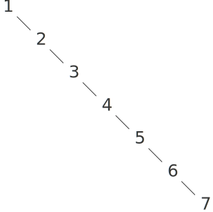

# 2.3.3  Example: Representing Sets(集合的表示)
In the previous examples we built representations for two kinds of compound data objects: rational numbers and algebraic expressions. In one of these examples we had the choice of simplifying (reducing) the expressions at either construction time or selection time, but other than that the choice of a representation for these structures in terms of lists was straightforward. When we turn to the representation of sets, the choice of a representation is not so obvious. Indeed, there are a number of possible representations, and they differ significantly from one another in several ways.<br>
在前面的实例中，我们已经构造起两类复合数据对象的表示：有理数和代数表达式。在这两个实例中，我们都采用了某一种选择，在构造时或者选择成员时去简化(约简)有关的表示。除此之外，选择用表的形式来表示这些结构都是直截了当的。现在我们要转到集合的表示问题，此时，表示方式的选择就不那么显然了。实际上，在这里存在几种选择，而且它们相互之间在几个方面存在明显的不同。

Informally, a set is simply a collection of distinct objects. To give a more precise definition we can employ the method of data abstraction. That is, we define ''set'' by specifying the operations that are to be used on sets. These are `union-set`, `intersection-set`, `element-of-set?`, and `adjoin-set`. `Element-of-set?` is a predicate that determines whether a given element is a member of a set. `Adjoin-set` takes an object and a set as arguments and returns a set that contains the elements of the original set and also the adjoined element. `Union-set` computes the union of two sets, which is the set containing each element that appears in either argument. `Intersection-set` computes the intersection of two sets, which is the set containing only elements that appear in both arguments. From the viewpoint of data abstraction, we are free to design any representation that implements these operations in a way consistent with the interpretations given above.[^1]<br>
非形式地说，一个集合就是一些不同对象的汇集。要给出一个更精确的定义，我们可以利用数据抽象的方法，也就是说，用一组可以作用于“集合”的操作来定义它们。这些操作是`union-set`,`intersection-set`,`element-of-set?`和`adjoin-set`。其中`element-of-set?`是一个谓词，用于确定某个给定元素是不是某个给定集合的成员。`adjoin-set`以一个对象和一个集合为参数，返回一个集合，其中包含了原集合的所有元素，再加上刚刚加入进来的这个新元素。`union-set`计算出两个集合的并集，这也是一个集合，其中包含了所有属于两个参数集合之一的元素。`intersection-set`计算出两个集合的交集，它包含着同时出现在两个参数集合中的那些元素。从数据抽象的观点看，我们在设计有关的表示方面具有充分的自由，只要在这种表示上实现的上述操作能以某种方式符合上面给出的解释[^1]。

## Sets as unordered lists(集合作为未排序的表)
One way to represent a set is as a list of its elements in which no element appears more than once. The empty set is represented by the empty list. In this representation, `element-of-set?` is similar to the procedure memq of section [2.3.1]. It uses `equal?` instead of `eq?` so that the set elements need not be symbols:<br>
集合的一种表示方式是用其元素的表，其中任何元素的出现都不超过一次。这样，空集就用空表来表示。对于这种表示形式，`element-of-set?`类似于[2.3.1]节的过程memq,但它应该用`equal?`而不是`eq?`,以保证集合元素可以不是符号：

```
(define (element-of-set? x set)
  (cond ((null? set) false)
        ((equal? x (car set)) true)
        (else (element-of-set? x (cdr set)))))
```

Using this, we can write `adjoin-set`. If the object to be adjoined is already in the set, we just return the set. Otherwise, we use `cons` to add the object to the list that represents the set:<br>
利用它就能写出`adjoin-set`。如果要加入的对象已经在相应集合里，那么就返回那个集合；否则就用`cons`将这一对象加入表示集合的表里：

```
(define (adjoin-set x set)
  (if (element-of-set? x set)
      set
      (cons x set)))
```

For `intersection-set` we can use a recursive strategy. If we know how to form the intersection of `set2` and the `cdr` of `set1`, we only need to decide whether to include the `car` of `set1` in this. But this depends on whether `(car set1)` is also in `set2`. Here is the resulting procedure:<br>
实现`intersection-set`时可以采用递归策略：如果我们已知如何做出`set2`与`set1`的`cdr`的交集，那么就只需要确定是否应将`set1`的`car`包含到结果之中了，而这依赖于`(car set1)`是否也在`set2`里。下面是这样写出的过程：

```
(define (intersection-set set1 set2)
  (cond ((or (null? set1) (null? set2)) '())
        ((element-of-set? (car set1) set2)        
         (cons (car set1)
               (intersection-set (cdr set1) set2)))
        (else (intersection-set (cdr set1) set2))))
```

In designing a representation, one of the issues we should be concerned with is efficiency. Consider the number of steps required by our set operations. Since they all use `element-of-set?`, the speed of this operation has a major impact on the efficiency of the set implementation as a whole. Now, in order to check whether an object is a member of a set, `element-of-set?` may have to scan the entire set. (In the worst case, the object turns out not to be in the set.) Hence, if the set has ${n}$ elements, `element-of-set?` might take up to ${n}$ steps. Thus, the number of steps required grows as ${\Theta(n)}$. The number of steps required by `adjoin-set`, which uses this operation, also grows as ${\Theta(n)}$. For `intersection-set`, which does an `element-of-set?` check for each element of `set1`, the number of steps required grows as the product of the sizes of the sets involved, or ${\Theta(n^2)}$ for two sets of size ${n}$. The same will be true of `union-set`.<br>
在设计一种表示形式时，有一件必须关注的事情是效率问题。为考虑这一问题，就需要考虑上面定义的各集合操作所需要的工作步数。因为它们都使用了`element-of-set?`,这一操作的速度对整个集合的实现效率将有重大影响。在上面这个实现里，为了检查某个对象是否为一个集合的成员，`element-of-set?`可能不得不扫描整个集合(最坏情况是这一元素恰好不在集合里)。因此，如果集合有n个元素，`element-of-set?`就可能需要n步才能完成。这样，这一操作所需的步数将以 ${\Theta(n)}$ 的速度增长。`adjoin-set`使用了这个操作，因此它所需的步数也以 ${\Theta(n)}$ 的速度增长。而对于`intersection-set`,它需要对`set1`的每个元素做一次`element-of-set?`检查，因此所需步数将按所涉及的两个集合的大小之乘积增长，或者说，在两个集合大小都为 ${n}$ 时就是 ${\Theta(n^2)}$。`union-set`的情况也是如此。

<div id="Exercise2.59" markdown>

Exercise 2.59.  Implement the `union-set` operation for the unordered-list representation of sets.<br>
练习2.59 请为采用未排序表的集合实现定义`union-set`操作。

</div>

<div id="Exercise2.60" markdown>

Exercise 2.60.  We specified that a set would be represented as a list with no duplicates. Now suppose we allow duplicates. For instance, the set `{1,2,3}` could be represented as the list `(2 3 2 1 3 2 2)`. Design procedures `element-of-set?`, `adjoin-set`, `union-set`, and `intersection-set` that operate on this representation. How does the efficiency of each compare with the corresponding procedure for the non-duplicate representation? Are there applications for which you would use this representation in preference to the non-duplicate one?<br>
练习2.60 我们前面说明了如何将集合表示为没有重复元素的表。现在假定允许重复，
例如，集合`{1,2,3}`可能被表示为表`(2 3 2 1 3 2 2)`。请为在这种表示上的操作设计过程`element-of-set?`、`adjoin-set`、`union-set`和`intersection-set`。与前面不重复表示里的相应操作相比，现在各个操作的效率怎么样?在什么样的应用中你更倾向于使用这种表示，而不是前面那种无重复的表示?

</div>


## Sets as ordered lists(集合作为排序的表)
One way to speed up our set operations is to change the representation so that the set elements are listed in increasing order. To do this, we need some way to compare two objects so that we can say which is bigger. For example, we could compare symbols lexicographically, or we could agree on some method for assigning a unique number to an object and then compare the elements by comparing the corresponding numbers. To keep our discussion simple, we will consider only the case where the set elements are numbers, so that we can compare elements using > and <. We will represent a set of numbers by listing its elements in increasing order. Whereas our first representation above allowed us to represent the set {1,3,6,10} by listing the elements in any order, our new representation allows only the list `(1 3 6 10)`.<br>
加速集合操作的一种方式是改变表示方式，使集合元素在表中按照上升序排列。为此，我们就需要有某种方式来比较两个元素，以便确定哪个元素更大一些。例如，我们可以按字典序做符号的比较；或者同意采用某种方式为每个对象关联一个唯一的数，在比较元素的时候就比较与之对应的数。为了简化这里的讨论，我们将仅仅考虑集合元素是数值的情况，这样就可以用>和<做元素的比较了。下面将数的集合表示为元素按照上升顺序排列的表。在前面第一种表示方式下，集合(1,3,6,10)的元素在相应的表里可以任意排列，而在现在的新表示方式中，我们就只允许用表`(1 3 6 10)`。

One advantage of ordering shows up in `element-of-set?`: In checking for the presence of an item, we no longer have to scan the entire set. If we reach a set element that is larger than the item we are looking for, then we know that the item is not in the set:<br>
从操作`element-of-set?`可以看到采用有序表示的一个优势：为了检查一个项的存在性，现在就不必扫描整个表了。如果检查中遇到的某个元素大于当时要找的东西，那么就可以断定这个东西根本不在表里：

```
(define (element-of-set? x set)
  (cond ((null? set) false)
        ((= x (car set)) true)
        ((< x (car set)) false)
        (else (element-of-set? x (cdr set)))))
```

How many steps does this save? In the worst case, the item we are looking for may be the largest one in the set, so the number of steps is the same as for the unordered representation. On the other hand, if we search for items of many different sizes we can expect that sometimes we will be able to stop searching at a point near the beginning of the list and that other times we will still need to examine most of the list. On the average we should expect to have to examine about half of the items in the set. Thus, the average number of steps required will be about ${n \big/ 2}$. This is still ${\Theta(n)}$ growth, but it does save us, on the average, a factor of 2 in number of steps over the previous implementation.<br>
这样能节约多少步数呢?在最坏情况下，我们要找的项目可能是集合中的最大元素，此时所需步数与采用未排序的表示时一样。但在另一方面，如果需要查找许多不同大小的项，我们总可以期望，有些时候这一检索可以在接近表开始处的某一点停止，也有些时候需要检查表的一大部分。平均而言，我们可以期望需要检查表中的一半元素，这样，平均所需的步数就是大约 ${n \big/ 2}$。这仍然是 ${\Theta(n)}$ 的增长速度，但与前一实现相比，平均来说，现在我们节约了大约一半的步数(这一解释并不合理；因为前面说未排序表需要检查整个表，考虑的只是一种特殊情况：查找没有出现在表里的元素。如果查找的是表里存在的元素，即使采用未排序的表，平均查找长度也是表元素的一半。——译者注)。


We obtain a more impressive speedup with `intersection-set`. In the unordered representation this operation required ${\Theta(n^2)}$ steps, because we performed a complete scan of `set2` for each element of `set1`. But with the ordered representation, we can use a more clever method. Begin by comparing the initial elements, `x1` and `x2`, of the two sets. If `x1` equals `x2`, then that gives an element of the intersection, and the rest of the intersection is the intersection of the `cdrs` of the two sets. Suppose, however, that `x1` is less than `x2`. Since `x2` is the smallest element in `set2`, we can immediately conclude that `x1` cannot appear anywhere in `set2` and hence is not in the intersection. Hence, the intersection is equal to the intersection of `set2` with the `cdr` of `set1`. Similarly, if `x2` is less than `x1`, then the intersection is given by the intersection of `set1` with the `cdr` of `set2`. Here is the procedure:<br>
操作`intersection-set`的加速情况更使人印象深刻。在未排序的表示方式里，这一操作需要 ${\Theta(n^2)}$ 的步数，因为对`set1`的每个元素，我们都需要对`set2`做一次完全的扫描。对于排序表示则可以有一种更聪明的方法。我们在开始时比较两个集合的起始元素，例如`x1`和`x2`。如果`x1`等于`x2`,那么这样就得到了交集的一个元素，而交集的其他元素就是这两个集合的`cdr`的交集。如果此时的情况是`x1`小于`x2`,由于`x2`是集合`set2`的最小元素，我们立即可以断定`x1`不会出现在集合`set2`里的任何地方，因此它不应该在交集里。这样，两集合的交集就等于集合`set2`与`set1`的`cdr`的交集。与此类似，如果`x2`小于`x1`,那么两集合的交集就等于集合`set1`与`set2`的`cdr`的交集。下面是按这种方式写出的过程：

```
(define (intersection-set set1 set2)
  (if (or (null? set1) (null? set2))
      '()    
      (let ((x1 (car set1)) (x2 (car set2)))
        (cond ((= x1 x2)
               (cons x1
                     (intersection-set (cdr set1)
                                       (cdr set2))))
              ((< x1 x2)
               (intersection-set (cdr set1) set2))
              ((< x2 x1)
               (intersection-set set1 (cdr set2)))))))
```

To estimate the number of steps required by this process, observe that at each step we reduce the intersection problem to computing intersections of smaller sets -- removing the first element from `set1` or `set2` or both. Thus, the number of steps required is at most the sum of the sizes of `set1` and `set2`, rather than the product of the sizes as with the unordered representation. This is ${\Theta(n)}$ growth rather than ${\Theta(n^2)}$ -- a considerable speedup, even for sets of moderate size.<br>
为了估计出这一过程所需的步数，请注意，在每个步骤中，我们都将求交集问题归结到更小集合的交集计算问题——去掉了`set1`和`set2`之一或者是两者的第一个元素。这样，所需步数至多等于`set1`与`set2`的大小之和，而不像在未排序表示中它们的乘积。这也就是 ${\Theta(n)}$ 的增长速度，而不是 ${\Theta(n^2)}$ ——这一加速非常明显，即使对中等大小的集合也是如此。

<div id="Exercise2.61" markdown>

Exercise 2.61.  Give an implementation of `adjoin-set` using the ordered representation. By analogy with `element-of-set?` show how to take advantage of the ordering to produce a procedure that requires on the average about half as many steps as with the unordered representation.<br>
练习2.61  请给出采用排序表示时`adjoin-set`的实现。通过类似`element-of-set?`的方式说明，可以如何利用排序的优势得到一个过程，其平均所需的步数是采用未排序表示时的一半。

</div>

Exercise 2.62.  Give a ${\Theta(n)}$ implementation of `union-set` for sets represented as ordered lists.<br>
练习2.62 请给出在集合的排序表示上`union-set`的一个 ${\Theta(n)}$ 实现。

## Sets as binary trees(集合作为二叉树)
We can do better than the ordered-list representation by arranging the set elements in the form of a tree. Each node of the tree holds one element of the set, called the ''entry'' at that node, and a link to each of two other (possibly empty) nodes. The ''left'' link points to elements smaller than the one at the node, and the ''right'' link to elements greater than the one at the node. Figure [2.16](#Figure2.16) shows some trees that represent the set {1,3,5,7,9,11}. The same set may be represented by a tree in a number of different ways. The only thing we require for a valid representation is that all elements in the left subtree be smaller than the node entry and that all elements in the right subtree be larger.<br>
如果将集合元素安排成一棵树的形式，我们还可以得到比排序表表示更好的结果。树中每个结点保存集合中的一个元素，称为该结点的“数据项”,它还链接到另外的两个结点(可能为空)。其中“左边”的链接所指向的所有元素均小于本结点的元素，而“右边”链接到的元素都大于本结点里的元素。图[2.16](#Figure2.16)显示的是一棵表示集合的树。同一个集合表示为树可以有多种不同的方式，我们对一个合法表示的要求就是，位于左子树里的所有元素都小于本结点里的数据项，而位于右子树里的所有元素都大于它。

<div id="Figure2.16" markdown>

<figure markdown>
  
  <figcaption>Figure 2.16:  Various binary trees that represent the set { 1,3,5,7,9,11 }.</figcaption>
</figure>

</div>

The advantage of the tree representation is this: Suppose we want to check whether a number ${x}$ is contained in a set. We begin by comparing ${x}$ with the entry in the top node. If ${x}$ is less than this, we know that we need only search the left subtree; if ${x}$ is greater, we need only search the right subtree. Now, if the tree is ''balanced,'' each of these subtrees will be about half the size of the original. Thus, in one step we have reduced the problem of searching a tree of size ${n}$ to searching a tree of size ${n \big/ 2}$. Since the size of the tree is halved at each step, we should expect that the number of steps needed to search a tree of size ${n}$ grows as ${\Theta(\log n)}$.[^2] For large sets, this will be a significant speedup over the previous representations.<br>
树表示方法的优点在于：假定我们希望检查某个数 ${x}$ 是否在一个集合里，那么就可以用 ${x}$ 与树顶结点的数据项相比较。如果 ${x}$ 小于它，我们就知道现在只需要搜索左子树；如果 ${x}$ 比较大，那么就只需搜索右子树。在这样做时，如果该树是“平衡的”,也就是说，每棵子树大约是整个树的一半大，那么，这样经过一步，我们就将需要搜索规模为 ${n}$ 的树的问题，归约为搜索规模为 ${n \big/ 2}$ 的树的问题。由于经过每个步骤能够使树的大小减小一半，我们可以期望搜索规模为 ${n}$ 的树的计算步数以 ${\Theta(\log n)}$ 速度增长[^2]。在集合很大时，相对于原来的表示，现在的操作速度将明显快得多。

We can represent trees by using lists. Each node will be a list of three items: the entry at the node, the left subtree, and the right subtree. A left or a right subtree of the empty list will indicate that there is no subtree connected there. We can describe this representation by the following procedures:[^3]<br>
我们可以用表来表示树，将结点表示为三个元素的表：本结点中的数据项，其左子树和右子树。以空表作为左子树或者右子树，就表示没有子树连接在那里。我们可以用下面过程描述这种表示[^3]:

```
(define (entry tree) (car tree))
(define (left-branch tree) (cadr tree))
(define (right-branch tree) (caddr tree))
(define (make-tree entry left right)
  (list entry left right))
```

Now we can write the `element-of-set?` procedure using the strategy described above:<br>
现在，我们就可以采用上面描述的方式实现过程`element-of-set?`了：

```
(define (element-of-set? x set)
  (cond ((null? set) false)
        ((= x (entry set)) true)
        ((< x (entry set))
         (element-of-set? x (left-branch set)))
        ((> x (entry set))
         (element-of-set? x (right-branch set)))))
```

Adjoining an item to a set is implemented similarly and also requires ${\Theta(\log n)}$ steps. To adjoin an item `x`, we compare `x` with the node entry to determine whether `x` should be added to the right or to the left branch, and having adjoined `x` to the appropriate branch we piece this newly constructed branch together with the original entry and the other branch. If `x` is equal to the entry, we just return the node. If we are asked to adjoin `x` to an empty tree, we generate a tree that has `x` as the entry and empty right and left branches. Here is the procedure:<br>
向集合里加入一个项的实现方式与此类似，也需要 ${\Theta(\log n)}$ 步数。为了加入元素`x`,我们需要将`x`与结点数据项比较，以便确定`x`应该加入右子树还是左子树中。在将`x`加入适当的分支之后，我们将新构造出的这个分支、原来的数据项与另一分支放到一起。如果`x`等于这个数据项，那么就直接返回这个结点。如果需要将x加入一个空子树，那么我们就生成一棵树，以`x`作为数据项，并让它具有空的左右分支。下面是这个过程：

```
(define (adjoin-set x set)
  (cond ((null? set) (make-tree x '() '()))
        ((= x (entry set)) set)
        ((< x (entry set))
         (make-tree (entry set) 
                    (adjoin-set x (left-branch set))
                    (right-branch set)))
        ((> x (entry set))
         (make-tree (entry set)
                    (left-branch set)
                    (adjoin-set x (right-branch set))))))
```

The above claim that searching the tree can be performed in a logarithmic number of steps rests on the assumption that the tree is ''balanced,'' i.e., that the left and the right subtree of every tree have approximately the same number of elements, so that each subtree contains about half the elements of its parent. But how can we be certain that the trees we construct will be balanced? Even if we start with a balanced tree, adding elements with `adjoin-set` may produce an unbalanced result. Since the position of a newly adjoined element depends on how the element compares with the items already in the set, we can expect that if we add elements ''randomly'' the tree will tend to be balanced on the average. But this is not a guarantee. For example, if we start with an empty set and adjoin the numbers 1 through 7 in sequence we end up with the highly unbalanced tree shown in figure [2.17](#Figure2.17). In this tree all the left subtrees are empty, so it has no advantage over a simple ordered list. One way to solve this problem is to define an operation that transforms an arbitrary tree into a balanced tree with the same elements. Then we can perform this transformation after every few `adjoin-set` operations to keep our set in balance. There are also other ways to solve this problem, most of which involve designing new data structures for which searching and insertion both can be done in ${\Theta(\log n)}$ steps.[^4]<br>
我们在上面断言，搜索树的操作可以在对数步数中完成，这实际上依赖于树“平衡”的假设，也就是说，每个树的左右子树中的结点大致上一样多，因此每棵子树中包含的结点大约就是其父的一半。但是我们怎么才能确保构造出的树是平衡的呢?即使是从一棵平衡的树开始工作，采用`adjoin-set`加入元素也可能产生出不平衡的结果。因为新加入元素的位置依赖于它与当时已经在树中的那些项比较的情况。我们可以期望，如果“随机地”将元素加入树中，平均而言将会使树趋于平衡。但在这里并没有任何保证。例如，如果我们从空集出发，顺序将数值1至7加入其中，我们就会得到如图[2.17](#Figure2.17)所示的高度不平衡的树。在这个树里，所有的左子树都为空，所以它与简单排序表相比一点优势也没有。解决这个问题的一种方式是定义一个操作，它可以将任意的树变换为一棵具有同样元素的平衡树。在每执行过几次`adjoin-set`操作之后，我们就可以通过执行它来保持树的平衡。当然，解决这一问题的方法还有许多，大部分这类方法都涉及到设计一种新的数据结构，设法使这种数据结构上的搜索和插入操作都能够 ${\Theta(\log n)}$ 步数内完成[^4]。


<div id="Figure2.17" markdown>

<figure markdown>
  
  <figcaption>Figure 2.17:  Unbalanced tree produced by adjoining 1 through 7 in sequence.</figcaption>
</figure>

</div>

<div id="Exercise2.63" markdown>

Exercise 2.63.  Each of the following two procedures converts a binary tree to a list.<br>
练习2.63  下面两个过程都能将树变换为表：

```
(define (tree->list-1 tree)
  (if (null? tree)
      '()
      (append (tree->list-1 (left-branch tree))
              (cons (entry tree)
                    (tree->list-1 (right-branch tree))))))
(define (tree->list-2 tree)
  (define (copy-to-list tree result-list)
    (if (null? tree)
        result-list
        (copy-to-list (left-branch tree)
                      (cons (entry tree)
                            (copy-to-list (right-branch tree)
                                          result-list)))))
  (copy-to-list tree '()))
```

a. Do the two procedures produce the same result for every tree? If not, how do the results differ? What lists do the two procedures produce for the trees in figure [2.16]](#Figure2.16)?<br>
这两个过程对所有的树都产生同样结果吗?如果不是，它们产生出的结果有什么不同?它们对图[2.16]](#Figure2.16)中的那些树产生什么样的表?

b. Do the two procedures have the same order of growth in the number of steps required to convert a balanced tree with ${n}$ elements to a list? If not, which one grows more slowly?<br>
将 ${n}$ 个结点的平衡树变换为表时，这两个过程所需的步数具有同样量级的增长速度吗?如果不一样，哪个过程增长得慢一些?

</div>

<div id="Exercise2.64" markdown>

Exercise 2.64.  The following procedure `list->tree` converts an ordered list to a balanced binary tree. The helper procedure `partial-tree` takes as arguments an integer ${n}$ and list of at least ${n}$ elements and constructs a balanced tree containing the first ${n}$ elements of the list. The result returned by `partial-tree` is a pair (formed with `cons`) whose `car` is the constructed tree and whose `cdr` is the list of elements not included in the tree.<br>
练习2.64 下面过程`list->tree`将一个有序表变换为一棵平衡二叉树。其中的辅助函数`partial-tree`以整数 ${n}$ 和一个至少包含 ${n}$ 个元素的表为参数，构造出一棵包含这个表的前n个元素的平衡树。由`partial-tree`返回的结果是一个序对(用`cons`构造),其`car`是构造出的树，其`cdr`是没有包含在树中那些元素的表。

```
(define (list->tree elements)
  (car (partial-tree elements (length elements))))

(define (partial-tree elts n)
  (if (= n 0)
      (cons '() elts)
      (let ((left-size (quotient (- n 1) 2)))
        (let ((left-result (partial-tree elts left-size)))
          (let ((left-tree (car left-result))
                (non-left-elts (cdr left-result))
                (right-size (- n (+ left-size 1))))
            (let ((this-entry (car non-left-elts))
                  (right-result (partial-tree (cdr non-left-elts)
                                              right-size)))
              (let ((right-tree (car right-result))
                    (remaining-elts (cdr right-result)))
                (cons (make-tree this-entry left-tree right-tree)
                      remaining-elts))))))))
```

a. Write a short paragraph explaining as clearly as you can how `partial-tree` works. Draw the tree produced by `list->tree` for the list `(1 3 5 7 9 11)`.<br>
请简要地并尽可能清楚地解释为什么`partial-tree`能完成工作。请画出将`list->tree`用于表`(1 3 5 7 9 11)`产生出的树。

b. What is the order of growth in the number of steps required by `list->tree` to convert a list of n elements?<br>
过程`list->tree`转换n个元素的表所需的步数以什么量级增长?

</div>

<div id="Exercise2.65" markdown>

Exercise 2.65.  Use the results of exercises [2.63](#Exercise2.63) and  [2.64](#Exercise2.64) to give ${\Theta(\log n)}$ implementations of `union-set` and `intersection-set` for sets implemented as (balanced) binary trees.[^5]<br>
练习2.65 利用练习[2.63](#Exercise2.63)和练习[2.64](#Exercise2.64)的结果，给出对采用(平衡)二叉树方式实现的集合的`union-set`和`intersection-set`操作的 ${\Theta(\log n)}$ 实现[^5]。


## Sets and information retrieval(集合与信息检索)
We have examined options for using lists to represent sets and have seen how the choice of representation for a data object can have a large impact on the performance of the programs that use the data. Another reason for concentrating on sets is that the techniques discussed here appear again and again in applications involving information retrieval.<br>
我们考察了用表表示集合的各种选择，并看到了数据对象表示的选择可能如何深刻地影响到使用数据的程序的性能。关注集合的另一个原因是，这里所讨论的技术在涉及信息检索的各种应用中将会一次又一次地出现。

Consider a data base containing a large number of individual records, such as the personnel files for a company or the transactions in an accounting system. A typical data-management system spends a large amount of time accessing or modifying the data in the records and therefore requires an efficient method for accessing records. This is done by identifying a part of each record to serve as an identifying `key`. A key can be anything that uniquely identifies the record. For a personnel file, it might be an employee's ID number. For an accounting system, it might be a transaction number. Whatever the key is, when we define the record as a data structure we should include a `key` selector procedure that retrieves the key associated with a given record.<br>
现在考虑一个包含大量独立记录的数据库，例如一个企业中的人事文件，或者一个会计系统里的交易记录。典型的数据管理系统都需将大量时间用在访问和修改所存的数据上，因此就需要访问记录的高效方法。完成此事的一种方式是将每个记录中的一部分当作标识`key`(键值)。所用键值可以是任何能唯一标识记录的东西。对于人事文件而言，它可能是雇员的ID编码。对于会计系统而言，它可能是交易的编号。在确定了采用什么键值之后，就可以将记录定义为一种数据结构，并包含`key`选择过程，它可以从给定记录中提取出有关的键值。

Now we represent the data base as a set of records. To locate the record with a given key we use a procedure `lookup`, which takes as arguments a key and a data base and which returns the record that has that key, or false if there is no such record. `Lookup` is implemented in almost the same way as `element-of-set?`. For example, if the set of records is implemented as an unordered list, we could use<br>
现在就可以将这个数据库表示为一个记录的集合。为了根据给定键值确定相关记录的位置，我们用一个过程`lookup`,它以一个键值和一个数据库为参数，返回具有这个键值的记录，或者在找不到相应记录时报告失败。`lookup`的实现方式几乎与`element-of-set?`一模一样，如果记录的集合被表示为未排序的表，我们就可以用：

```
(define (lookup given-key set-of-records)
  (cond ((null? set-of-records) false)
        ((equal? given-key (key (car set-of-records)))
         (car set-of-records))
        (else (lookup given-key (cdr set-of-records)))))
```

Of course, there are better ways to represent large sets than as unordered lists. Information-retrieval systems in which records have to be ''randomly accessed'' are typically implemented by a tree-based method, such as the binary-tree representation discussed previously. In designing such a system the methodology of data abstraction can be a great help. The designer can create an initial implementation using a simple, straightforward representation such as unordered lists. This will be unsuitable for the eventual system, but it can be useful in providing a ''quick and dirty'' data base with which to test the rest of the system. Later on, the data representation can be modified to be more sophisticated. If the data base is accessed in terms of abstract selectors and constructors, this change in representation will not require any changes to the rest of the system.<br>
不言而喻，还有比未排序表更好的表示大集合的方法。常常需要“随机访问”其中记录的信息检索系统通常用某种基于树的方法实现，例如用前面讨论过的二叉树。在设计这种系统时，数据抽象的方法学将很有帮助。设计师可以创建某种简单而直接的初始实现，例如采用未排序的表。对于最终系统而言，这种做法显然并不合适，但采用这种方式提供一个“一挥而就”的数据库，对用于测试系统的其他部分则可能很有帮助。然后可以将数据表示修改得更加精细。如果对数据库的访问都是基于抽象的选择函数和构造函数，这种表示的改变就不会要求对系统其余部分做任何修改。

<div id="Exercise2.66" markdown>

Exercise 2.66.  Implement the `lookup` procedure for the case where the set of records is structured as a binary tree, ordered by the numerical values of the keys.<br>
练习2.66  假设记录的集合来用二叉树实现，按照其中作为键值的数值排序。请实现相应的`lookup`过程。

</div>

[^1]: 
    If we want to be more formal, we can specify ''consistent with the interpretations given above'' to mean that the operations satisfy a collection of rules such as these:<br>
    如果希望更形式化些，可以将“以某种方式符合上面给出的解释”说明为，有关操作必须满足以规则：

    - For any set `S` and any object `x`, `(element-of-set? x (adjoin-set x S))` is true (informally: ``Adjoining an object to a set produces a set that contains the object'').<br />
    对于任何集合`S`和对象x,`(element-of-set? x (adjoin-set x S))`为真(非形式地说，“将一个对象加入某集合后产生的集合里包含着这个对象")。

    - For any sets `S` and `T` and any object `x`, `(element-of-set? x (union-set S T))` is equal to `(or (element-of-set? x S) (element-of-set? x T))` (informally: ''The elements of (union S T) are the elements that are in S or in T'').<br>
    对于任何集合`S`和`T`,以及对象`x`, `(element-of-set? x (union-set S T))`等于 `(or (element-of-set? x S) (element-of-set? x T))` (非形式地说，`(union S T)`的元素,就是在S里或者在T里的元素)。

    - For any object `x`, `(element-of-set? x '())` is false (informally: ''No object is an element of the empty set'').<br>
    对于任何对象`x`, `(element-of-set? x '0)`为假(非形式地说，任何对象都不是空集的元素)。


[^2]:
    Halving the size of the problem at each step is the distinguishing characteristic of logarithmic growth, as we saw with the fast-exponentiation algorithm of section [1.2.4] and the half-interval search method of section [1.3.3].<br>
    每步使问题规模减小一半，这就是对数型增长的最明显特征，就像我们在[1.2.4]节里的快速求幂算法和[1.3.3]节里的半区间搜索算法中所看到的那样。

[^3]:
    We are representing sets in terms of trees, and trees in terms of lists -- in effect, a data abstraction built upon a data abstraction. We can regard the procedures `entry`, `left-branch`, `right-branch`, and `make-tree` as a way of isolating the abstraction of a ''binary tree'' from the particular way we might wish to represent such a tree in terms of list structure.<br>
    我们用树来表示集合，而树本身又用表表示——从作用上看，这就是在一种数据抽象上面构造另一种数据抽象。我们可以把过程`entry`、`left-branch`、`right-branch`和`make-tree`看作是一种方法，它将“二叉树”抽象隔离于如何用表结构表示它的特定方式之外。

[^4]:
    Examples of such structures include *B-trees and red-black trees*. There is a large literature on data structures devoted to this problem. See Cormen, Leiserson, and Rivest 1990.，<br>
    这种结构的例子如B树和红黑树。存在大量有关数据结构的文献讨论这一问题，参见Cormen,Leiserson,andRivest 1990.

[^5]:
    Exercises [2.63](#Exercise2.63)-[2.65](#Exercise2.65) are due to Paul Hilfinger.<br>
    练习[2.63](#Exercise2.63)到[2.65](#Exercise2.65)来自Paul Hilfinger.

[2.3.1]: {{ config.extra.homepage_sicp }}/chapter_2/chapter_2_3/2.3.1/

[1.2.4]: {{ config.extra.homepage_sicp }}/chapter_1/chapter_1_2/1.2.4/

[1.3.3]: {{ config.extra.homepage_sicp }}/chapter_1/chapter_1_3/1.3.3/