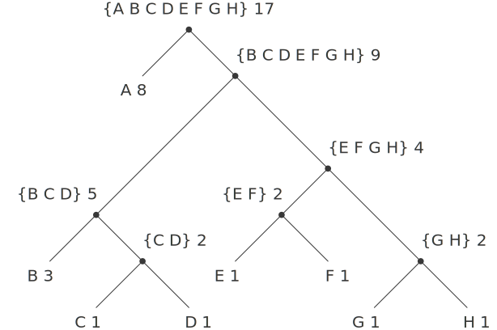

# 2.3.4  Example: Huffman Encoding Trees
This section provides practice in the use of list structure and data abstraction to manipulate sets and trees. The application is to methods for representing data as sequences of ones and zeros (bits). For example, the ASCII standard code used to represent text in computers encodes each character as a sequence of seven bits. Using seven bits allows us to distinguish ${2^7}$, or 128, possible different characters. In general, if we want to distinguish ${n}$ different symbols, we will need to use ${\log_2\!n}$ bits per symbol. If all our messages are made up of the eight symbols A, B, C, D, E, F, G, and H, we can choose a code with three bits per character, for example

```
A 000	C 010	E 100	G 110
B 001	D 011	F 101	H 111
```

With this code, the message

```
BACADAEAFABBAAAGAH
```

is encoded as the string of 54 bits

```
001000010000011000100000101000001001000000000110000111
```

Codes such as ASCII and the A-through-H code above are known as *fixed-length* codes, because they represent each symbol in the message with the same number of bits. It is sometimes advantageous to use *variable-length* codes, in which different symbols may be represented by different numbers of bits. For example, Morse code does not use the same number of dots and dashes for each letter of the alphabet. In particular, E, the most frequent letter, is represented by a single dot. In general, if our messages are such that some symbols appear very frequently and some very rarely, we can encode data more efficiently (i.e., using fewer bits per message) if we assign shorter codes to the frequent symbols. Consider the following alternative code for the letters A through H:

```
A 0	C 1010	E 1100	G 1110
B 100	D 1011	F 1101	H 1111
```

With this code, the same message as above is encoded as the string

```
100010100101101100011010100100000111001111
```

This string contains 42 bits, so it saves more than 20% in space in comparison with the fixed-length code shown above.

One of the difficulties of using a variable-length code is knowing when you have reached the end of a symbol in reading a sequence of zeros and ones. Morse code solves this problem by using a special separator code (in this case, a pause) after the sequence of dots and dashes for each letter. Another solution is to design the code in such a way that no complete code for any symbol is the beginning (or *prefix*) of the code for another symbol. Such a code is called a *prefix* code. In the example above, A is encoded by 0 and B is encoded by 100, so no other symbol can have a code that begins with 0 or with 100.

In general, we can attain significant savings if we use variable-length prefix codes that take advantage of the relative frequencies of the symbols in the messages to be encoded. One particular scheme for doing this is called the Huffman encoding method, after its discoverer, David Huffman. A Huffman code can be represented as a binary tree whose leaves are the symbols that are encoded. At each non-leaf node of the tree there is a set containing all the symbols in the leaves that lie below the node. In addition, each symbol at a leaf is assigned a weight (which is its relative frequency), and each non-leaf node contains a weight that is the sum of all the weights of the leaves lying below it. The weights are not used in the encoding or the decoding process. We will see below how they are used to help construct the tree.

<div id="Figure2.18" markdown>

<figure markdown>
  
  <figcaption>Figure 2.18:  A Huffman encoding tree.</figcaption>
</figure>

</div>

Figure [2.18](#Figure2.18) shows the Huffman tree for the A-through-H code given above. The weights at the leaves indicate that the tree was designed for messages in which A appears with relative frequency 8, B with relative frequency 3, and the other letters each with relative frequency 1.

Given a Huffman tree, we can find the encoding of any symbol by starting at the root and moving down until we reach the leaf that holds the symbol. Each time we move down a left branch we add a 0 to the code, and each time we move down a right branch we add a 1. (We decide which branch to follow by testing to see which branch either is the leaf node for the symbol or contains the symbol in its set.) For example, starting from the root of the tree in figure [2.18](#Figure2.18), we arrive at the leaf for D by following a right branch, then a left branch, then a right branch, then a right branch; hence, the code for D is 1011.

To decode a bit sequence using a Huffman tree, we begin at the root and use the successive zeros and ones of the bit sequence to determine whether to move down the left or the right branch. Each time we come to a leaf, we have generated a new symbol in the message, at which point we start over from the root of the tree to find the next symbol. For example, suppose we are given the tree above and the sequence 10001010. Starting at the root, we move down the right branch, (since the first bit of the string is 1), then down the left branch (since the second bit is 0), then down the left branch (since the third bit is also 0). This brings us to the leaf for B, so the first symbol of the decoded message is B. Now we start again at the root, and we make a left move because the next bit in the string is 0. This brings us to the leaf for A. Then we start again at the root with the rest of the string 1010, so we move right, left, right, left and reach C. Thus, the entire message is BAC.


## Generating Huffman trees
Given an ''alphabet'' of symbols and their relative frequencies, how do we construct the ''best'' code? (In other words, which tree will encode messages with the fewest bits?) Huffman gave an algorithm for doing this and showed that the resulting code is indeed the best variable-length code for messages where the relative frequency of the symbols matches the frequencies with which the code was constructed. We will not prove this optimality of Huffman codes here, but we will show how Huffman trees are constructed.[^1]

The algorithm for generating a Huffman tree is very simple. The idea is to arrange the tree so that the symbols with the lowest frequency appear farthest away from the root. Begin with the set of leaf nodes, containing symbols and their frequencies, as determined by the initial data from which the code is to be constructed. Now find two leaves with the lowest weights and merge them to produce a node that has these two nodes as its left and right branches. The weight of the new node is the sum of the two weights. Remove the two leaves from the original set and replace them by this new node. Now continue this process. At each step, merge two nodes with the smallest weights, removing them from the set and replacing them with a node that has these two as its left and right branches. The process stops when there is only one node left, which is the root of the entire tree. Here is how the Huffman tree of figure [2.18](#Figure2.18) was generated:

```
Initial leaves	{(A 8) (B 3) (C 1) (D 1) (E 1) (F 1) (G 1) (H 1)}
Merge {(A 8) (B 3) ({C D} 2) (E 1) (F 1) (G 1) (H 1)}
Merge {(A 8) (B 3) ({C D} 2) ({E F} 2) (G 1) (H 1)}
Merge {(A 8) (B 3) ({C D} 2) ({E F} 2) ({G H} 2)}
Merge {(A 8) (B 3) ({C D} 2) ({E F G H} 4)}
Merge {(A 8) ({B C D} 5) ({E F G H} 4)}
Merge {(A 8) ({B C D E F G H} 9)}
Final merge {({A B C D E F G H} 17)}
```

The algorithm does not always specify a unique tree, because there may not be unique smallest-weight nodes at each step. Also, the choice of the order in which the two nodes are merged (i.e., which will be the right branch and which will be the left branch) is arbitrary.

## Representing Huffman trees
In the exercises below we will work with a system that uses Huffman trees to encode and decode messages and generates Huffman trees according to the algorithm outlined above. We will begin by discussing how trees are represented.

Leaves of the tree are represented by a list consisting of the symbol leaf, the symbol at the `leaf`, and the weight:

```
(define (make-leaf symbol weight)
  (list 'leaf symbol weight))
(define (leaf? object)
  (eq? (car object) 'leaf))
(define (symbol-leaf x) (cadr x))
(define (weight-leaf x) (caddr x))
```

A general tree will be a list of a left branch, a right branch, a set of symbols, and a weight. The set of symbols will be simply a list of the symbols, rather than some more sophisticated set representation. When we make a tree by merging two nodes, we obtain the weight of the tree as the sum of the weights of the nodes, and the set of symbols as the union of the sets of symbols for the nodes. Since our symbol sets are represented as lists, we can form the union by using the append procedure we defined in section [2.2.1]:

```
(define (make-code-tree left right)
  (list left
        right
        (append (symbols left) (symbols right))
        (+ (weight left) (weight right))))
```

If we make a tree in this way, we have the following selectors:

```
(define (left-branch tree) (car tree))

(define (right-branch tree) (cadr tree))
(define (symbols tree)
  (if (leaf? tree)
      (list (symbol-leaf tree))
      (caddr tree)))
(define (weight tree)
  (if (leaf? tree)
      (weight-leaf tree)
      (cadddr tree)))
```

The procedures `symbols` and `weight` must do something slightly different depending on whether they are called with a leaf or a general tree. These are simple examples of *generic procedures* (procedures that can handle more than one kind of data), which we will have much more to say about in sections [2.4] and [2.5].


## The decoding procedure
The following procedure implements the decoding algorithm. It takes as arguments a list of zeros and ones, together with a Huffman tree.

```
(define (decode bits tree)
  (define (decode-1 bits current-branch)
    (if (null? bits)
        '()
        (let ((next-branch
               (choose-branch (car bits) current-branch)))
          (if (leaf? next-branch)
              (cons (symbol-leaf next-branch)
                    (decode-1 (cdr bits) tree))
              (decode-1 (cdr bits) next-branch)))))
  (decode-1 bits tree))
(define (choose-branch bit branch)
  (cond ((= bit 0) (left-branch branch))
        ((= bit 1) (right-branch branch))
        (else (error "bad bit -- CHOOSE-BRANCH" bit))))
```

The procedure `decode-1` takes two arguments: the list of remaining bits and the current position in the tree. It keeps moving ''down'' the tree, choosing a left or a right branch according to whether the next bit in the list is a zero or a one. (This is done with the procedure `choose-branch`.) When it reaches a leaf, it returns the symbol at that leaf as the next symbol in the message by `cons`ing it onto the result of decoding the rest of the message, starting at the root of the tree. Note the error check in the final clause of `choose-branch`, which complains if the procedure finds something other than a zero or a one in the input data.

## Sets of weighted elements
In our representation of trees, each non-leaf node contains a set of symbols, which we have represented as a simple list. However, the tree-generating algorithm discussed above requires that we also work with sets of leaves and trees, successively merging the two smallest items. Since we will be required to repeatedly find the smallest item in a set, it is convenient to use an ordered representation for this kind of set.

We will represent a set of leaves and trees as a list of elements, arranged in increasing order of weight. The following `adjoin-set` procedure for constructing sets is similar to the one described in exercise [2.61]; however, items are compared by their weights, and the element being added to the set is never already in it.

```
(define (adjoin-set x set)
  (cond ((null? set) (list x))
        ((< (weight x) (weight (car set))) (cons x set))
        (else (cons (car set)
                    (adjoin-set x (cdr set))))))
```

The following procedure takes a list of symbol-frequency pairs such as `((A 4) (B 2) (C 1) (D 1))` and constructs an initial ordered set of leaves, ready to be merged according to the Huffman algorithm:

```
(define (make-leaf-set pairs)
  (if (null? pairs)
      '()
      (let ((pair (car pairs)))
        (adjoin-set (make-leaf (car pair)    ; symbol
                               (cadr pair))  ; frequency
                    (make-leaf-set (cdr pairs))))))
```

<div id="Exercise2.67" markdown>

Exercise 2.67.  Define an encoding tree and a sample message:

```
(define sample-tree
  (make-code-tree (make-leaf 'A 4)
                  (make-code-tree
                   (make-leaf 'B 2)
                   (make-code-tree (make-leaf 'D 1)
                                   (make-leaf 'C 1)))))

(define sample-message '(0 1 1 0 0 1 0 1 0 1 1 1 0))
```

Use the `decode` procedure to decode the message, and give the result.

</div>

<div id="Exercise2.68" markdown>

Exercise 2.68.  The `encode` procedure takes as arguments a message and a tree and produces the list of bits that gives the encoded message.

```
(define (encode message tree)
  (if (null? message)
      '()
      (append (encode-symbol (car message) tree)
              (encode (cdr message) tree))))
```

`Encode-symbol` is a procedure, which you must write, that returns the list of bits that encodes a given symbol according to a given tree. You should design `encode-symbol` so that it signals an error if the symbol is not in the tree at all. Test your procedure by encoding the result you obtained in exercise [2.67](#Exercise2.67) with the sample tree and seeing whether it is the same as the original sample message.

</div>

<div id="Exercise2.69" markdown>

Exercise 2.69.  The following procedure takes as its argument a list of symbol-frequency pairs (where no symbol appears in more than one pair) and generates a Huffman encoding tree according to the Huffman algorithm.

```
(define (generate-huffman-tree pairs)
  (successive-merge (make-leaf-set pairs)))
```

`Make-leaf-set` is the procedure given above that transforms the list of pairs into an ordered set of leaves. `Successive-merge` is the procedure you must write, using `make-code-tree` to successively merge the smallest-weight elements of the set until there is only one element left, which is the desired Huffman tree. (This procedure is slightly tricky, but not really complicated. If you find yourself designing a complex procedure, then you are almost certainly doing something wrong. You can take significant advantage of the fact that we are using an ordered set representation.)

</div>

<div id="Exercise2.70" markdown>

Exercise 2.70.  The following eight-symbol alphabet with associated relative frequencies was designed to efficiently encode the lyrics of 1950s rock songs. (Note that the ''symbols'' of an ''alphabet'' need not be individual letters.)

```
A	2	NA	16
BOOM	1	SHA	3
GET	2	YIP	9
JOB	2	WAH	1
```

Use `generate-huffman-tree` (exercise [2.69](#Exercise2.69)) to generate a corresponding Huffman tree, and use encode (exercise [2.68](#Exercise2.68)) to encode the following message:

```
Get a job

Sha na na na na na na na na

Get a job

Sha na na na na na na na na

Wah yip yip yip yip yip yip yip yip yip

Sha boom
```

How many bits are required for the encoding? What is the smallest number of bits that would be needed to encode this song if we used a fixed-length code for the eight-symbol alphabet?

</div>

<div id="Exercise2.71" markdown>

Exercise 2.71.  Suppose we have a Huffman tree for an alphabet of ${n}$ symbols, and that the relative frequencies of the symbols are ${1, 2, 4, \dots, 2^{n-1}}$. Sketch the tree for ${n=5}$; for ${n=10}$. In such a tree (for general ${n}$) how many bits are required to encode the most frequent symbol? the least frequent symbol?

</div>

<div id="Exercise2.72" markdown>

Exercise 2.72.  Consider the encoding procedure that you designed in exercise [2.68](#Exercise2.68). What is the order of growth in the number of steps needed to encode a symbol? Be sure to include the number of steps needed to search the symbol list at each node encountered. To answer this question in general is difficult. Consider the special case where the relative frequencies of the n symbols are as described in exercise [2.71](#Exercise2.71), and give the order of growth (as a function of n) of the number of steps needed to encode the most frequent and least frequent symbols in the alphabet.

</div>

[^1]:
    See Hamming 1980 for a discussion of the mathematical properties of Huffman codes.

[2.2.1]: {{ config.extra.homepage_sicp }}/chapter_2/chapter_2_2/2.2.1/

[2.4]: {{ config.extra.homepage_sicp }}/chapter_2/chapter_2_4/

[2.5]: {{ config.extra.homepage_sicp }}/chapter_2/chapter_2_5/

[2.61]: {{ config.extra.homepage_sicp }}/chapter_2/chapter_2_3/2.3.3/Exercise2.61