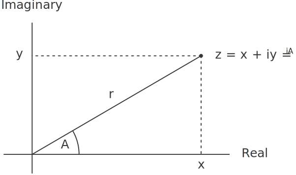

# 2.4.1  Representations for Complex Numbers
We will develop a system that performs arithmetic operations on complex numbers as a simple but unrealistic example of a program that uses generic operations. We begin by discussing two plausible representations for complex numbers as ordered pairs: rectangular form (real part and imaginary part) and polar form (magnitude and angle).[^1] Section [2.4.2] will show how both representations can be made to coexist in a single system through the use of type tags and generic operations.

Like rational numbers, complex numbers are naturally represented as ordered pairs. The set of complex numbers can be thought of as a two-dimensional space with two orthogonal axes, the ''real'' axis and the ''imaginary'' axis. (See figure [2.20].) From this point of view, the complex number ${z = x + iy}$ (where ${i^2 = -1}$) can be thought of as the point in the plane whose real coordinate is ${x}$ and whose imaginary coordinate is ${y}$. Addition of complex numbers reduces in this representation to addition of coordinates:

$$ \eqalign{
\hbox{Real-part} (z_1 + z_2)\; 		&= 
	\hbox{ Real-part} (z_1)\; \cr &+ \hbox{ Real-part} (z_2), \cr
\hbox{Imaginary-part} (z_1 + z_2)\; 	&= 
	\hbox{ Imaginary-part} (z_1)\; \cr &+ \hbox{ Imaginary-part} (z_2). \cr 
} $$

When multiplying complex numbers, it is more natural to think in terms of representing a complex number in polar form, as a magnitude and an angle (${r}$ and ${A}$ in figure [2.20]). The product of two complex numbers is the vector obtained by stretching one complex number by the length of the other and then rotating it through the angle of the other:

$$ \eqalign{
	\hbox{Magnitude} (z_1 \cdot z_2)\; 	&= 
		\hbox{ Magnitude} (z_1)\; \cdot \hbox{ Magnitude} (z_2), \cr
	\hbox{Angle} (z_1 \cdot z_2)\; 		&= 
		\hbox{ Angle} (z_1)\; + \hbox{ Angle} (z_2). \cr
} $$

Thus, there are two different representations for complex numbers, which are appropriate for different operations. Yet, from the viewpoint of someone writing a program that uses complex numbers, the principle of data abstraction suggests that all the operations for manipulating complex numbers should be available regardless of which representation is used by the computer. For example, it is often useful to be able to find the magnitude of a complex number that is specified by rectangular coordinates. Similarly, it is often useful to be able to determine the real part of a complex number that is specified by polar coordinates.

<div id="Figure2.20" markdown>

<figure markdown>
  
  <figcaption>Figure 2.20:  Complex numbers as points in the plane.</figcaption>
</figure>

</div>

To design such a system, we can follow the same data-abstraction strategy we followed in designing the rational-number package in section [2.1.1]. Assume that the operations on complex numbers are implemented in terms of four selectors: `real-part`, `imag-part`, `magnitude`, and `angle`. Also assume that we have two procedures for constructing complex numbers: `make-from-real-imag` returns a complex number with specified real and imaginary parts, and `make-from-mag-ang` returns a complex number with specified magnitude and angle. These procedures have the property that, for any complex number `z`, both

```
(make-from-real-imag (real-part z) (imag-part z))
```

and

```
(make-from-mag-ang (magnitude z) (angle z))
```

produce complex numbers that are equal to `z`.

Using these constructors and selectors, we can implement arithmetic on complex numbers using the ''abstract data'' specified by the constructors and selectors, just as we did for rational numbers in section [2.1.1]. As shown in the formulas above, we can add and subtract complex numbers in terms of real and imaginary parts while multiplying and dividing complex numbers in terms of magnitudes and angles:

```
(define (add-complex z1 z2)
  (make-from-real-imag (+ (real-part z1) (real-part z2))
                       (+ (imag-part z1) (imag-part z2))))
(define (sub-complex z1 z2)
  (make-from-real-imag (- (real-part z1) (real-part z2))
                       (- (imag-part z1) (imag-part z2))))
(define (mul-complex z1 z2)
  (make-from-mag-ang (* (magnitude z1) (magnitude z2))
                     (+ (angle z1) (angle z2))))
(define (div-complex z1 z2)
  (make-from-mag-ang (/ (magnitude z1) (magnitude z2))
                     (- (angle z1) (angle z2))))
```

To complete the complex-number package, we must choose a representation and we must implement the constructors and selectors in terms of primitive numbers and primitive list structure. There are two obvious ways to do this: We can represent a complex number in ''rectangular form'' as a pair (real part, imaginary part) or in ``polar form'' as a pair (magnitude, angle). Which shall we choose?

In order to make the different choices concrete, imagine that there are two programmers, Ben Bitdiddle and Alyssa P. Hacker, who are independently designing representations for the complex-number system. Ben chooses to represent complex numbers in rectangular form. With this choice, selecting the real and imaginary parts of a complex number is straightforward, as is constructing a complex number with given real and imaginary parts. To find the magnitude and the angle, or to construct a complex number with a given magnitude and angle, he uses the trigonometric relations

$$ \eqalign{
	x = r \cos A, \qquad 	& r = \sqrt{x^2 + y^2,} \cr
	y = r \sin A, \qquad 	& A = \arctan(y, x), \cr
} $$

which relate the real and imaginary parts ${(x, y)}$ to the magnitude and the angle ${(r, A)}$.[^2] Ben's representation is therefore given by the following selectors and constructors:

```
(define (real-part z) (car z))
(define (imag-part z) (cdr z))
(define (magnitude z)
  (sqrt (+ (square (real-part z)) (square (imag-part z)))))
(define (angle z)
  (atan (imag-part z) (real-part z)))
(define (make-from-real-imag x y) (cons x y))
(define (make-from-mag-ang r a) 
  (cons (* r (cos a)) (* r (sin a))))
```

Alyssa, in contrast, chooses to represent complex numbers in polar form. For her, selecting the magnitude and angle is straightforward, but she has to use the trigonometric relations to obtain the real and imaginary parts. Alyssa's representation is:

```
(define (real-part z)
  (* (magnitude z) (cos (angle z))))
(define (imag-part z)
  (* (magnitude z) (sin (angle z))))
(define (magnitude z) (car z))
(define (angle z) (cdr z))
(define (make-from-real-imag x y) 
  (cons (sqrt (+ (square x) (square y)))
        (atan y x)))
(define (make-from-mag-ang r a) (cons r a))
```

The discipline of data abstraction ensures that the same implementation of add-complex, sub-complex, mul-complex, and div-complex will work with either Ben's representation or Alyssa's representation.

[^1]: 
    In actual computational systems, rectangular form is preferable to polar form most of the time because of roundoff errors in conversion between rectangular and polar form. This is why the complex-number example is unrealistic. Nevertheless, it provides a clear illustration of the design of a system using generic operations and a good introduction to the more substantial systems to be developed later in this chapter.

[^2]:
    The arctangent function referred to here, computed by Scheme's `atan` procedure, is defined so as to take two arguments ${y}$ and ${x}$ and to return the angle whose tangent is ${y \big/\! x}$. The signs of the arguments determine the quadrant of the angle.

[2.4.2]: {{ config.extra.homepage_sicp }}/chapter_2/chapter_2_4/2.4.2/

[2.20]: {{ config.extra.homepage_sicp }}/chapter_2/chapter_2_4/2.4.1/#Figure2.20

[2.1.1]: {{ config.extra.homepage_sicp }}/chapter_2/chapter_2_1/2.1.1/