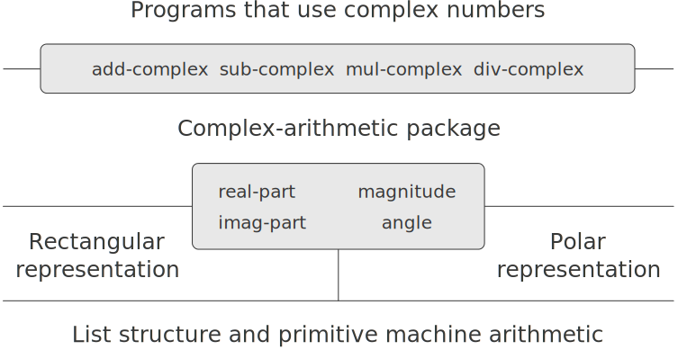

# 2.4.2  Tagged data(带标志数据)
One way to view data abstraction is as an application of the ''principle of least commitment.'' In implementing the complex-number system in section [2.4.1], we can use either Ben's rectangular representation or Alyssa's polar representation. The abstraction barrier formed by the selectors and constructors permits us to defer to the last possible moment the choice of a concrete representation for our data objects and thus retain maximum flexibility in our system design.<br />
认识数据抽象的一种方式是将其看作“最小允诺原则”的一个应用。在[2.4.1]节中实现复数系统时，我们可以采用Ben的直角坐标表示形式或者Alyssa的极坐标表示形式，由选择函数和构造函数形成的抽象屏障，使我们可以把为自己所用数据对象选择具体表示形式的事情尽量向后推，而且还能保持系统设计的最大灵活性。

The principle of least commitment can be carried to even further extremes. If we desire, we can maintain the ambiguity of representation even after we have designed the selectors and constructors, and elect to use both Ben's representation and Alyssa's representation. If both representations are included in a single system, however, we will need some way to distinguish data in polar form from data in rectangular form. Otherwise, if we were asked, for instance, to find the `magnitude` of the pair (3,4), we wouldn't know whether to answer 5 (interpreting the number in rectangular form) or 3 (interpreting the number in polar form). A straightforward way to accomplish this distinction is to include a type tag -- the symbol `rectangular` or `polar` -- as part of each complex number. Then when we need to manipulate a complex number we can use the tag to decide which selector to apply.<br />
最小允诺原则还可以推进到更极端的情况。如果我们需要的话，那么还可以在设计完成选择函数和构造函数，并决定了同时使用Ben的表示和Alyssa的表示之后，仍然维持所用表示方式的不确定性。如果要在同一个系统里包含这两种不同表示形式，那么就需要有一种方式，将极坐标形式的数据与直角坐标形式的数据区分开。否则的话，如果现在要找出对偶(3,4)的`magnitude`,我们将无法知道答案是5(将数据解释为直角坐标表示形式)还是3(将数据解释为极坐标表示)。完成这种区分的一种方式，就是在每个复数里包含一个类型标志部分——用符号`rectangular`或者`polar`。此后如果我们需要操作一个复数，借助于这个标志就可以确定应该使用的选择函数了。

In order to manipulate tagged data, we will assume that we have procedures `type-tag` and `contents` that extract from a data object the tag and the actual contents (the polar or rectangular coordinates, in the case of a complex number). We will also postulate a procedure `attach-tag` that takes a tag and contents and produces a tagged data object. A straightforward way to implement this is to use ordinary list structure:<br />
为了能对带标志数据进行各种操作，我们将假定有过程`type-tag`和`contents`,它们分别从数据对象中提取出类型标志和实际内容(对于复数的情况，其中的极坐标或者直角坐标)。还要假定有一个过程`attach-tag`,它以一个标志和实际内容为参数，生成出一个带标志的数据对象。实现这些的直接方式就是采用普通的表结构：

```
(define (attach-tag type-tag contents)
  (cons type-tag contents))
(define (type-tag datum)
  (if (pair? datum)
      (car datum)
      (error "Bad tagged datum -- TYPE-TAG" datum)))
(define (contents datum)
  (if (pair? datum)
      (cdr datum)
      (error "Bad tagged datum -- CONTENTS" datum)))
```

Using these procedures, we can define predicates `rectangular?` and `polar?`, which recognize polar and rectangular numbers, respectively:<br />
利用这些过程，我们就可以定义出谓词`rectangular?`和`polar?`,它们分别辨识直角坐标的和极坐标的复数：

```
(define (rectangular? z)
  (eq? (type-tag z) 'rectangular))
(define (polar? z)
  (eq? (type-tag z) 'polar))
```

With type tags, Ben and Alyssa can now modify their code so that their two different representations can coexist in the same system. Whenever Ben constructs a complex number, he tags it as rectangular. Whenever Alyssa constructs a complex number, she tags it as polar. In addition, Ben and Alyssa must make sure that the names of their procedures do not conflict. One way to do this is for Ben to append the suffix `rectangular` to the name of each of his representation procedures and for Alyssa to append `polar` to the names of hers. Here is Ben's revised rectangular representation from section [2.4.1]:<br />
有了类型标志之后，Ben和Alyssa现在就可以修改自己的代码，使他们的两种不同表示能够共存于同一个系统中了。当Ben构造一个复数时，总为它加上标志，说明采用的是直角坐标；而当Alyssa构造复数时，总将其标志设置为极坐标。此外，Ben和Alyssa还必须保证他们所用的过程名并不冲突。保证这一点的一种方式是，Ben总为在他的表示上操作的过程名字加上后缀`rectangular`,而Alyssa为她的过程名加上后缀`polar`。这里是Ben根据[2.4.1]节修改后的直角坐标表示：

```
(define (real-part-rectangular z) (car z))
(define (imag-part-rectangular z) (cdr z))
(define (magnitude-rectangular z)
  (sqrt (+ (square (real-part-rectangular z))
           (square (imag-part-rectangular z)))))
(define (angle-rectangular z)
  (atan (imag-part-rectangular z)
        (real-part-rectangular z)))
(define (make-from-real-imag-rectangular x y)
  (attach-tag 'rectangular (cons x y)))
(define (make-from-mag-ang-rectangular r a) 
  (attach-tag 'rectangular
              (cons (* r (cos a)) (* r (sin a)))))
```

and here is Alyssa's revised polar representation:<br />
下面是修改后的极坐标表示：

```
(define (real-part-polar z)
  (* (magnitude-polar z) (cos (angle-polar z))))
(define (imag-part-polar z)
  (* (magnitude-polar z) (sin (angle-polar z))))
(define (magnitude-polar z) (car z))
(define (angle-polar z) (cdr z))
(define (make-from-real-imag-polar x y) 
  (attach-tag 'polar
               (cons (sqrt (+ (square x) (square y)))
                     (atan y x))))
(define (make-from-mag-ang-polar r a)
  (attach-tag 'polar (cons r a)))
```

Each generic selector is implemented as a procedure that checks the tag of its argument and calls the appropriate procedure for handling data of that type. For example, to obtain the real part of a complex number, `real-part` examines the tag to determine whether to use Ben's `real-part-rectangular` or Alyssa's `real-part-polar`. In either case, we use `contents` to extract the bare, untagged datum and send this to the rectangular or polar procedure as required:<br />
每个通用型选择函数都需要实现为这样的过程，它首先检查参数的标志，而后去调用处理该类数据的适当过程。例如，为了得到一个复数的实部，`real-part`需要通过检查，设法确定是去使用Ben的`real-part-rectangular`,还是所用Alyssa的real-part-polar。在这两种情况下，我们都用`contents`提取出原始的无标志数据，并将它送给所需的直角坐标过程或者极坐标过程：

```
(define (real-part z)
  (cond ((rectangular? z) 
         (real-part-rectangular (contents z)))
        ((polar? z)
         (real-part-polar (contents z)))
        (else (error "Unknown type -- REAL-PART" z))))
(define (imag-part z)
  (cond ((rectangular? z)
         (imag-part-rectangular (contents z)))
        ((polar? z)
         (imag-part-polar (contents z)))
        (else (error "Unknown type -- IMAG-PART" z))))
(define (magnitude z)
  (cond ((rectangular? z)
         (magnitude-rectangular (contents z)))
        ((polar? z)
         (magnitude-polar (contents z)))
        (else (error "Unknown type -- MAGNITUDE" z))))
(define (angle z)
  (cond ((rectangular? z)
         (angle-rectangular (contents z)))
        ((polar? z)
         (angle-polar (contents z)))
        (else (error "Unknown type -- ANGLE" z))))
```

To implement the complex-number arithmetic operations, we can use the same procedures `add-complex`, `sub-complex`, `mul-complex`, and `div-complex` from section [2.4.1], because the selectors they call are generic, and so will work with either representation. For example, the procedure `add-complex` is still<br />
在实现复数算术运算时，我们仍然可以采用取自[2.4.1]节的同样过程`add-complex`、`sub-complex`、`mul-complex`和`div-complex`,因为它们所调用的选择函数现在都是通用型的，对任何表示都能工作。例如，过程`add-complex`仍然是：

```
(define (add-complex z1 z2)
  (make-from-real-imag (+ (real-part z1) (real-part z2))
                       (+ (imag-part z1) (imag-part z2))))
```

Finally, we must choose whether to construct complex numbers using Ben's representation or Alyssa's representation. One reasonable choice is to construct rectangular numbers whenever we have real and imaginary parts and to construct polar numbers whenever we have magnitudes and angles:<br />
最后，我们还必须选择是采用Ben的表示还是Alyssa的表示构造复数。一种合理选择是，在手头有实部和虚部时采用直角坐标表示，有模和幅角时就采用极坐标表示：

```
(define (make-from-real-imag x y)
  (make-from-real-imag-rectangular x y))
(define (make-from-mag-ang r a)
  (make-from-mag-ang-polar r a))
```

<div id="Figure2.21" markdown>

<figure markdown>
  
  <figcaption>Figure 2.21:  Structure of the generic complex-arithmetic system.</figcaption>
</figure>

</div>

The resulting complex-number system has the structure shown in figure [2.21]. The system has been decomposed into three relatively independent parts: the complex-number-arithmetic operations, Alyssa's polar implementation, and Ben's rectangular implementation. The polar and rectangular implementations could have been written by Ben and Alyssa working separately, and both of these can be used as underlying representations by a third programmer implementing the complex-arithmetic procedures in terms of the abstract constructor/selector interface.<br />
这样得到的复数系统所具有的结构如图[2.21]所示。这一系统已经分解为三个相对独立的部分：复数算术运算、Alyssa的极坐标实现和Ben的直角坐标实现。极坐标或直角坐标的实现可以是Ben和Alyssa独立工作写出的东西，这两部分又被第三个程序员作为基础表示，用于在抽象构造函数和选择函数界面之上实现各种复数算术过程。

Since each data object is tagged with its type, the selectors operate on the data in a generic manner. That is, each selector is defined to have a behavior that depends upon the particular type of data it is applied to. Notice the general mechanism for interfacing the separate representations: Within a given representation implementation (say, Alyssa's polar package) a complex number is an untyped pair (magnitude, angle). When a generic selector operates on a number of `polar` type, it strips off the tag and passes the contents on to Alyssa's code. Conversely, when Alyssa constructs a number for general use, she tags it with a type so that it can be appropriately recognized by the higher-level procedures. This discipline of stripping off and attaching tags as data objects are passed from level to level can be an important organizational strategy, as we shall see in section [2.5].<br />
因为每个数据对象都以其类型作为标志，选择函数就能够在不同的数据上以一种通用的方式操作。也就是说，每个选择函数的定义行为依赖于它操作其上的特定的数据类型。请注意这里建立不同表示之间的界面的一般性机制：在一种给定的表示实现中(例如Alyssa的极坐标包),复数是一种无类型的对偶(模，幅角)。当通用型选择函数对一个`polar`类型的复数进行操作时，它会剥去标志并将相应内容传递给Alyssa的代码。与此相对应，当Alyssa去构造一个供一般性使用的复数时，她也为其加上类型标志，使这个数据对象可以为高层过程所识别。在将数据对象从一个层次传到另一层次的过程中，这种剥去和加上标志的规范方式可以成为一种重要的组织策略，正如我们将在[2.5]节中看到的那样。

[2.4.1]: {{ config.extra.homepage_sicp }}/chapter_2/chapter_2_4/2.4.1/

[2.21]: {{ config.extra.homepage_sicp }}/chapter_2/chapter_2_4/2.4.2/#Figure2.21

[2.5]: {{ config.extra.homepage_sicp }}/chapter_2/chapter_2_5/