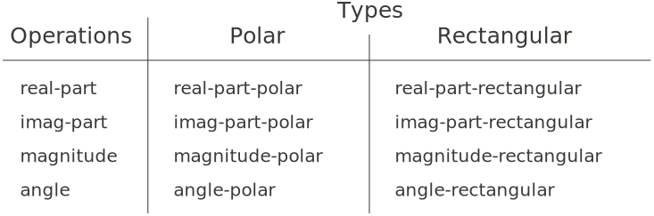

# 2.4.3  Data-Directed Programming and Additivity(数据导向的程序设计和可加性)
The general strategy of checking the type of a datum and calling an appropriate procedure is called dispatching on type. This is a powerful strategy for obtaining modularity in system design. On the other hand, implementing the dispatch as in section [2.4.2] has two significant weaknesses. One weakness is that the generic interface procedures (`real-part`, `imag-part`, `magnitude`, and `angle`) must know about all the different representations. For instance, suppose we wanted to incorporate a new representation for complex numbers into our complex-number system. We would need to identify this new representation with a type, and then add a clause to each of the generic interface procedures to check for the new type and apply the appropriate selector for that representation.<br />
检查一个数据项的类型，并据此去调用某个适当过程称为基于类型的分派。在系统设计中，这是一种获得模块性的强有力策略。而在另一方面，像[2.4.2]节那样实现的分派有两个显著的弱点。第一个弱点是，其中的这些通用型界面过程(`real-part`、`imag-part`、`magnitude`和`angle`)必须知道所有的不同表示。举例来说，假定现在希望能为前面的复数系统增加另一种表示，我们就必须将这一新表示方式标识为一种新类型，而且要在每个通用界面过程里增加一个子句，检查这一新类型，并对这种表示形式使用适当的选择函数。

Another weakness of the technique is that even though the individual representations can be designed separately, we must guarantee that no two procedures in the entire system have the same name. This is why Ben and Alyssa had to change the names of their original procedures from section [2.4.1].<br />
这一技术还有另一个弱点。即使这些独立的表示形式可以分别设计，我们也必须保证在整个系统里不存在两个名字相同的过程。正因为这一原因，Ben和Alyssa必须去修改原来在[2.4.1]节中给出的那些过程的名字。

The issue underlying both of these weaknesses is that the technique for implementing generic interfaces is not additive. The person implementing the generic selector procedures must modify those procedures each time a new representation is installed, and the people interfacing the individual representations must modify their code to avoid name conflicts. In each of these cases, the changes that must be made to the code are straightforward, but they must be made nonetheless, and this is a source of inconvenience and error. This is not much of a problem for the complex-number system as it stands, but suppose there were not two but hundreds of different representations for complex numbers. And suppose that there were many generic selectors to be maintained in the abstract-data interface. Suppose, in fact, that no one programmer knew all the interface procedures or all the representations. The problem is real and must be addressed in such programs as large-scale data-base-management systems.<br />
位于这两个弱点之下的基础问题是，上面这种实现通用型界面的技术不具有可加性。在每次增加一种新表示形式时，实现通用选择函数的人都必须修改他们的过程，而那些做独立表示的界面的人也必须修改其代码，以避免名字冲突问题。在做这些事情时，所有修改都必须直接对代码去做，而且必须准确无误。这当然会带来极大的不便，而且还很容易引进错误。对于上面这样的复数系统，这种修改还不是什么大问题。但如果假定现在需要处理的不是复数的两种表示形式，而是几百种不同表示形式，假定在抽象数据界面上有许许多多需要维护的通用型选择函数，再假定(事实上)没有一个程序员了解所有的界面过程和表示形式，情况又会怎样呢?在例如大规模的数据库管理系统中，这一问题是现实存在，且必须去面对的。

What we need is a means for modularizing the system design even further. This is provided by the programming technique known as data-directed programming. To understand how data-directed programming works, begin with the observation that whenever we deal with a set of generic operations that are common to a set of different types we are, in effect, dealing with a two-dimensional table that contains the possible operations on one axis and the possible types on the other axis. The entries in the table are the procedures that implement each operation for each type of argument presented. In the complex-number system developed in the previous section, the correspondence between operation name, data type, and actual procedure was spread out among the various conditional clauses in the generic interface procedures. But the same information could have been organized in a table, as shown in figure [2.22].<br />
现在我们需要的是一种能够将系统设计进一步模块化的方法。一种称为数据导向的程序设计的编程技术提供了这种能力。为了理解数据导向的程序设计如何工作，我们首先应该看到，在需要处理的是针对不同类型的一集公共通用型操作时，事实上，我们正是在处理一个二维表格，其中的一个维上包含着所有的可能操作，另一个维就是所有的可能类型。表格中的项目是一些过程，它们针对作为参数的每个类型实现每一个操作。在前一节中开发的复数系统里，操作名字、数据类型和实际过程之间的对应关系散布在各个通用界面过程的各个条件子句里，我们也可以将同样的信息组织为一个表格，如图[2-22]所示。

Data-directed programming is the technique of designing programs to work with such a table directly. Previously, we implemented the mechanism that interfaces the complex-arithmetic code with the two representation packages as a set of procedures that each perform an explicit dispatch on type. Here we will implement the interface as a single procedure that looks up the combination of the operation name and argument type in the table to find the correct procedure to apply, and then applies it to the contents of the argument. If we do this, then to add a new representation package to the system we need not change any existing procedures; we need only add new entries to the table.<br />
数据导向的程序设计就是一种使程序能直接利用这种表格工作的程序设计技术。在我们前面的实现里，是采用一集过程作为复数算术与两个表示包之间的界面，并让这些过程中的每一个去做基于类型的显式分派。下面我们要把这一界面实现为一个过程，由它用操作名和参数类型的组合到表格中查找，以便找出应该调用的适当过程，并将这一过程应用于参数的内容。如果能做到这些，再把一种新的表示包加入系统里，我们就不需要修改任何现存的过程，而只要在这个表格里添加一些新的项目即可。

<div id="Figure2.22" markdown>

<figure markdown>
  
  <figcaption>Figure 2.22:  Table of operations for the complex-number system.</figcaption>
</figure>

</div>

To implement this plan, assume that we have two procedures, `put` and `get`, for manipulating the operation-and-type table:<br />
为了实现这一计划，现在假定有两个过程`put`和`get`,用于处理这种操作-类型表格：

- `(put <op> <type> <item>)`<br />
installs the `<item>` in the table, indexed by the `<op>` and the `<type>`.<br />
将项`<item>`加入表格中，以`<op>`和`<type>`作为这个表项的索引。

- `(get <op> <type>)`<br />
looks up the `<op>`, `<type>` entry in the table and returns the item found there. If no item is found, get returns false.<br />
在表中查找与`<op>`和`<type>`对应的项，如果找到就返回找到的项，否则就返回假。

For now, we can assume that `put` and `get` are included in our language. In chapter 3 (section [3.3.3], exercise [3.24]) we will see how to implement these and other operations for manipulating tables.<br />
从现在起，我们将假定`put`和`get`已经包含在所用的语言里。在第3章里([3.3.3]节，练习[3.24])可以看到如何实现这些函数，以及其他操作表格的过程。

Here is how data-directed programming can be used in the complex-number system. Ben, who developed the rectangular representation, implements his code just as he did originally. He defines a collection of procedures, or a package, and interfaces these to the rest of the system by adding entries to the table that tell the system how to operate on rectangular numbers. This is accomplished by calling the following procedure:<br />
下面我们要说明，这种数据导向的程序设计可以如何用于复数系统。在开发了直角坐标表示时，Ben完全按他原来所做的那样实现了自己的代码，他定义了一组过程或者说一个程序包，并通过向表格中加入一些项的方式，告诉系统如何去操作直角坐标形式表示的数，这样就建立起了与系统其他部分的界面。完成此事的方式就是调用下面的过程：

```
(define (install-rectangular-package)
  ;; internal procedures
  (define (real-part z) (car z))
  (define (imag-part z) (cdr z))
  (define (make-from-real-imag x y) (cons x y))
  (define (magnitude z)
    (sqrt (+ (square (real-part z))
             (square (imag-part z)))))
  (define (angle z)
    (atan (imag-part z) (real-part z)))
  (define (make-from-mag-ang r a) 
    (cons (* r (cos a)) (* r (sin a))))
  ;; interface to the rest of the system
  (define (tag x) (attach-tag 'rectangular x))
  (put 'real-part '(rectangular) real-part)
  (put 'imag-part '(rectangular) imag-part)
  (put 'magnitude '(rectangular) magnitude)
  (put 'angle '(rectangular) angle)
  (put 'make-from-real-imag 'rectangular 
       (lambda (x y) (tag (make-from-real-imag x y))))
  (put 'make-from-mag-ang 'rectangular 
       (lambda (r a) (tag (make-from-mag-ang r a))))
  'done)
```

Notice that the internal procedures here are the same procedures from section [2.4.1] that Ben wrote when he was working in isolation. No changes are necessary in order to interface them to the rest of the system. Moreover, since these procedure definitions are internal to the installation procedure, Ben needn't worry about name conflicts with other procedures outside the rectangular package. To interface these to the rest of the system, Ben installs his `real-part` procedure under the operation name `real-part` and the type `(rectangular)`, and similarly for the other selectors.[^1] The interface also defines the constructors to be used by the external system.[^2] These are identical to Ben's internally defined constructors, except that they attach the tag.<br />
请注意，这里的所有内部过程，与[2.4.1]节里Ben在自己独立工作中写出的过程完全一样，在将它们与系统的其他部分建立联系时，也不需要做任何修改。进一步说，由于这些过程定义都是上述安装过程内部的东西，Ben完全不必担心它们的名字会与直角坐标程序包外面的其他过程的名字相互冲突。为了能与系统里的其他部分建立起联系，Ben将他的`real-part`过程安装在操作名字`real-part`和类`(rectangular)`之下，其他选择函数的情况也都与此类似[^1]。这一界面还定义了提供给外部系统的构造函数[^2],它们也与Ben自己定义的构造函数一样，只是其中还需要完成添加标志的工作。

Alyssa's polar package is analogous:<br />
Alyssa的极坐标包与此类似：

```
(define (install-polar-package)
  ;; internal procedures
  (define (magnitude z) (car z))
  (define (angle z) (cdr z))
  (define (make-from-mag-ang r a) (cons r a))
  (define (real-part z)
    (* (magnitude z) (cos (angle z))))
  (define (imag-part z)
    (* (magnitude z) (sin (angle z))))
  (define (make-from-real-imag x y) 
    (cons (sqrt (+ (square x) (square y)))
          (atan y x)))
  ;; interface to the rest of the system
  (define (tag x) (attach-tag 'polar x))
  (put 'real-part '(polar) real-part)
  (put 'imag-part '(polar) imag-part)
  (put 'magnitude '(polar) magnitude)
  (put 'angle '(polar) angle)
  (put 'make-from-real-imag 'polar
       (lambda (x y) (tag (make-from-real-imag x y))))
  (put 'make-from-mag-ang 'polar 
       (lambda (r a) (tag (make-from-mag-ang r a))))
  'done)
```

Even though Ben and Alyssa both still use their original procedures defined with the same names as each other's (e.g., `real-part`), these definitions are now internal to different procedures (see section [1.1.8]), so there is no name conflict.<br />
虽然Ben和Alyssa两个人仍然使用着他们原来的过程定义，这些过程也有着同样的名字(例如`real-part`),但对于其他过程而言，这些定义都是内部的(参见[1.1.8]节),所以在这里不会出现名字冲突问题。

The complex-arithmetic selectors access the table by means of a general ''operation'' procedure called `apply-generic`, which applies a generic operation to some arguments. `Apply-generic` looks in the table under the name of the operation and the types of the arguments and applies the resulting procedure if one is present:[^3]<br />
复数算术的选择函数通过一个通用的名为`apply-generic`的“操作”过程访问有关表格，这个过程将通用型操作应用于一些参数。`apply-generic`在表格中用操作名和参数类型查找，如果找到，就去应用查找中得到的过程[^3]:

```
(define (apply-generic op . args)
  (let ((type-tags (map type-tag args)))
    (let ((proc (get op type-tags)))
      (if proc
          (apply proc (map contents args))
          (error
            "No method for these types -- APPLY-GENERIC"
            (list op type-tags))))))
```

Using `apply-generic`, we can define our generic selectors as follows:<br />
利用`apply-generic`,各种通用型选择函数可以定义如下：

```
(define (real-part z) (apply-generic 'real-part z))
(define (imag-part z) (apply-generic 'imag-part z))
(define (magnitude z) (apply-generic 'magnitude z))
(define (angle z) (apply-generic 'angle z))
```

Observe that these do not change at all if a new representation is added to the system.<br />
请注意，如果要将一个新表示形式加入这个系统，上述这些都完全不必修改。

We can also extract from the table the constructors to be used by the programs external to the packages in making complex numbers from real and imaginary parts and from magnitudes and angles. As in section [2.4.2], we construct rectangular numbers whenever we have real and imaginary parts, and polar numbers whenever we have magnitudes and angles:<br />
我们同样可以从表中提取出构造函数，用到包之外的程序中，从实部和虚部或者模和幅角构造出复数来。就像在[2.4.2]节中那样，当我们有的是实部和虚部时就构造直角坐标表示的复数，有模和幅角时就构造极坐标的数：

```
(define (make-from-real-imag x y)
  ((get 'make-from-real-imag 'rectangular) x y))
(define (make-from-mag-ang r a)
  ((get 'make-from-mag-ang 'polar) r a))
```

<div id="Exercise2.73" markdown>

Exercise 2.73.  Section [2.3.2] described a program that performs symbolic differentiation:<br />
练习2.73 [2.3.2]节描述了一个执行符号求导的程序：

```
(define (deriv exp var)
  (cond ((number? exp) 0)
        ((variable? exp) (if (same-variable? exp var) 1 0))
        ((sum? exp)
         (make-sum (deriv (addend exp) var)
                   (deriv (augend exp) var)))
        ((product? exp)
         (make-sum
           (make-product (multiplier exp)
                         (deriv (multiplicand exp) var))
           (make-product (deriv (multiplier exp) var)
                         (multiplicand exp))))
        <more rules can be added here>
        (else (error "unknown expression type -- DERIV" exp))))
```

We can regard this program as performing a dispatch on the type of the expression to be differentiated. In this situation the ''type tag'' of the datum is the algebraic operator symbol (such as `+`) and the operation being performed is `deriv`. We can transform this program into data-directed style by rewriting the basic derivative procedure as<br />
可以认为，这个程序是在执行一种基于被求导表达式类型的分派工作。在这里，数据的“类型标志”就是代数运算符(例如`+`),需要执行的操作是`deriv`。我们也可以将这一程序变换到数据导向的风格，将基本求导过程重新写成：

```
(define (deriv exp var)
   (cond ((number? exp) 0)
         ((variable? exp) (if (same-variable? exp var) 1 0))
         (else ((get 'deriv (operator exp)) (operands exp)
                                            var))))
(define (operator exp) (car exp))
(define (operands exp) (cdr exp))
```

a.  Explain what was done above. Why can't we assimilate the predicates `number?` and `same-variable?` into the data-directed dispatch?<br />
请解释上面究竞做了些什么。为什么我们无法将相近的谓词`number?`和`same-variable?`也加入数据导向分派中?

b.  Write the procedures for derivatives of sums and products, and the auxiliary code required to install them in the table used by the program above.<br />
请写出针对和式与积式的求导过程，并把它们安装到表格里，以便上面程序使用所需要的辅助性代码。

c.  Choose any additional differentiation rule that you like, such as the one for exponents (exercise [2.56]), and install it in this data-directed system.<br />
请选择一些你希望包括的求导规则，例如对乘幂(练习[2.56])求导等等，并将它们安装到这一数据导向的系统里。

d.  In this simple algebraic manipulator the type of an expression is the algebraic operator that binds it together. Suppose, however, we indexed the procedures in the opposite way, so that the dispatch line in `deriv` looked like<br />
在这一简单的代数运算器中，表达式的类型就是构造起它们来的代数运算符。假定我们想以另一种相反的方式做索引，使得`deriv`里完成分派的代码行像下面这样：

```
((get (operator exp) 'deriv) (operands exp) var)
```

What corresponding changes to the derivative system are required?<br />
求导系统里还需要做哪些相应的改动?

</div>

<div id="Exercise2.74" markdown>

Exercise 2.74.  Insatiable Enterprises, Inc., is a highly decentralized conglomerate company consisting of a large number of independent divisions located all over the world. The company's computer facilities have just been interconnected by means of a clever network-interfacing scheme that makes the entire network appear to any user to be a single computer. Insatiable's president, in her first attempt to exploit the ability of the network to extract administrative information from division files, is dismayed to discover that, although all the division files have been implemented as data structures in Scheme, the particular data structure used varies from division to division. A meeting of division managers is hastily called to search for a strategy to integrate the files that will satisfy headquarters' needs while preserving the existing autonomy of the divisions.<br />
练习2.74  Insatiable Enterprise公司是一个高度分散经营的联合公司，由大量分布在世界各地的分支机构组成。公司的计算机设施已经通过一种非常巧妙的网络连接模式联为一体，它使得从任何一个用户的角度看，整个网络就像是一台计算机。在第一次试图利用网络能力从各分支机构的文件中提取管理信息时，Insatiable的总经理非常沮丧地发现，虽然所有分支机构的文件都被实现为Scheme的数据结构，但是各分支机构所用的数据结构却各不相同。她马上招集了各分支机构的经理会议，希望寻找一种策略集成起这些文件，以便在维持各个分支机构中现存独立工作方式的同时，又能满足公司总部管理的需要。

Show how such a strategy can be implemented with data-directed programming. As an example, suppose that each division's personnel records consist of a single file, which contains a set of records keyed on employees' names. The structure of the set varies from division to division. Furthermore, each employee's record is itself a set (structured differently from division to division) that contains information keyed under identifiers such as `address` and `salary`. In particular:<br />
请说明这种策略可以如何通过数据导向的程序设计技术实现。作为例子，假定每个分支机构的人事记录都存放在一个独立文件里，其中包含了一集以雇员名字作为键值的记录。而有关集合的结构却由于分支机构的不同而不同。进一步说，某个雇员的记录本身又是一个集合(各分支机构所用的结构也不同),其中所包含的信息也在一些作为键值的标识符之下，例如`address`和`salary`。特别是考虑如下问题：

a. Implement for headquarters a `get-record` procedure that retrieves a specified employee's record from a specified personnel file. The procedure should be applicable to any division's file. Explain how the individual divisions' files should be structured. In particular, what type information must be supplied?<br />
a. 请为公司总部实现一个`get-record`过程，使它能从一个特定的人事文件里提取出一个特定的雇员记录。这一过程应该能应用于任何分支机构的文件。请说明各个独立分支机构的文件应具有怎样的结构。特别是考虑，它们必须提供哪些类型信息?

b.  Implement for headquarters a `get-salary` procedure that returns the salary information from a given employee's record from any division's personnel file. How should the record be structured in order to make this operation work?<br />
b. 请为公司总部实现一个`get-salary`过程，它能从任何分支机构的人事文件中取得某个给定雇员的薪金信息。为了使这一操作能够工作，这些记录应具有怎样的结构?

c.  Implement for headquarters a `find-employee-record` procedure. This should search all the divisions' files for the record of a given employee and return the record. Assume that this procedure takes as arguments an employee's name and a list of all the divisions' files.<br />
c. 请为公司总部实现一个过程`find-employee-record`,该过程需要针对一个特定雇员名，在所有分支机构的文件去查找对应的记录，并返回找到的记录。假定这一过程的参数是一个雇员名和所有分支文件的表。

d.  When Insatiable takes over a new company, what changes must be made in order to incorporate the new personnel information into the central system?<br />
d. 当Insatiable购并新公司后，要将新的人事文件结合到系统中，必须做哪些修改?

## Message passing(消息传递)
The key idea of data-directed programming is to handle generic operations in programs by dealing explicitly with operation-and-type tables, such as the table in figure [2.22]. The style of programming we used in section [2.4.2] organized the required dispatching on type by having each operation take care of its own dispatching. In effect, this decomposes the operation-and-type table into rows, with each generic operation procedure representing a row of the table.<br />
在数据导向的程序设计里，最关键的想法就是通过显式处理操作一类型表格(例如图[2-22]里的表格)的方式，管理程序中的各种通用型操作。我们在[2.4.2]节中所用的程序设计风格，是一种基于类型进行分派的组织方式，其中让每个操作管理自己的分派。从效果上看，这种方式就是将操作一类型表格分解为一行一行，每个通用型过程表示表格中的一行。

An alternative implementation strategy is to decompose the table into columns and, instead of using ''intelligent operations'' that dispatch on data types, to work with ''intelligent data objects'' that dispatch on operation names. We can do this by arranging things so that a data object, such as a rectangular number, is represented as a procedure that takes as input the required operation name and performs the operation indicated. In such a discipline, `make-from-real-imag` could be written as<br />
另一种实现策略是将这一表格按列进行分解，不是采用一批“智能操作”去基于数据类型进行分派，而是采用“智能数据对象”,让它们基于操作名完成所需的分派工作。如果我们想这样做，所需要做的就是做出一种安排，将每一个数据对象(例如一个采用直角坐标表示的复数)表示为一个过程。它以操作的名字作为输入，能够去执行指定的操作。按照这种方式，`make-from-real-imag`应该写成下面样子：

```
(define (make-from-real-imag x y)
  (define (dispatch op)
    (cond ((eq? op 'real-part) x)
          ((eq? op 'imag-part) y)
          ((eq? op 'magnitude)
           (sqrt (+ (square x) (square y))))
          ((eq? op 'angle) (atan y x))
          (else
           (error "Unknown op -- MAKE-FROM-REAL-IMAG" op))))
  dispatch)
```

The corresponding `apply-generic` procedure, which applies a generic operation to an argument, now simply feeds the operation's name to the data object and lets the object do the work:[^3]<br />
与之对应的`apply-generic`过程应该对其参数应用一个通用型操作，此时它只需要简单地将操作名馈入该数据对象，并让那个对象去完成工作[^3]:

(define (apply-generic op arg) (arg op))

Note that the value returned by `make-from-real-imag` is a procedure -- the internal `dispatch` procedure. This is the procedure that is invoked when `apply-generic` requests an operation to be performed.<br />
请注意，`make-from-real-imag`返回的值是一个过程——它内部的`dispatch`过程。这也就是当`apply-generic`要求执行一个操作时所调用的过程。

This style of programming is called message passing. The name comes from the image that a data object is an entity that receives the requested operation name as a ''message.'' We have already seen an example of message passing in section [2.1.3], where we saw how `cons`, `car`, and `cdr` could be defined with no data objects but only procedures. Here we see that message passing is not a mathematical trick but a useful technique for organizing systems with generic operations. In the remainder of this chapter we will continue to use data-directed programming, rather than message passing, to discuss generic arithmetic operations. In chapter 3 we will return to message passing, and we will see that it can be a powerful tool for structuring simulation programs.<br />
这种风格的程序设计称为消息传递，这一名字源自将数据对象设想为一个实体，它以“消息”的方式接收到所需操作的名字。在[2.1.3]节中我们已经看到过一个消息传递的例子，在那里看到的是如何用没有数据对象而只有过程的方式定义`cons`、`car`和`cdr`。现在我们看到的是，消息传递并不是一种数学机巧，而是一种有价值的技术，可以用于组织带有通用型操作的系统。在本章剩下的部分里，我们将要继续使用数据导向的程序设计(而不是用消息传递),进一步讨论通用型算术运算的问题。在第3章里我们将会回到消息传递，并在那里看到它可能怎样成为构造模拟程序的强有力工具。

</div>

<div id="Exercise2.75" markdown>

Exercise 2.75.  Implement the constructor `make-from-mag-ang` in message-passing style. This procedure should be analogous to the `make-from-real-imag` procedure given above.<br />
练习2.75  请用消息传递的风格实现构造函数`make-from-mag-ang`。这一过程应该与上面给出的`make-from-real-imag`过程类似。

</div>

<div id="Exercise2.76" markdown>

Exercise 2.76.  As a large system with generic operations evolves, new types of data objects or new operations may be needed. For each of the three strategies -- generic operations with explicit dispatch, data-directed style, and message-passing-style -- describe the changes that must be made to a system in order to add new types or new operations. Which organization would be most appropriate for a system in which new types must often be added? Which would be most appropriate for a system in which new operations must often be added?<br />
练习2.76  一个带有通用型操作的大型系统可能不断演化，在演化中常需要加入新的数据对象类型或者新的操作。对于上面提出的三种策略——带有显式分派的通用型操作，数据导向的风格，以及消息传递的风格——请描述在加入一个新类型或者新操作时，系统所必须做的修改。哪种组织方式最适合那些经常需要加入新类型的系统?哪种组织方式最适合那些经常需要加入新操作的系统?

</div>

[^1]: 
    We use the list `(rectangular)` rather than the symbol `rectangular` to allow for the possibility of operations with multiple arguments, not all of the same type.<br />
    这里采用的是表`(rectangular)`而不是符号`rectangular`,以便能尤许某些带有多个参数，而且这些参数又并非都是同一类型的操作。

[^2]:
    The type the constructors are installed under needn't be a list because a constructor is always used to make an object of one particular type.<br />
    这里安装的构造函数所用的类型不必是表，因为每个构造函数总是只用于做出某个特定类型的对象。

[^3]:
    `Apply-generic` uses the dotted-tail notation described in exercise [2.20], because different generic operations may take different numbers of arguments. In `apply-generic`, `op` has as its value the first argument to `apply-generic` and `args` has as its value a list of the remaining arguments.
    `Apply-generic` also uses the primitive procedure `apply`, which takes two arguments, a procedure and a list. Apply applies the procedure, using the elements in the list as arguments. For example,<br />
    `apply-generic`使用了练习[2.20]中描述的带点尾部记法，因为不同的通用型操作的参数个数可能不同。在`apply-generic`里，`OP`将取得`apply-generic`的第一个参数的值，而`args`的值是其余参数的表。`apply-generic`还使用了基本过程`apply`,这一过程需要两个 数，一个过程和一个表。`apply`将应用这一过程，用表的元素作为其参数。例如

    ```
    (apply + (list 1 2 3 4))
    ```
    returns 10.

[^4]: 
    One limitation of this organization is it permits only generic procedures of one argument.<br />
    这种组织方式的一个限制是只允许一个参数的通用型过程。

[2.4.2]: {{ config.extra.homepage_sicp }}/chapter_2/chapter_2_4/2.4.2/

[2.4.1]: {{ config.extra.homepage_sicp }}/chapter_2/chapter_2_4/2.4.1/

[2.22]: {{ config.extra.homepage_sicp }}/chapter_2/chapter_2_4/2.4.3/#Figure2.22

[3.3.3]: {{ config.extra.homepage_sicp }}/chapter_3/chapter_3_3/3.3.3/

[3.24]: {{ config.extra.homepage_sicp }}/chapter_3/chapter_3_3/3.3.3/#Exercise3.24

[1.1.8]: {{ config.extra.homepage_sicp }}/chapter_1/chapter_1_1/1.1.8/

[2.20]: {{ config.extra.homepage_sicp }}/chapter_2/chapter_2_2/2.2.1/#Exercise2.20

[2.4.2]: {{ config.extra.homepage_sicp }}/chapter_2/chapter_2_4/2.4.2/

[2.3.2]: {{ config.extra.homepage_sicp }}/chapter_2/chapter_2_3/2.3.2/

[2.56]: {{ config.extra.homepage_sicp }}/chapter_2/chapter_2_3/2.3.2/#Exercise2.56

[2.1.3]: {{ config.extra.homepage_sicp }}/chapter_2/chapter_2_1/2.1.3/