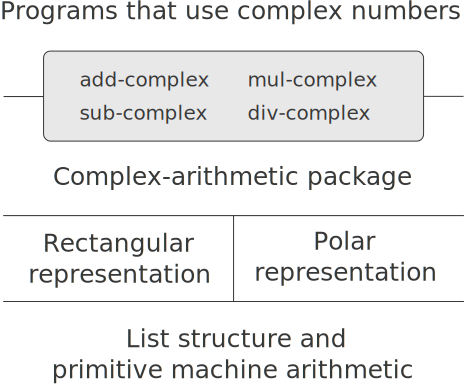

# 2.4  Multiple Representations for Abstract Data
We have introduced data abstraction, a methodology for structuring systems in such a way that much of a program can be specified independent of the choices involved in implementing the data objects that the program manipulates. For example, we saw in section [2.1.1] how to separate the task of designing a program that uses rational numbers from the task of implementing rational numbers in terms of the computer language's primitive mechanisms for constructing compound data. The key idea was to erect an abstraction barrier -- in this case, the selectors and constructors for rational numbers (`make-rat`, `numer`, `denom`) -- that isolates the way rational numbers are used from their underlying representation in terms of list structure. A similar abstraction barrier isolates the details of the procedures that perform rational arithmetic (`add-rat`, `sub-rat`, `mul-rat`, and `div-rat`) from the ''higher-level'' procedures that use rational numbers. The resulting program has the structure shown in figure [2.1].

These data-abstraction barriers are powerful tools for controlling complexity. By isolating the underlying representations of data objects, we can divide the task of designing a large program into smaller tasks that can be performed separately. But this kind of data abstraction is not yet powerful enough, because it may not always make sense to speak of ''the underlying representation'' for a data object.

For one thing, there might be more than one useful representation for a data object, and we might like to design systems that can deal with multiple representations. To take a simple example, complex numbers may be represented in two almost equivalent ways: in rectangular form (real and imaginary parts) and in polar form (magnitude and angle). Sometimes rectangular form is more appropriate and sometimes polar form is more appropriate. Indeed, it is perfectly plausible to imagine a system in which complex numbers are represented in both ways, and in which the procedures for manipulating complex numbers work with either representation.

More importantly, programming systems are often designed by many people working over extended periods of time, subject to requirements that change over time. In such an environment, it is simply not possible for everyone to agree in advance on choices of data representation. So in addition to the data-abstraction barriers that isolate representation from use, we need abstraction barriers that isolate different design choices from each other and permit different choices to coexist in a single program. Furthermore, since large programs are often created by combining pre-existing modules that were designed in isolation, we need conventions that permit programmers to incorporate modules into larger systems additively, that is, without having to redesign or reimplement these modules.

In this section, we will learn how to cope with data that may be represented in different ways by different parts of a program. This requires constructing generic procedures -- procedures that can operate on data that may be represented in more than one way. Our main technique for building generic procedures will be to work in terms of data objects that have type tags, that is, data objects that include explicit information about how they are to be processed. We will also discuss data-directed programming, a powerful and convenient implementation strategy for additively assembling systems with generic operations.

We begin with the simple complex-number example. We will see how type tags and data-directed style enable us to design separate rectangular and polar representations for complex numbers while maintaining the notion of an abstract ''complex-number'' data object. We will accomplish this by defining arithmetic procedures for complex numbers (`add-complex`, `sub-complex`, `mul-complex`, and `div-complex`) in terms of generic selectors that access parts of a complex number independent of how the number is represented. The resulting complex-number system, as shown in figure [2.19], contains two different kinds of abstraction barriers. The ''horizontal'' abstraction barriers play the same role as the ones in figure [2.1]. They isolate ''higher-level'' operations from ''lower-level'' representations. In addition, there is a ''vertical'' barrier that gives us the ability to separately design and install alternative representations.

<figure markdown>
  
  <figcaption>Figure 2.19:  Data-abstraction barriers in the complex-number system.</figcaption>
</figure>

In section [2.5] we will show how to use type tags and data-directed style to develop a generic arithmetic package. This provides procedures (`add`, `mul`, and so on) that can be used to manipulate all sorts of ''numbers'' and can be easily extended when a new kind of number is needed. In section [2.5.3], we'll show how to use generic arithmetic in a system that performs symbolic algebra.

[2.1.1]: {{ config.extra.homepage_sicp }}/chapter_2/chapter_2_1/2.1.1/

[2.1]: {{ config.extra.homepage_sicp }}/chapter_2/chapter_2_1/2.1.1/#Figure2.1

[2.19]: {{ config.extra.homepage_sicp }}/chapter_2/chapter_2_4/#Figure2.19

[2.5]: {{ config.extra.homepage_sicp }}/chapter_2/chapter_2_5/

[2.5.3]: {{ config.extra.homepage_sicp }}/chapter_2/chapter_2_5/2.5.3/
