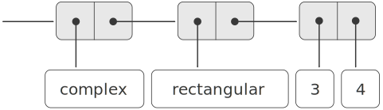

# 2.5.1  Generic Arithmetic Operations(通用型算术运算)
The task of designing generic arithmetic operations is analogous to that of designing the generic complex-number operations. We would like, for instance, to have a generic addition procedure `add` that acts like ordinary primitive addition + on ordinary numbers, like `add-rat` on rational numbers, and like `add-complex` on complex numbers. We can implement `add`, and the other generic arithmetic operations, by following the same strategy we used in section [2.4.3] to implement the generic selectors for complex numbers. We will attach a type tag to each kind of number and cause the generic procedure to dispatch to an appropriate package according to the data type of its arguments.<br />
设计通用型算术运算的工作类似于设计通用型复数运算。我们希望(例如)有一个通用型的加法过程`add`,对于常规的数，它的行为就像常规的基本加法+;对于有理数，它就像`add-rat`,对于复数就像`add-complex`。我们可以沿用在[2.4.3]节为实现复数上的通用选择函数所用的同样策略，去实现`add`和其他通用算术运算。下面将为每种数附着一个类型标志，以便通用型过程能够根据其参数的类型完成到某个适用的程序包的分派。

The generic arithmetic procedures are defined as follows:<br />
通用型算术过程的定义如下：

```
(define (add x y) (apply-generic 'add x y))
(define (sub x y) (apply-generic 'sub x y))
(define (mul x y) (apply-generic 'mul x y))
(define (div x y) (apply-generic 'div x y))
```

We begin by installing a package for handling *ordinary numbers*, that is, the primitive numbers of our language. We will tag these with the symbol `scheme-number`. The arithmetic operations in this package are the primitive arithmetic procedures (so there is no need to define extra procedures to handle the untagged numbers). Since these operations each take two arguments, they are installed in the table keyed by the list (`scheme-number scheme-number`):<br />
下面我们将从安装处理常规数(即，语言中基本的数)的包开始，对这种数采用的标志是符号`scheme-number`。这个包里的算术运算都是基本算术过程.(因此不需要再定义过程去处理无标志的数)。因为每个操作都有两个参数，所以用表(`scheme-number` `scheme-number`)作为表格中的键值去安装它们：

```
(define (install-scheme-number-package)
  (define (tag x)
    (attach-tag 'scheme-number x))    
  (put 'add '(scheme-number scheme-number)
       (lambda (x y) (tag (+ x y))))
  (put 'sub '(scheme-number scheme-number)
       (lambda (x y) (tag (- x y))))
  (put 'mul '(scheme-number scheme-number)
       (lambda (x y) (tag (* x y))))
  (put 'div '(scheme-number scheme-number)
       (lambda (x y) (tag (/ x y))))
  (put 'make 'scheme-number
       (lambda (x) (tag x)))
  'done)
```

Users of the Scheme-number package will create (tagged) ordinary numbers by means of the procedure:<br />
Scheme数值包的用户可以通过下面过程，创建带标志的常规数：

```
(define (make-scheme-number n)
  ((get 'make 'scheme-number) n))
```

Now that the framework of the generic arithmetic system is in place, we can readily include new kinds of numbers. Here is a package that performs rational arithmetic. Notice that, as a benefit of additivity, we can use without modification the rational-number code from section [2.1.1] as the internal procedures in the package:<br />
现在我们已经做好了通用型算术系统的框架，可以将新的数类型加入其中了。下面是一个执行有理数算术的程序包。请注意，由于具有可加性，我们可以直接把取自[2.1.1]节的有理数代码作为这个程序包的内部过程，完全不必做任何修改：

```
(define (install-rational-package)
  ;; internal procedures
  (define (numer x) (car x))
  (define (denom x) (cdr x))
  (define (make-rat n d)
    (let ((g (gcd n d)))
      (cons (/ n g) (/ d g))))
  (define (add-rat x y)
    (make-rat (+ (* (numer x) (denom y))
                 (* (numer y) (denom x)))
              (* (denom x) (denom y))))
  (define (sub-rat x y)
    (make-rat (- (* (numer x) (denom y))
                 (* (numer y) (denom x)))
              (* (denom x) (denom y))))
  (define (mul-rat x y)
    (make-rat (* (numer x) (numer y))
              (* (denom x) (denom y))))
  (define (div-rat x y)
    (make-rat (* (numer x) (denom y))
              (* (denom x) (numer y))))
  ;; interface to rest of the system
  (define (tag x) (attach-tag 'rational x))
  (put 'add '(rational rational)
       (lambda (x y) (tag (add-rat x y))))
  (put 'sub '(rational rational)
       (lambda (x y) (tag (sub-rat x y))))
  (put 'mul '(rational rational)
       (lambda (x y) (tag (mul-rat x y))))
  (put 'div '(rational rational)
       (lambda (x y) (tag (div-rat x y))))

  (put 'make 'rational
       (lambda (n d) (tag (make-rat n d))))
  'done)
(define (make-rational n d)
  ((get 'make 'rational) n d))
```

We can install a similar package to handle complex numbers, using the tag `complex`. In creating the package, we extract from the table the operations `make-from-real-imag` and `make-from-mag-ang` that were defined by the rectangular and polar packages. Additivity permits us to use, as the internal operations, the same `add-complex`, `sub-complex`, `mul-complex`, and `div-complex` procedures from section [2.4.1].<br />
我们可以安装上另一个处理复数的类似程序包，采用的标志是`complex`。在创建这个程序包时，我们要从表格里抽取出操作`make-from-real-imag`和`make-from-mag-an`g,它们原来分别定义在直角坐标和极坐标包里。可加性使我们能把取自[2.4.1]节同样的`add-complex`、`sub-complex`、`mul-complex`和`div-complex`过程用作内部操作。

```
(define (install-complex-package)
  ;; imported procedures from rectangular and polar packages
  (define (make-from-real-imag x y)
    ((get 'make-from-real-imag 'rectangular) x y))
  (define (make-from-mag-ang r a)
    ((get 'make-from-mag-ang 'polar) r a))
  ;; internal procedures
  (define (add-complex z1 z2)
    (make-from-real-imag (+ (real-part z1) (real-part z2))
                         (+ (imag-part z1) (imag-part z2))))
  (define (sub-complex z1 z2)
    (make-from-real-imag (- (real-part z1) (real-part z2))
                         (- (imag-part z1) (imag-part z2))))
  (define (mul-complex z1 z2)
    (make-from-mag-ang (* (magnitude z1) (magnitude z2))
                       (+ (angle z1) (angle z2))))
  (define (div-complex z1 z2)
    (make-from-mag-ang (/ (magnitude z1) (magnitude z2))
                       (- (angle z1) (angle z2))))
  ;; interface to rest of the system
  (define (tag z) (attach-tag 'complex z))
  (put 'add '(complex complex)
       (lambda (z1 z2) (tag (add-complex z1 z2))))
  (put 'sub '(complex complex)
       (lambda (z1 z2) (tag (sub-complex z1 z2))))
  (put 'mul '(complex complex)
       (lambda (z1 z2) (tag (mul-complex z1 z2))))
  (put 'div '(complex complex)
       (lambda (z1 z2) (tag (div-complex z1 z2))))
  (put 'make-from-real-imag 'complex
       (lambda (x y) (tag (make-from-real-imag x y))))
  (put 'make-from-mag-ang 'complex
       (lambda (r a) (tag (make-from-mag-ang r a))))
  'done)
```

Programs outside the complex-number package can construct complex numbers either from real and imaginary parts or from magnitudes and angles. Notice how the underlying procedures, originally defined in the rectangular and polar packages, are exported to the complex package, and exported from there to the outside world.<br />
在复数包之外的程序可以从实部和虚部出发构造复数，也可以从模和幅角出发。请注意这里如何将原先定义在直角坐标和极坐标包里的集成过程导出，放入复数包中，又如何从这里导出送给外面的世界。

```
(define (make-complex-from-real-imag x y)
  ((get 'make-from-real-imag 'complex) x y))
(define (make-complex-from-mag-ang r a)
  ((get 'make-from-mag-ang 'complex) r a))
```

What we have here is a two-level tag system. A typical complex number, such as 3 + 4i in rectangular form, would be represented as shown in figure [2.24]. The outer tag (`complex`) is used to direct the number to the complex package. Once within the complex package, the next tag (`rectangular`) is used to direct the number to the rectangular package. In a large and complicated system there might be many levels, each interfaced with the next by means of generic operations. As a data object is passed ''downward,'' the outer tag that is used to direct it to the appropriate package is stripped off (by applying `contents`) and the next level of tag (if any) becomes visible to be used for further dispatching.<br />
这里描述的是一个具有两层标志的系统。一个典型的复数如直角坐标表示的3 + 4i,现在的表示形式如图[2.24]所示。外层标志(`complex`)用于将这个数引导到复数包，一旦进入复数包，下一个标志(`rectangular`)就会引导这个数进入直角坐标表示包。在一个大型的复杂系统里可能有许多层次，每层与下一层次之间的连接都借助于一些通用型操作。当一个数据对象被“向下”传输时，用于引导它进入适当程序包的最外层标志被剥除(通过使用`contents`),下一层次的标志(如果有的话)变成可见的，并将被用于下一次分派。

<div id="Figure2.24" markdown>

<figure markdown>
  
  <figcaption>Figure 2.24: Representation of 3 + 4i in rectangular form.</figcaption>
</figure>
</div>

In the above packages, we used `add-rat`, `add-complex`, and the other arithmetic procedures exactly as originally written. Once these definitions are internal to different installation procedures, however, they no longer need names that are distinct from each other: we could simply name them `add`, `sub`, `mul`, and `div` in both packages.<br />
在上面这些程序包里，我们使用了`add-rat`、`add-complex`以及其他算术过程，完全按照它们原来写出的形式。一旦把这些过程定义为不同安装过程内部的东西，它们的名字就没有必要再相互不同了，可以在两个包中都简单地将它们命名为`add`、`sub`、`mul`和`div`。

Exercise 2.77.  Louis Reasoner tries to evaluate the expression (magnitude z) where `z` is the object shown in figure [2.24]. To his surprise, instead of the answer 5 he gets an error message from `apply-generic`, saying there is no method for the operation `magnitude` on the types (`complex`). He shows this interaction to Alyssa P. Hacker, who says ''The problem is that the complex-number selectors were never defined for `complex` numbers, just for `polar` and `rectangular` numbers. All you have to do to make this work is add the following to the `complex` package:''<br />
练习2.77 Louis Reasoner试着去求值`(magnitude z)`,其中的Z就是图[2.24]里的那个对象。令他吃惊的是，从`apply-generic`出来的不是5而是一个错误信息，说没办法对类型(`complex`)做操作magnitude。他将这次交互的情况给Alyssa P.Hacker看，Alyssa说“问题出在没有为`complex`数定义复数选择函数，而只是为`polar`和`rectangular`数定义了它们。你需要做的就是在`complex`包里加入下面这些东西":

(put 'real-part '(complex) real-part)
(put 'imag-part '(complex) imag-part)
(put 'magnitude '(complex) magnitude)
(put 'angle '(complex) angle)

Describe in detail why this works. As an example, trace through all the procedures called in evaluating the expression (`magnitude z`) where `z` is the object shown in figure [2.24]. In particular, how many times is `apply-generic` invoked? What procedure is dispatched to in each case?<br />
请详细说明为什么这样做是可行的。作为一个例子，请考虑表达式`(magnitude z)`的求值过程，其中`z`就是图[2.24]里展示的那个对象，请追踪一下这一求值过程中的所有函数调用。特别是看看`apply-generic`被调用了几次?每次调用中分派的是哪个过程?

Exercise 2.78.  The internal procedures in the `scheme-number` package are essentially nothing more than calls to the primitive procedures `+`, `-`, etc. It was not possible to use the primitives of the language directly because our type-tag system requires that each data object have a type attached to it. In fact, however, all Lisp implementations do have a type system, which they use internally. Primitive predicates such as `symbol?` and `number?` determine whether data objects have particular types. Modify the definitions of `type-tag`, `contents`, and `attach-tag` from section [2.4.2] so that our generic system takes advantage of Scheme's internal type system. That is to say, the system should work as before except that ordinary numbers should be represented simply as Scheme numbers rather than as pairs whose `car` is the symbol `scheme-number`.<br />
练习2.78  包s`cheme-number`里的内部过程几乎什么也没做，只不过是去调用基本过程`+`, `-`,等等。直接使用语言的基本过程当然是不可能的，因为我们的类型标志系统要求每个数据对象都附加一个类型。然而，事实上所有Lisp实现都有自己的类型系统，使用在系统实现的内部，基本谓词`symbol?`和`number?`等用于确定某个数据对象是否具有特定的类型。请修改[2.4.2]节中`type-tag`,`contents`和`attach-tag`的定义，使我们的通用算术系统可以利用Scheme的内部类型系统。这也就是说，修改后的系统应该像原来一样工作，除了其中常规的数直接采用Scheme的数形式，而不是表示为一个car部分是符号`scheme-number`的序对。


<div id="Exercise2.79" markdown>

Exercise 2.79.  Define a generic equality predicate `equ?` that tests the equality of two numbers, and install it in the generic arithmetic package. This operation should work for ordinary numbers, rational numbers, and complex numbers.<br />
练习2.79  请定义一个通用型相等谓词`equ?`,它能检查两个数是否相等。请将它安装到通用算术包里。这一操作应该能处理常规的数、有理数和复数。
</div>

<div id="Exercise2.80" markdown>

Exercise 2.80.  Define a generic predicate `=zero?` that tests if its argument is zero, and install it in the generic arithmetic package. This operation should work for ordinary numbers, rational numbers, and complex numbers.<br />
练习2.80  请定义一个通用谓词`=zero?`,检查其参数是否为0,并将它安装到通用算术包里。这一操作应该能处理常规的数、有理数和复数。

</div>

[2.4.3]: {{ config.extra.homepage_sicp }}/chapter_2/chapter_2_4/2.4.3/
[2.1.1]: {{ config.extra.homepage_sicp }}/chapter_2/chapter_2_1/2.1.1/
[2.4.1]: {{ config.extra.homepage_sicp }}/chapter_2/chapter_2_4/2.4.1/
[2.24]: {{ config.extra.homepage_sicp }}/chapter_2/chapter_2_5/2.5.1/#Figure2.24
[2.4.2]: {{ config.extra.homepage_sicp }}/chapter_2/chapter_2_4/2.4.2/