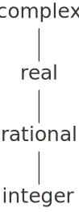
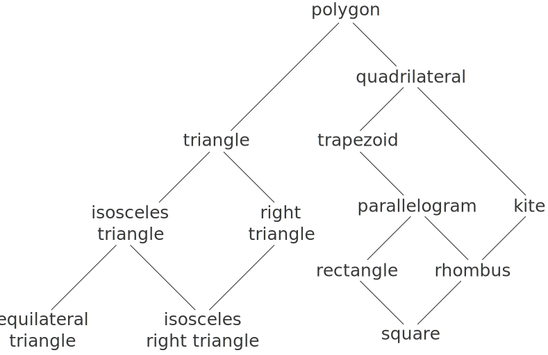

# 2.5.2  Combining Data of Different Types
We have seen how to define a unified arithmetic system that encompasses ordinary numbers, complex numbers, rational numbers, and any other type of number we might decide to invent, but we have ignored an important issue. The operations we have defined so far treat the different data types as being completely independent. Thus, there are separate packages for adding, say, two ordinary numbers, or two complex numbers. What we have not yet considered is the fact that it is meaningful to define operations that cross the type boundaries, such as the addition of a complex number to an ordinary number. We have gone to great pains to introduce barriers between parts of our programs so that they can be developed and understood separately. We would like to introduce the cross-type operations in some carefully controlled way, so that we can support them without seriously violating our module boundaries.

One way to handle cross-type operations is to design a different procedure for each possible combination of types for which the operation is valid. For example, we could extend the complex-number package so that it provides a procedure for adding complex numbers to ordinary numbers and installs this in the table using the tag `(complex scheme-number)`:[^1]

```
;; to be included in the complex package
(define (add-complex-to-schemenum z x)
  (make-from-real-imag (+ (real-part z) x)
                       (imag-part z)))
(put 'add '(complex scheme-number)
     (lambda (z x) (tag (add-complex-to-schemenum z x))))
```

This technique works, but it is cumbersome. With such a system, the cost of introducing a new type is not just the construction of the package of procedures for that type but also the construction and installation of the procedures that implement the cross-type operations. This can easily be much more code than is needed to define the operations on the type itself. The method also undermines our ability to combine separate packages additively, or least to limit the extent to which the implementors of the individual packages need to take account of other packages. For instance, in the example above, it seems reasonable that handling mixed operations on complex numbers and ordinary numbers should be the responsibility of the complex-number package. Combining rational numbers and complex numbers, however, might be done by the complex package, by the rational package, or by some third package that uses operations extracted from these two packages. Formulating coherent policies on the division of responsibility among packages can be an overwhelming task in designing systems with many packages and many cross-type operations.

## Coercion
In the general situation of completely unrelated operations acting on completely unrelated types, implementing explicit cross-type operations, cumbersome though it may be, is the best that one can hope for. Fortunately, we can usually do better by taking advantage of additional structure that may be latent in our type system. Often the different data types are not completely independent, and there may be ways by which objects of one type may be viewed as being of another type. This process is called coercion. For example, if we are asked to arithmetically combine an ordinary number with a complex number, we can view the ordinary number as a complex number whose imaginary part is zero. This transforms the problem to that of combining two complex numbers, which can be handled in the ordinary way by the complex-arithmetic package.

In general, we can implement this idea by designing coercion procedures that transform an object of one type into an equivalent object of another type. Here is a typical coercion procedure, which transforms a given ordinary number to a complex number with that real part and zero imaginary part:

```
(define (scheme-number->complex n)
  (make-complex-from-real-imag (contents n) 0))
```

We install these coercion procedures in a special coercion table, indexed under the names of the two types:

```
(put-coercion 'scheme-number 'complex scheme-number->complex)
```

(We assume that there are `put-coercion` and `get-coercion` procedures available for manipulating this table.) Generally some of the slots in the table will be empty, because it is not generally possible to coerce an arbitrary data object of each type into all other types. For example, there is no way to coerce an arbitrary complex number to an ordinary number, so there will be no general `complex->scheme-number` procedure included in the table.

Once the coercion table has been set up, we can handle coercion in a uniform manner by modifying the `apply-generic` procedure of section [2.4.3]. When asked to apply an operation, we first check whether the operation is defined for the arguments' types, just as before. If so, we dispatch to the procedure found in the operation-and-type table. Otherwise, we try coercion. For simplicity, we consider only the case where there are two arguments[^2]. We check the coercion table to see if objects of the first type can be coerced to the second type. If so, we coerce the first argument and try the operation again. If objects of the first type cannot in general be coerced to the second type, we try the coercion the other way around to see if there is a way to coerce the second argument to the type of the first argument. Finally, if there is no known way to coerce either type to the other type, we give up. Here is the procedure:

```
(define (apply-generic op . args)
  (let ((type-tags (map type-tag args)))
    (let ((proc (get op type-tags)))
      (if proc
          (apply proc (map contents args))
          (if (= (length args) 2)
              (let ((type1 (car type-tags))
                    (type2 (cadr type-tags))
                    (a1 (car args))
                    (a2 (cadr args)))
                (let ((t1->t2 (get-coercion type1 type2))
                      (t2->t1 (get-coercion type2 type1)))
                  (cond (t1->t2
                         (apply-generic op (t1->t2 a1) a2))
                        (t2->t1
                         (apply-generic op a1 (t2->t1 a2)))
                        (else
                         (error "No method for these types"
                                (list op type-tags))))))
              (error "No method for these types"
                     (list op type-tags)))))))
```

This coercion scheme has many advantages over the method of defining explicit cross-type operations, as outlined above. Although we still need to write coercion procedures to relate the types (possibly ${n^2}$ procedures for a system with ${n}$ types), we need to write only one procedure for each pair of types rather than a different procedure for each collection of types and each generic operation[^3]. What we are counting on here is the fact that the appropriate transformation between types depends only on the types themselves, not on the operation to be applied.

On the other hand, there may be applications for which our coercion scheme is not general enough. Even when neither of the objects to be combined can be converted to the type of the other it may still be possible to perform the operation by converting both objects to a third type. In order to deal with such complexity and still preserve modularity in our programs, it is usually necessary to build systems that take advantage of still further structure in the relations among types, as we discuss next.

## Hierarchies of types
The coercion scheme presented above relied on the existence of natural relations between pairs of types. Often there is more ''global'' structure in how the different types relate to each other. For instance, suppose we are building a generic arithmetic system to handle integers, rational numbers, real numbers, and complex numbers. In such a system, it is quite natural to regard an integer as a special kind of rational number, which is in turn a special kind of real number, which is in turn a special kind of complex number. What we actually have is a so-called *hierarchy of types*, in which, for example, integers are a *subtype* of rational numbers (i.e., any operation that can be applied to a rational number can automatically be applied to an integer). Conversely, we say that rational numbers form a supertype of integers. The particular hierarchy we have here is of a very simple kind, in which each type has at most one supertype and at most one subtype. Such a structure, called a *tower*, is illustrated in figure [2.25].

<div id="Figure2.25" markdown>

<figure markdown>
  
  <figcaption>Figure 2.25:  A tower of types.</figcaption>
</figure>
</div>

If we have a tower structure, then we can greatly simplify the problem of adding a new type to the hierarchy, for we need only specify how the new type is embedded in the next supertype above it and how it is the supertype of the type below it. For example, if we want to add an integer to a complex number, we need not explicitly define a special coercion procedure `integer->complex`. Instead, we define how an integer can be transformed into a rational number, how a rational number is transformed into a real number, and how a real number is transformed into a complex number. We then allow the system to transform the integer into a complex number through these steps and then add the two complex numbers.

We can redesign our `apply-generic` procedure in the following way: For each type, we need to supply a `raise` procedure, which ''raises'' objects of that type one level in the tower. Then when the system is required to operate on objects of different types it can successively raise the lower types until all the objects are at the same level in the tower. (Exercises [2.83] and  [2.84] concern the details of implementing such a strategy.)

Another advantage of a tower is that we can easily implement the notion that every type ''inherits'' all operations defined on a supertype. For instance, if we do not supply a special procedure for finding the real part of an integer, we should nevertheless expect that `real-part` will be defined for integers by virtue of the fact that integers are a subtype of complex numbers. In a tower, we can arrange for this to happen in a uniform way by modifying `apply-generic`. If the required operation is not directly defined for the type of the object given, we raise the object to its supertype and try again. We thus crawl up the tower, transforming our argument as we go, until we either find a level at which the desired operation can be performed or hit the top (in which case we give up).

Yet another advantage of a tower over a more general hierarchy is that it gives us a simple way to ''lower'' a data object to the simplest representation. For example, if we add ${2 + 3i}$ to ${4 - 3i}$, it would be nice to obtain the answer as the integer 6 rather than as the complex number ${6 + 0i}$. Exercise [2.85] discusses a way to implement such a lowering operation. (The trick is that we need a general way to distinguish those objects that can be lowered, such as ${6 + 0i}$, from those that cannot, such as ${6 + 2i}$.)

<div id="Figure2.26" markdown>

<figure markdown>
  
  <figcaption>Figure 2.26:  Relations among types of geometric figures.</figcaption>
</figure>
</div>

## Inadequacies of hierarchies
If the data types in our system can be naturally arranged in a tower, this greatly simplifies the problems of dealing with generic operations on different types, as we have seen. Unfortunately, this is usually not the case. Figure 2.26 illustrates a more complex arrangement of mixed types, this one showing relations among different types of geometric figures. We see that, in general, a type may have more than one subtype. Triangles and quadrilaterals, for instance, are both subtypes of polygons. In addition, a type may have more than one supertype. For example, an isosceles right triangle may be regarded either as an isosceles triangle or as a right triangle. This multiple-supertypes issue is particularly thorny, since it means that there is no unique way to ''raise'' a type in the hierarchy. Finding the ''correct'' supertype in which to apply an operation to an object may involve considerable searching through the entire type network on the part of a procedure such as `apply-generic`. Since there generally are multiple subtypes for a type, there is a similar problem in coercing a value ''down'' the type hierarchy. Dealing with large numbers of interrelated types while still preserving modularity in the design of large systems is very difficult, and is an area of much current research.[^4]

<div id="Exercise2.81" markdown>

Exercise 2.81. Louis Reasoner has noticed that `apply-generic` may try to coerce the arguments to each other's type even if they already have the same type. Therefore, he reasons, we need to put procedures in the coercion table to "coerce" arguments of each type to their own type. For example, in addition to the `scheme-number->complex` coercion shown above, he would do:

```
(define (scheme-number->scheme-number n) n)
(define (complex->complex z) z)
(put-coercion 'scheme-number 'scheme-number
              scheme-number->scheme-number)
(put-coercion 'complex 'complex complex->complex)
```

a. With Louis's coercion procedures installed, what happens if `apply-generic` is called with two arguments of type `scheme-number` or two arguments of type `complex` for an operation that is not found in the table for those types? For example, assume that we've defined a generic exponentiation operation:

```
(define (exp x y) (apply-generic 'exp x y))
```

and have put a procedure for exponentiation in the Scheme-number package but not in any other package:

```
;; following added to Scheme-number package
(put 'exp '(scheme-number scheme-number)
     (lambda (x y) (tag (expt x y)))) ; using primitive expt
```

What happens if we call `exp` with two complex numbers as arguments?

b. Is Louis correct that something had to be done about coercion with arguments of the same type, or does `apply-generic` work correctly as is?

c. Modify `apply-generic` so that it doesn't try coercion if the two arguments have the same type.
</div>

<div id="Exercise2.82" markdown>

Exercise 2.82.  Show how to generalize `apply-generic` to handle coercion in the general case of multiple arguments. One strategy is to attempt to coerce all the arguments to the type of the first argument, then to the type of the second argument, and so on. Give an example of a situation where this strategy (and likewise the two-argument version given above) is not sufficiently general. (Hint: Consider the case where there are some suitable mixed-type operations present in the table that will not be tried.)
</div>

<div id="Exercise2.83" markdown>

Exercise 2.83.  Suppose you are designing a generic arithmetic system for dealing with the tower of types shown in figure [2.25]: integer, rational, real, complex. For each type (except complex), design a procedure that raises objects of that type one level in the tower. Show how to install a generic `raise` operation that will work for each type (except complex).
</div>

<div id="Exercise2.84" markdown>

Exercise 2.84.  Using the `raise` operation of exercise [2.83], modify the `apply-generic` procedure so that it coerces its arguments to have the same type by the method of successive raising, as discussed in this section. You will need to devise a way to test which of two types is higher in the tower. Do this in a manner that is ''compatible'' with the rest of the system and will not lead to problems in adding new levels to the tower.
</div>

<div id="Exercise2.85" markdown>

Exercise 2.85.  This section mentioned a method for ''simplifying'' a data object by lowering it in the tower of types as far as possible. Design a procedure `drop` that accomplishes this for the tower described in exercise [2.83]. The key is to decide, in some general way, whether an object can be lowered. For example, the complex number ${1.5 + 0i}$ can be lowered as far as `real`, the complex number ${1 + 0i}$ can be lowered as far as `integer`, and the complex number ${2 + 3i}$ cannot be lowered at all. Here is a plan for determining whether an object can be lowered: Begin by defining a generic operation `project` that ''pushes'' an object down in the tower. For example, projecting a complex number would involve throwing away the imaginary part. Then a number can be dropped if, when we `project` it and `raise` the result back to the type we started with, we end up with something equal to what we started with. Show how to implement this idea in detail, by writing a `drop` procedure that drops an object as far as possible. You will need to design the various projection operations[^5] and install `project` as a generic operation in the system. You will also need to make use of a generic equality predicate, such as described in exercise [2.79]. Finally, use `drop` to rewrite `apply-generic` from exercise [2.84] so that it ''simplifies'' its answers.
</div>

<div id="Exercise2.86" markdown>

Exercise 2.86.  Suppose we want to handle complex numbers whose real parts, imaginary parts, magnitudes, and angles can be either ordinary numbers, rational numbers, or other numbers we might wish to add to the system. Describe and implement the changes to the system needed to accommodate this. You will have to define operations such as `sine` and `cosine` that are generic over ordinary numbers and rational numbers
</div>

[^1]:
    We also have to supply an almost identical procedure to handle the types `(scheme-number complex)`.

[^2]:
    See exercise [2.82] for generalizations.

[^3]:
    If we are clever, we can usually get by with fewer than ${n^2}$ coercion procedures. For instance, if we know how to convert from type 1 to type 2 and from type 2 to type 3, then we can use this knowledge to convert from type 1 to type 3. This can greatly decrease the number of coercion procedures we need to supply explicitly when we add a new type to the system. If we are willing to build the required amount of sophistication into our system, we can have it search the ''graph'' of relations among types and automatically generate those coercion procedures that can be inferred from the ones that are supplied explicitly.

[^4]:
    This statement, which also appears in the first edition of this book, is just as true now as it was when we wrote it twelve years ago. Developing a useful, general framework for expressing the relations among different types of entities (what philosophers call ''ontology'') seems intractably difficult. The main difference between the confusion that existed ten years ago and the confusion that exists now is that now a variety of inadequate ontological theories have been embodied in a plethora of correspondingly inadequate programming languages. For example, much of the complexity of object-oriented programming languages -- and the subtle and confusing differences among contemporary object-oriented languages -- centers on the treatment of generic operations on interrelated types. Our own discussion of computational objects in chapter 3 avoids these issues entirely. Readers familiar with object-oriented programming will notice that we have much to say in chapter 3 about local state, but we do not even mention ``classes'' or ``inheritance.'' In fact, we suspect that these problems cannot be adequately addressed in terms of computer-language design alone, without also drawing on work in knowledge representation and automated reasoning.

[^5]: 
    A real number can be projected to an integer using the round primitive, which returns the closest integer to its argument.

[2.82]: {{ config.extra.homepage_sicp }}/chapter_2/chapter_2_5/2.5.2/#Exercise2.82

[2.4.3]: {{ config.extra.homepage_sicp }}/chapter_2/chapter_2_4/2.4.3/

[2.25]: {{ config.extra.homepage_sicp }}/chapter_2/chapter_2_5/2.5.2/#Figure2.25

[2.83]: {{ config.extra.homepage_sicp }}/chapter_2/chapter_2_5/2.5.2/#Exercise2.83

[2.85]: {{ config.extra.homepage_sicp }}/chapter_2/chapter_2_5/2.5.2/#Exercise2.85

[2.84]: {{ config.extra.homepage_sicp }}/chapter_2/chapter_2_5/2.5.2/#Exercise2.84

[2.79]: {{ config.extra.homepage_sicp }}/chapter_2/chapter_2_5/2.5.1/#Exercise2.79

