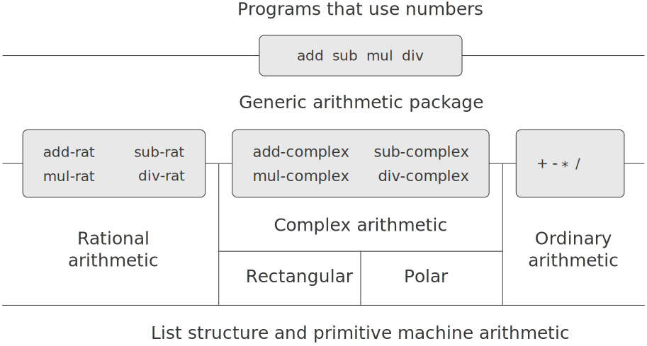

# 2.5  Systems with Generic Operations

In the previous section, we saw how to design systems in which data objects can be represented in more than one way. The key idea is to link the code that specifies the data operations to the several representations by means of generic interface procedures. Now we will see how to use this same idea not only to define operations that are generic over different representations but also to define operations that are generic over different kinds of arguments. We have already seen several different packages of arithmetic operations: the primitive arithmetic (`+, -, *, /`) built into our language, the rational-number arithmetic (`add-rat, sub-rat, mul-rat, div-rat`) of section [2.1.1], and the complex-number arithmetic that we implemented in section [2.4.3]. We will now use data-directed techniques to construct a package of arithmetic operations that incorporates all the arithmetic packages we have already constructed.

Figure [2.23](#Figure2.23) shows the structure of the system we shall build. Notice the abstraction barriers. From the perspective of someone using ''numbers,'' there is a single procedure `add` that operates on whatever numbers are supplied. `Add` is part of a generic interface that allows the separate ordinary-arithmetic, rational-arithmetic, and complex-arithmetic packages to be accessed uniformly by programs that use numbers. Any individual arithmetic package (such as the complex package) may itself be accessed through generic procedures (such as `add-complex`) that combine packages designed for different representations (such as rectangular and polar). Moreover, the structure of the system is additive, so that one can design the individual arithmetic packages separately and combine them to produce a generic arithmetic system.

<figure markdown>
  
  <figcaption>Figure 2.23:  Generic arithmetic system.</figcaption>
</figure>

[2.1.1]: {{ config.extra.homepage_sicp }}/chapter_2/chapter_2_1/2.1.1/

[2.4.3]: {{ config.extra.homepage_sicp }}/chapter_2/chapter_2_4/2.4.3/