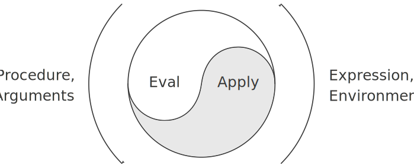

# 4.1 The Metacircular Evaluator
Our evaluator for Lisp will be implemented as a Lisp program. It may seem circular to think about evaluating Lisp programs using an evaluator that is itself implemented in Lisp. However, evaluation is a process, so it is appropriate to describe the evaluation process using Lisp, which, after all, is our tool for describing processes.[^1] An evaluator that is written in the same language that it evaluates is said to be metacircular.

The metacircular evaluator is essentially a Scheme formulation of the environment model of evaluation described in section [3.2]. Recall that the model has two basic parts:

1. To evaluate a combination (a compound expression other than a special form), evaluate the subexpressions and then apply the value of the operator subexpression to the values of the operand subexpressions.

2. To apply a compound procedure to a set of arguments, evaluate the body of the procedure in a new environment. To construct this environment, extend the environment part of the procedure object by a frame in which the formal parameters of the procedure are bound to the arguments to which the procedure is applied.

These two rules describe the essence of the evaluation process, a basic cycle in which expressions to be evaluated in environments are reduced to procedures to be applied to arguments, which in turn are reduced to new expressions to be evaluated in new environments, and so on, until we get down to symbols, whose values are looked up in the environment, and to primitive procedures, which are applied directly (see Figure [4.1]).[^2] This evaluation cycle will be embodied by the interplay between the two critical procedures in the evaluator, `eval` and `apply`, which are described in section [4.1.1] (see Figure [4.1]).

<figure markdown>
  
  <figcaption markdown>
  Figure 4.1: The eval-apply cycle exposes the essence of a computer language.
  </figcaption>
</figure>

The implementation of the evaluator will depend upon procedures that define the syntax of the expressions to be evaluated. We will use data abstraction to make the evaluator independent of the representation of the language. For example, rather than committing to a choice that an assignment is to be represented by a list beginning with the symbol `set!` we use an abstract predicate `assignment?` to test for an assignment, and we use abstract selectors `assignment-variable` and `assignment-value` to access the parts of an assignment. Implementation of expressions will be described in detail in [4.1.2]. There are also operations, described in [4.1.3], that specify the representation of procedures and environments. For example, `make-procedure` constructs compound procedures, `lookup-variable-value` accesses the values of variables, and `apply-primitive-procedure` applies a primitive procedure to a given list of arguments.

[^1]:
    Even so, there will remain important aspects of the evaluation process that are not elucidated by our evaluator. The most important of these are the detailed mechanisms by which procedures call other procedures and return values to their callers. We will address these issues in chapter 5, where we take a closer look at the evaluation process by implementing the evaluator as a simple register machine.

[^2]:
    If we grant ourselves the ability to apply primitives, then what remains for us to implement in the evaluator? The job of the evaluator is not to specify the primitives of the language, but rather to provide the connective tissue -- the means of combination and the means of abstraction -- that binds a collection of primitives to form a language. Specifically:

    - The evaluator enables us to deal with nested expressions. For example, although simply applying primitives would suffice for evaluating the expression `(+ 1 6)`, it is not adequate for handling `(+ 1 (* 2 3))`. As far as the primitive procedure `+` is concerned, its arguments must be numbers, and it would choke if we passed it the expression `(* 2 3)` as an argument. One important role of the evaluator is to choreograph procedure composition so that `(* 2 3)` is reduced to 6 before being passed as an argument to `+`.

    - The evaluator allows us to use variables. For example, the primitive procedure for addition has no way to deal with expressions such as `(+ x 1)`. We need an evaluator to keep track of variables and obtain their values before invoking the primitive procedures.

    - The evaluator allows us to define compound procedures. This involves keeping track of procedure definitions, knowing how to use these definitions in evaluating expressions, and providing a mechanism that enables procedures to accept arguments.

    - The evaluator provides the special forms, which must be evaluated differently from procedure calls.    
    
[3.2]: {{ config.extra.homepage_sicp }}/chapter_3/chapter_3_2/

[4.1.1]: {{ config.extra.homepage_sicp }}/chapter_4/chapter_4_1/4.1.1

[4.1.2]: {{ config.extra.homepage_sicp }}/chapter_4/chapter_4_1/4.1.2

[4.1.3]: {{ config.extra.homepage_sicp }}/chapter_4/chapter_4_1/4.1.3
    