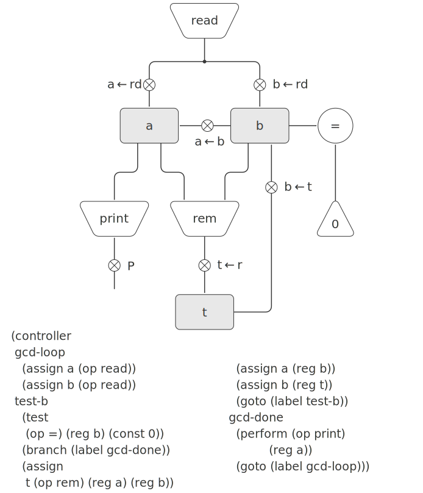

# 5.1.1 A Language for Describing Register Machines

Data-path and controller diagrams are adequate for representing simple machines such as GCD, but they are unwieldy for describing large machines such as a Lisp interpreter. To make it possible to deal with complex machines, we will create a language that presents, in textual form, all the information given by the data-path and controller diagrams. We will start with a notation that directly mirrors the diagrams.

We define the data paths of a machine by describing the registers and the operations. To describe a register, we give it a name and specify the buttons that control assignment to it. We give each of these buttons a name and specify the source of the data that enters the register under the button’s control. (The source is a register, a constant, or an operation.) To describe an operation, we give it a name and specify its inputs (registers or constants).

We define the controller of a machine as a sequence of instructions together with labels that identify entry points in the sequence. An instruction is one of the following:

- The name of a data-path button to push to assign a value to a register. (This corresponds to a box in the controller diagram.)

- A test instruction, that performs a specified test.

- A conditional branch (branch instruction) to a location indicated by a controller label, based on the result of the previous test. (The test and branch together correspond to a diamond in the controller diagram.) If the test is false, the controller should continue with the next instruction in the sequence. Otherwise, the controller should continue with the instruction after the label.

- An unconditional branch (goto instruction) naming a controller label at which to continue execution.
The machine starts at the beginning of the controller instruction sequence and stops when execution reaches the end of the sequence. Except when a branch changes the flow of control, instructions are executed in the order in which they are listed.

[Figure 5.3](#Figure5.3) shows the GCD machine described in this way. This example only hints at the generality of these descriptions, since the GCD machine is a very simple case: Each register has only one button, and each button and test is used only once in the controller.

<div id="Figure5.3" markdown></div>
Figure 5.3: A specification of the GCD machine.

```
(data-paths
 (registers
  ((name a)
   (buttons ((name a<-b) 
             (source (register b)))))
  ((name b)
   (buttons ((name b<-t)
             (source (register t)))))
  ((name t)
   (buttons ((name t<-r)
             (source (operation rem))))))
 (operations
  ((name rem)
   (inputs (register a) (register b)))
  ((name =)
   (inputs (register b) (constant 0)))))

(controller
 test-b                ; label
   (test =)            ; test
   (branch 
    (label gcd-done))  ; conditional branch
   (t<-r)              ; button push
   (a<-b)              ; button push
   (b<-t)              ; button push
   (goto 
    (label test-b))    ; unconditional branch
 gcd-done)             ; label

```

Unfortunately, it is difficult to read such a description. In order to understand the controller instructions we must constantly refer back to the definitions of the button names and the operation names, and to understand what the buttons do we may have to refer to the definitions of the operation names. We will thus transform our notation to combine the information from the data-path and controller descriptions so that we see it all together.

To obtain this form of description, we will replace the arbitrary button and operation names by the definitions of their behavior. That is, instead of saying (in the controller) “Push button t<-r” and separately saying (in the data paths) “Button t<-r assigns the value of the rem operation to register t” and “The rem operation’s inputs are the contents of registers a and b,” we will say (in the controller) “Push the button that assigns to register t the value of the rem operation on the contents of registers a and b.” Similarly, instead of saying (in the controller) “Perform the = test” and separately saying (in the data paths) “The = test operates on the contents of register b and the constant 0,” we will say “Perform the = test on the contents of register b and the constant 0.” We will omit the data-path description, leaving only the controller sequence. Thus, the GCD machine is described as follows:

```
(controller
 test-b
   (test (op =) (reg b) (const 0))
   (branch (label gcd-done))
   (assign t (op rem) (reg a) (reg b))
   (assign a (reg b))
   (assign b (reg t))
   (goto (label test-b))
 gcd-done)

```

This form of description is easier to read than the kind illustrated in [Figure 5.3](#Figure5.3), but it also has disadvantages:

- It is more verbose for large machines, because complete descriptions of the data-path elements are repeated whenever the elements are mentioned in the controller instruction sequence. (This is not a problem in the GCD example, because each operation and button is used only once.) Moreover, repeating the data-path descriptions obscures the actual data-path structure of the machine; it is not obvious for a large machine how many registers, operations, and buttons there are and how they are interconnected.

- Because the controller instructions in a machine definition look like Lisp expressions, it is easy to forget that they are not arbitrary Lisp expressions. They can notate only legal machine operations. For example, operations can operate directly only on constants and the contents of registers, not on the results of other operations.

In spite of these disadvantages, we will use this register-machine language throughout this chapter, because we will be more concerned with understanding controllers than with understanding the elements and connections in data paths. We should keep in mind, however, that data-path design is crucial in designing real machines.

Exercise 5.2: Use the register-machine language to describe the iterative factorial machine of [Exercise 5.1].

Actions
Let us modify the GCD machine so that we can type in the numbers whose GCD we want and get the answer printed at our terminal. We will not discuss how to make a machine that can read and print, but will assume (as we do when we use read and display in Scheme) that they are available as primitive operations.[^1]

Read is like the operations we have been using in that it produces a value that can be stored in a register. But read does not take inputs from any registers; its value depends on something that happens outside the parts of the machine we are designing. We will allow our machine’s operations to have such behavior, and thus will draw and notate the use of read just as we do any other operation that computes a value.

Print, on the other hand, differs from the operations we have been using in a fundamental way: It does not produce an output value to be stored in a register. Though it has an effect, this effect is not on a part of the machine we are designing. We will refer to this kind of operation as an action. We will represent an action in a data-path diagram just as we represent an operation that computes a value—as a trapezoid that contains the name of the action. Arrows point to the action box from any inputs (registers or constants). We also associate a button with the action. Pushing the button makes the action happen. To make a controller push an action button we use a new kind of instruction called perform. Thus, the action of printing the contents of register a is represented in a controller sequence by the instruction


(perform (op print) (reg a))


[Figure 5.4](#Figure5.4) shows the data paths and controller for the new GCD machine. Instead of having the machine stop after printing the answer, we have made it start over, so that it repeatedly reads a pair of numbers, computes their GCD, and prints the result. This structure is like the driver loops we used in the interpreters of Chapter 4.

<div id="Figure5.4" markdown>

<figure markdown>
  
  <figcaption markdown>
  Figure 5.4: A GCD machine that reads inputs and prints results.
  </figcaption>
</figure>
</div>


[^1]:
    This assumption glosses over a great deal of complexity. Usually a large portion of the implementation of a Lisp system is dedicated to making reading and printing work.


[Exercise 5.1]: {{ config.extra.homepage_sicp }}/chapter5/chapter_5_1/#Exercise5.1