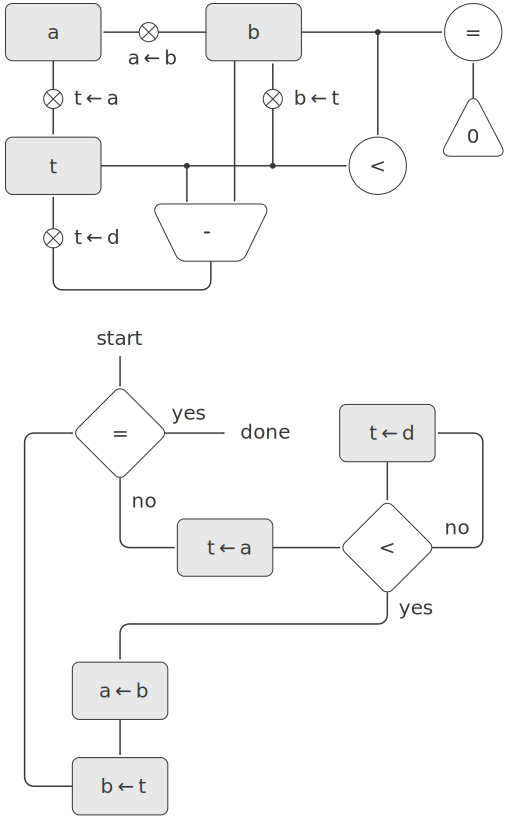

# 5.1.2 Abstraction in Machine Design
We will often define a machine to include “primitive” operations that are actually very complex. For example, in [5.4] and [5.5] we will treat Scheme’s environment manipulations as primitive. Such abstraction is valuable because it allows us to ignore the details of parts of a machine so that we can concentrate on other aspects of the design. The fact that we have swept a lot of complexity under the rug, however, does not mean that a machine design is unrealistic. We can always replace the complex “primitives” by simpler primitive operations.

Consider the GCD machine. The machine has an instruction that computes the remainder of the contents of registers a and b and assigns the result to register t. If we want to construct the GCD machine without using a primitive remainder operation, we must specify how to compute remainders in terms of simpler operations, such as subtraction. Indeed, we can write a Scheme procedure that finds remainders in this way:

```
(define (remainder n d)
  (if (< n d) n (remainder (- n d) d)))
```

We can thus replace the remainder operation in the GCD machine’s data paths with a subtraction operation and a comparison test. [Figure 5.5](#Figure5.5) shows the data paths and controller for the elaborated machine. The instruction

```
(assign t (op rem) (reg a) (reg b))
```

in the GCD controller definition is replaced by a sequence of instructions that contains a loop, as shown in [Figure 5.6](#Figure5.6).

<div id="Figure5.5" markdown>
<figure markdown>
  
  <figcaption markdown>
  Figure 5.5: Data paths and controller for the elaborated GCD machine.
  </figcaption>
</figure>
</div>

<div id="Figure5.6" markdown>

```
(controller
 test-b
   (test (op =) (reg b) (const 0))
   (branch (label gcd-done))
   (assign t (reg a))
 rem-loop
   (test (op <) (reg t) (reg b))
   (branch (label rem-done))
   (assign t (op -) (reg t) (reg b))
   (goto (label rem-loop))
 rem-done
   (assign a (reg b))
   (assign b (reg t))
   (goto (label test-b))
 gcd-done)
```
</div>

<div id="Exercise5.3" markdown>
Exercise 5.3: Design a machine to compute square roots using Newton’s method, as described in 1.1.7:

```
(define (sqrt x)
  (define (good-enough? guess)
    (< (abs (- (square guess) x)) 0.001))
  (define (improve guess)
    (average guess (/ x guess)))
  (define (sqrt-iter guess)
    (if (good-enough? guess)
        guess
        (sqrt-iter (improve guess))))
  (sqrt-iter 1.0))
```
</div>

Begin by assuming that `good-enough?` and improve operations are available as primitives. Then show how to expand these in terms of arithmetic operations. Describe each version of the sqrt machine design by drawing a data-path diagram and writing a controller definition in the register-machine language.

[5.4]: {{ config.extra.homepage_sicp }}/chapter_5/chapter_5_4/

[5.5]: {{ config.extra.homepage_sicp }}/chapter_5/chapter_5_5/

[Figure 5.1]: {{ config.extra.homepage_sicp }}/chapter_5/chapter_5_1/#Figure5.1