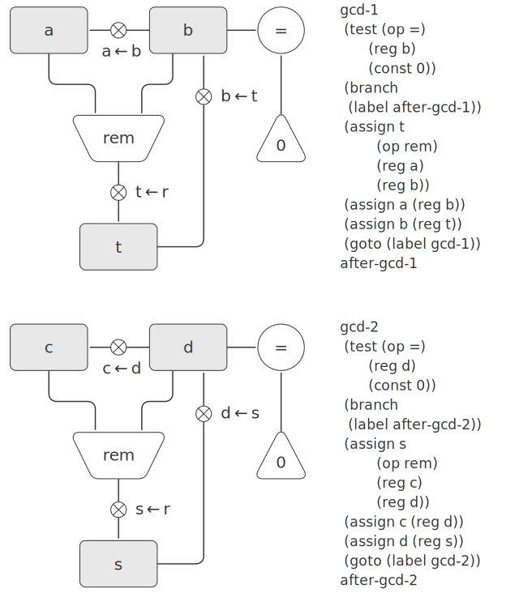

# 5.1.3 Subroutines
When designing a machine to perform a computation, we would often prefer to arrange for components to be shared by different parts of the computation rather than duplicate the components. Consider a machine that includes two GCD computations—one that finds the GCD of the contents of registers `a` and `b` and one that finds the GCD of the contents of registers `c` and `d`. We might start by assuming we have a primitive `gcd` operation, then expand the two instances of `gcd` in terms of more primitive operations. [Figure 5.7](#Figure5.7) shows just the GCD portions of the resulting machine’s data paths, without showing how they connect to the rest of the machine. The figure also shows the corresponding portions of the machine’s controller sequence.

<div id="Figure5.7" markdown>
<figure markdown>
  
  <figcaption markdown>
  Figure 5.7: Portions of the data paths and controller sequence for a machine with two GCD computations.
  </figcaption>
</figure>
</div>

This machine has two remainder operation boxes and two boxes for testing equality. If the duplicated components are complicated, as is the remainder box, this will not be an economical way to build the machine. We can avoid duplicating the data-path components by using the same components for both GCD computations, provided that doing so will not affect the rest of the larger machine’s computation. If the values in registers `a` and `b` are not needed by the time the controller gets to `gcd-2` (or if these values can be moved to other registers for safekeeping), we can change the machine so that it uses registers `a` and `b`, rather than registers `c` and `d`, in computing the second GCD as well as the first. If we do this, we obtain the controller sequence shown in [Figure 5.8](#Figure5.8).

<div id="Figure5.8" markdown>
```
gcd-1
 (test (op =) (reg b) (const 0))
 (branch (label after-gcd-1))
 (assign t (op rem) (reg a) (reg b))
 (assign a (reg b))
 (assign b (reg t))
 (goto (label gcd-1))
after-gcd-1
  …
gcd-2
 (test (op =) (reg b) (const 0))
 (branch (label after-gcd-2))
 (assign t (op rem) (reg a) (reg b))
 (assign a (reg b))
 (assign b (reg t))
 (goto (label gcd-2))
after-gcd-2
```
</div>

We have removed the duplicate data-path components (so that the data paths are again as in [Figure 5.1]), but the controller now has two GCD sequences that differ only in their entry-point labels. It would be better to replace these two sequences by branches to a single sequence—a `gcd` subroutine—at the end of which we branch back to the correct place in the main instruction sequence. We can accomplish this as follows: Before branching to `gcd`, we place a distinguishing value (such as 0 or 1) into a special register, continue. At the end of the `gcd` subroutine we return either to `after-gcd-1` or to `after-gcd-2`, depending on the value of the `continue` register. [Figure 5.9](#Figure5.9) shows the relevant portion of the resulting controller sequence, which includes only a single copy of the `gcd` instructions.

<div id="Figure5.9" markdown>

```
gcd
 (test (op =) (reg b) (const 0))
 (branch (label gcd-done))
 (assign t (op rem) (reg a) (reg b))
 (assign a (reg b))
 (assign b (reg t))
 (goto (label gcd))
gcd-done
 (test (op =) (reg continue) (const 0))
 (branch (label after-gcd-1))
 (goto (label after-gcd-2))
  …
;; Before branching to gcd from
;; the first place where it is needed,
;; we place 0 in the continue register
 (assign continue (const 0))
 (goto (label gcd))
after-gcd-1
  …
;; Before the second use of gcd, 
;; we place 1 in the continue register
 (assign continue (const 1))
 (goto (label gcd))
after-gcd-2
```
</div>

This is a reasonable approach for handling small problems, but it would be awkward if there were many instances of GCD computations in the controller sequence. To decide where to continue executing after the `gcd` subroutine, we would need tests in the data paths and branch instructions in the controller for all the places that use `gcd`. A more powerful method for implementing subroutines is to have the `continue` register hold the label of the entry point in the controller sequence at which execution should continue when the subroutine is finished. Implementing this strategy requires a new kind of connection between the data paths and the controller of a register machine: There must be a way to assign to a register a label in the controller sequence in such a way that this value can be fetched from the register and used to continue execution at the designated entry point.

To reflect this ability, we will extend the `assign` instruction of the register-machine language to allow a register to be assigned as value a label from the controller sequence (as a special kind of constant). We will also extend the `goto` instruction to allow execution to continue at the entry point described by the contents of a register rather than only at an entry point described by a constant label. Using these new constructs we can terminate the `gcd` subroutine with a branch to the location stored in the `continue` register. This leads to the controller sequence shown in [Figure 5.10](#Figure5.10).


<div id="Figure5.10" markdown>

```
gcd
 (test (op =) (reg b) (const 0))
 (branch (label gcd-done))
 (assign t (op rem) (reg a) (reg b))
 (assign a (reg b))
 (assign b (reg t))
 (goto (label gcd))
gcd-done
 (goto (reg continue))
  …
;; Before calling gcd, 
;; we assign to continue the label
;; to which gcd should return.
 (assign continue (label after-gcd-1))
 (goto (label gcd))
after-gcd-1
  …
;; Here is the second call to gcd,
;; with a different continuation.
 (assign continue (label after-gcd-2))
 (goto (label gcd))
after-gcd-2
```
</div>

A machine with more than one subroutine could use multiple continuation registers (e.g., `gcd-continue`, `factorial-continue`) or we could have all subroutines share a single `continue` register. Sharing is more economical, but we must be careful if we have a subroutine `(sub1)` that calls another subroutine `(sub2)`. Unless `sub1` saves the contents of `continue` in some other register before setting up `continue` for the call to `sub2`, `sub1` will not know where to go when it is finished. The mechanism developed in the next section to handle recursion also provides a better solution to this problem of nested subroutine calls.