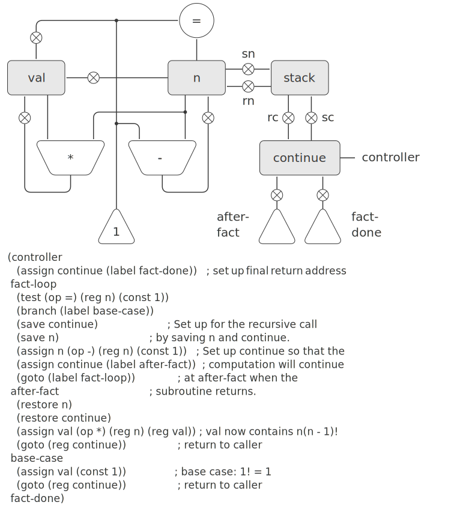

# 5.1.4 Using a Stack to Implement Recursion
With the ideas illustrated so far, we can implement any iterative process by specifying a register machine that has a register corresponding to each state variable of the process. The machine repeatedly executes a controller loop, changing the contents of the registers, until some termination condition is satisfied. At each point in the controller sequence, the state of the machine (representing the state of the iterative process) is completely determined by the contents of the registers (the values of the state variables).

Implementing recursive processes, however, requires an additional mechanism. Consider the following recursive method for computing factorials, which we first examined in [1.2.1]:

```
(define (factorial n)
  (if (= n 1) 
      1
      (* (factorial (- n 1)) n)))
```

As we see from the procedure, computing ${n!}$ requires computing ${(n - 1)!}$. Our GCD machine, modeled on the procedure

```
(define (gcd a b)
  (if (= b 0) 
      a
      (gcd b (remainder a b))))
```

similarly had to compute another GCD. But there is an important difference between the `gcd` procedure, which reduces the original computation to a new GCD computation, and `factorial`, which requires computing another factorial as a subproblem. In GCD, the answer to the new GCD computation is the answer to the original problem. To compute the next GCD, we simply place the new arguments in the input registers of the GCD machine and reuse the machine’s data paths by executing the same controller sequence. When the machine is finished solving the final GCD problem, it has completed the entire computation.

In the case of factorial (or any recursive process) the answer to the new factorial subproblem is not the answer to the original problem. The value obtained for ${(n - 1)!}$ must be multiplied by ${n}$ to get the final answer. If we try to imitate the GCD design, and solve the factorial subproblem by decrementing the `n` register and rerunning the factorial machine, we will no longer have available the old value of `n` by which to multiply the result. We thus need a second factorial machine to work on the subproblem. This second factorial computation itself has a factorial subproblem, which requires a third factorial machine, and so on. Since each factorial machine contains another factorial machine within it, the total machine contains an infinite nest of similar machines and hence cannot be constructed from a fixed, finite number of parts.

Nevertheless, we can implement the factorial process as a register machine if we can arrange to use the same components for each nested instance of the machine. Specifically, the machine that computes $${n!}$$ should use the same components to work on the subproblem of computing ${(n - 1)!}$, on the subproblem for ${(n - 2)!}$, and so on. This is plausible because, although the factorial process dictates that an unbounded number of copies of the same machine are needed to perform a computation, only one of these copies needs to be active at any given time. When the machine encounters a recursive subproblem, it can suspend work on the main problem, reuse the same physical parts to work on the subproblem, then continue the suspended computation.

In the subproblem, the contents of the registers will be different than they were in the main problem. (In this case the `n` register is decremented.) In order to be able to continue the suspended computation, the machine must save the contents of any registers that will be needed after the subproblem is solved so that these can be restored to continue the suspended computation. In the case of factorial, we will save the old value of `n`, to be restored when we are finished computing the factorial of the decremented `n` register.[^1]

Since there is no a priori limit on the depth of nested recursive calls, we may need to save an arbitrary number of register values. These values must be restored in the reverse of the order in which they were saved, since in a nest of recursions the last subproblem to be entered is the first to be finished. This dictates the use of a stack, or “last in, first out” data structure, to save register values. We can extend the register-machine language to include a stack by adding two kinds of instructions: Values are placed on the stack using a `save` instruction and restored from the stack using a `restore` instruction. After a sequence of values has been `saved` on the stack, a sequence of `restores` will retrieve these values in reverse order.[^2]

With the aid of the stack, we can reuse a single copy of the factorial machine’s data paths for each factorial subproblem. There is a similar design issue in reusing the controller sequence that operates the data paths. To reexecute the factorial computation, the controller cannot simply loop back to the beginning, as with an iterative process, because after solving the ${(n - 1)!}$ subproblem the machine must still multiply the result by n. The controller must suspend its computation of ${n!}$, solve the ${(n - 1)!}$ subproblem, then continue its computation of ${n!}$. This view of the factorial computation suggests the use of the subroutine mechanism described in [5.1.3], which has the controller use a `continue` register to transfer to the part of the sequence that solves a subproblem and then continue where it left off on the main problem. We can thus make a factorial subroutine that returns to the entry point stored in the `continue` register. Around each subroutine call, we save and restore `continue` just as we do the `n` register, since each “level” of the factorial computation will use the same `continue` register. That is, the factorial subroutine must put a new value in `continue` when it calls itself for a subproblem, but it will need the old value in order to return to the place that called it to solve a subproblem.

[Figure 5.11](#Figure5.11) shows the data paths and controller for a machine that implements the recursive `factorial` procedure. The machine has a stack and three registers, called `n`, `val`, and `continue`. To simplify the data-path diagram, we have not named the register-assignment buttons, only the stack-operation buttons (`sc` and `sn` to save registers, `rc` and `rn` to restore registers). To operate the machine, we put in register `n` the number whose factorial we wish to compute and start the machine. When the machine reaches `fact-done`, the computation is finished and the answer will be found in the `val` register. In the controller sequence, `n` and `continue` are saved before each recursive call and restored upon return from the call. Returning from a call is accomplished by branching to the location stored in `continue`. `Continue` is initialized when the machine starts so that the last return will go to `fact-done`. The `val` register, which holds the result of the factorial computation, is not saved before the recursive call, because the old contents of `val` is not useful after the subroutine returns. Only the new value, which is the value produced by the subcomputation, is needed.

<div id="Figure5.11" markdown>
<figure markdown>
  {width = 100%}
  <figcaption markdown>
  Figure 5.11: A recursive factorial machine.
  </figcaption>
</figure>
</div>

Although in principle the factorial computation requires an infinite machine, the machine in [Figure 5.11](#Figure5.11) is actually finite except for the stack, which is potentially unbounded. Any particular physical implementation of a stack, however, will be of finite size, and this will limit the depth of recursive calls that can be handled by the machine. This implementation of factorial illustrates the general strategy for realizing recursive algorithms as ordinary register machines augmented by stacks. When a recursive subproblem is encountered, we save on the stack the registers whose current values will be required after the subproblem is solved, solve the recursive subproblem, then restore the saved registers and continue execution on the main problem. The `continue` register must always be saved. Whether there are other registers that need to be saved depends on the particular machine, since not all recursive computations need the original values of registers that are modified during solution of the subproblem (see [Exercise 5.4](#Exercise5.4)).

## A double recursion

Let us examine a more complex recursive process, the tree-recursive computation of the Fibonacci numbers, which we introduced in [1.2.2]:

```
(define (fib n)
  (if (< n 2) 
      n 
      (+ (fib (- n 1)) (fib (- n 2)))))
```
Just as with factorial, we can implement the recursive Fibonacci computation as a register machine with registers `n`, `val`, and `continue`. The machine is more complex than the one for factorial, because there are two places in the controller sequence where we need to perform recursive calls—once to compute ${ {\rm Fib}(n - 1) }$ and once to compute ${ {\rm Fib}(n - 2) }$. To set up for each of these calls, we save the registers whose values will be needed later, set the n register to the number whose Fib we need to compute recursively (${n - 1}$ or ${n - 2}$), and assign to `continue` the entry point in the main sequence to which to return (`afterfib-n-1` or `afterfib-n-2`, respectively). We then go to `fib-loop`. When we return from the recursive call, the answer is in `val`. [Figure 5.12](#Figure5.12) shows the controller sequence for this machine.


<div id="Figure5.12" markdown>

```
(controller
   (assign continue (label fib-done))
 fib-loop
   (test (op <) (reg n) (const 2))
   (branch (label immediate-answer))
   ;; set up to compute Fib(n − 1)
   (save continue)
   (assign continue (label afterfib-n-1))
   (save n)           ; save old value of n
   (assign n 
           (op -)
           (reg n)
           (const 1)) ; clobber n to n-1
   (goto 
    (label fib-loop)) ; perform recursive call
 afterfib-n-1 ; upon return, val contains Fib(n − 1)
   (restore n)
   (restore continue)
   ;; set up to compute Fib(n − 2)
   (assign n (op -) (reg n) (const 2))
   (save continue)
   (assign continue (label afterfib-n-2))
   (save val)         ; save Fib(n − 1)
   (goto (label fib-loop))
 afterfib-n-2 ; upon return, val contains Fib(n − 2)
   (assign n 
           (reg val)) ; n now contains Fib(n − 2)
   (restore val)      ; val now contains Fib(n − 1)
   (restore continue)
   (assign val        ; Fib(n − 1) + Fib(n − 2)
           (op +) 
           (reg val)
           (reg n))
   (goto              ; return to caller,
    (reg continue))   ; answer is in val
 immediate-answer
   (assign val 
           (reg n))   ; base case: Fib(n) = n
   (goto (reg continue))
 fib-done)
```

</div>

<div id="Exercise5.4" markdown>

Exercise 5.4: Specify register machines that implement each of the following procedures. For each machine, write a controller instruction sequence and draw a diagram showing the data paths.

a. Recursive exponentiation:

```
(define (expt b n)
  (if (= n 0)
      1
      (* b (expt b (- n 1)))))
```

b. Iterative exponentiation:

```
(define (expt b n)
  (define (expt-iter counter product)
    (if (= counter 0)
        product
        (expt-iter (- counter 1)
                   (* b product))))
  (expt-iter n 1))
```
</div>

<div id="Exercise5.5" markdown>

Exercise 5.5: Hand-simulate the factorial and Fibonacci machines, using some nontrivial input (requiring execution of at least one recursive call). Show the contents of the stack at each significant point in the execution.
</div>

<div id="Exercise5.6" markdown>

Exercise 5.6: Ben Bitdiddle observes that the Fibonacci machine’s controller sequence has an extra `save` and an extra `restore`, which can be removed to make a faster machine. Where are these instructions?
</div>

[^1]:
    One might argue that we don’t need to save the old `n`; after we decrement it and solve the subproblem, we could simply increment it to recover the old value. Although this strategy works for factorial, it cannot work in general, since the old value of a register cannot always be computed from the new one.

[^2]:
    In [5.3] we will see how to implement a stack in terms of more primitive operations.

[1.2.1]: {{ config.extra.homepage_sicp }}/chapter_1/chapter_1_2/1.2.1

[5.1.3]: {{ config.extra.homepage_sicp }}/chapter_5/chapter_5_1/5.1.3

[1.2.2]: {{ config.extra.homepage_sicp }}/chapter_1/chapter_1_2/1.2.2

[5.3]: {{ config.extra.homepage_sicp }}/chapter_5/chapter_5_3/