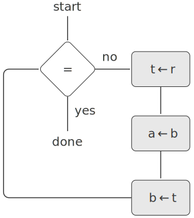

# 5.1 Designing Register Machines

To design a register machine, we must design its **data paths** (registers and operations) and the **controller** that sequences these operations. To illustrate the design of a simple register machine, let us examine Euclid’s Algorithm, which is used to compute the greatest common divisor (GCD) of two integers. As we saw in [1.2.5], Euclid’s Algorithm can be carried out by an iterative process, as specified by the following procedure:

```
(define (gcd a b)
  (if (= b 0)
      a
      (gcd b (remainder a b))))
```
A machine to carry out this algorithm must keep track of two numbers, a and b, so let us assume that these numbers are stored in two registers with those names. The basic operations required are testing whether the contents of register b is zero and computing the remainder of the contents of register a divided by the contents of register b. The remainder operation is a complex process, but assume for the moment that we have a primitive device that computes remainders. On each cycle of the GCD algorithm, the contents of register a must be replaced by the contents of register b, and the contents of b must be replaced by the remainder of the old contents of a divided by the old contents of b. It would be convenient if these replacements could be done simultaneously, but in our model of register machines we will assume that only one register can be assigned a new value at each step. To accomplish the replacements, our machine will use a third “temporary” register, which we call t. (First the remainder will be placed in t, then the contents of b will be placed in a, and finally the remainder stored in t will be placed in b.)

We can illustrate the registers and operations required for this machine by using the data-path diagram shown in [Figure 5.1](#Figure5.1). In this diagram, the registers (a, b, and t) are represented by rectangles. Each way to assign a value to a register is indicated by an arrow with an X behind the head, pointing from the source of data to the register. We can think of the X as a button that, when pushed, allows the value at the source to “flow” into the designated register. The label next to each button is the name we will use to refer to the button. The names are arbitrary, and can be chosen to have mnemonic value (for example, a<-b denotes pushing the button that assigns the contents of register b to register a). The source of data for a register can be another register (as in the a<-b assignment), an operation result (as in the t<-r assignment), or a constant (a built-in value that cannot be changed, represented in a data-path diagram by a triangle containing the constant).

<div id="Figure5.1" markdown>
<figure markdown>
  
  <figcaption markdown>
  Figure 5.1: Data paths for a GCD machine.
  </figcaption>
</figure>
</div>

An operation that computes a value from constants and the contents of registers is represented in a data-path diagram by a trapezoid containing a name for the operation. For example, the box marked rem in [Figure 5.1](#Figure5.1) represents an operation that computes the remainder of the contents of the registers a and b to which it is attached. Arrows (without buttons) point from the input registers and constants to the box, and arrows connect the operation’s output value to registers. A test is represented by a circle containing a name for the test. For example, our GCD machine has an operation that tests whether the contents of register b is zero. A test also has arrows from its input registers and constants, but it has no output arrows; its value is used by the controller rather than by the data paths. Overall, the data-path diagram shows the registers and operations that are required for the machine and how they must be connected. If we view the arrows as wires and the X buttons as switches, the data-path diagram is very like the wiring diagram for a machine that could be constructed from electrical components.

In order for the data paths to actually compute GCDs, the buttons must be pushed in the correct sequence. We will describe this sequence in terms of a controller diagram, as illustrated in [Figure 5.2](#Figure5.2). The elements of the controller diagram indicate how the data-path components should be operated. The rectangular boxes in the controller diagram identify data-path buttons to be pushed, and the arrows describe the sequencing from one step to the next. The diamond in the diagram represents a decision. One of the two sequencing arrows will be followed, depending on the value of the data-path test identified in the diamond. We can interpret the controller in terms of a physical analogy: Think of the diagram as a maze in which a marble is rolling. When the marble rolls into a box, it pushes the data-path button that is named by the box. When the marble rolls into a decision node (such as the test for b = 0), it leaves the node on the path determined by the result of the indicated test. Taken together, the data paths and the controller completely describe a machine for computing GCDs. We start the controller (the rolling marble) at the place marked start, after placing numbers in registers a and b. When the controller reaches done, we will find the value of the GCD in register a.

<div id="Figure5.2" markdown>
<figure markdown>
  
  <figcaption markdown>
  Figure 5.2: Controller for a GCD machine.
  </figcaption>
</figure>
</div>

<div id="Exercise5.1" markdown>

Exercise 5.1: Design a register machine to compute factorials using the iterative algorithm specified by the following procedure. Draw data-path and controller diagrams for this machine.

```
(define (factorial n)
  (define (iter product counter)
    (if (> counter n)
        product
        (iter (* counter product)
              (+ counter 1))))
  (iter 1 1))
```

</div>