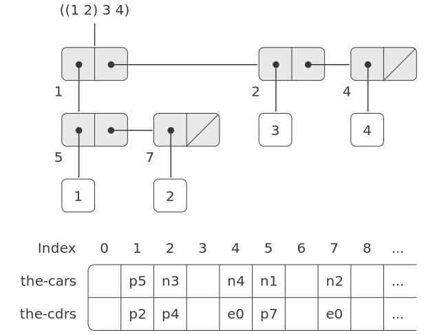

# 5.3.1 Memory as Vectors
A conventional computer memory can be thought of as an array of cubbyholes, each of which can contain a piece of information. Each cubbyhole has a unique name, called its address or location. Typical memory systems provide two primitive operations: one that fetches the data stored in a specified location and one that assigns new data to a specified location. Memory addresses can be incremented to support sequential access to some set of the cubbyholes. More generally, many important data operations require that memory addresses be treated as data, which can be stored in memory locations and manipulated in machine registers. The representation of list structure is one application of such address arithmetic.

To model computer memory, we use a new kind of data structure called a vector. Abstractly, a vector is a compound data object whose individual elements can be accessed by means of an integer index in an amount of time that is independent of the index.[^1] In order to describe memory operations, we use two primitive Scheme procedures for manipulating vectors:

```
(vector-ref ⟨vector⟩ ⟨n⟩)
``` 
returns the $n^{\mathrm{th}}$ element of the vector.

```
(vector-set! ⟨vector⟩ ⟨n⟩ ⟨value⟩)
```
sets the $n^{\mathrm{th}}$ element of the vector to the designated value.


For example, if `v` is a vector, then `(vector-ref v 5)` gets the fifth entry in the vector `v` and `(vector-set! v 5 7)` changes the value of the fifth entry of the vector `v` to 7.[^2] For computer memory, this access can be implemented through the use of address arithmetic to combine a base address that specifies the beginning location of a vector in memory with an index that specifies the offset of a particular element of the vector.

## Representing Lisp data
We can use vectors to implement the basic pair structures required for a list-structured memory. Let us imagine that computer memory is divided into two vectors: `the-cars` and `the-cdrs`. We will represent list structure as follows: A pointer to a pair is an index into the two vectors. The `car` of the pair is the entry in `the-cars` with the designated index, and the `cdr` of the pair is the entry in `the-cdrs` with the designated index. We also need a representation for objects other than pairs (such as numbers and symbols) and a way to distinguish one kind of data from another. There are many methods of accomplishing this, but they all reduce to using typed pointers, that is, to extending the notion of “pointer” to include information on data type.[^3] The data type enables the system to distinguish a pointer to a pair (which consists of the “pair” data type and an index into the memory vectors) from pointers to other kinds of data (which consist of some other data type and whatever is being used to represent data of that type). Two data objects are considered to be the same `(eq?)` if their pointers are identical.[^4] Figure [5.14](#Figure5.14) illustrates the use of this method to represent the list `((1 2) 3 4)`, whose box-and-pointer diagram is also shown. We use letter prefixes to denote the data-type information. Thus, a pointer to the pair with index 5 is denoted `p5`, the empty list is denoted by the pointer `e0`, and a pointer to the number 4 is denoted `n4`. In the box-and-pointer diagram, we have indicated at the lower left of each pair the vector index that specifies where the `car` and `cdr` of the pair are stored. The blank locations in `the-cars` and `the-cdrs` may contain parts of other list structures (not of interest here).

<div id="Figure5.14" markdown>
<figure markdown>
  
  <figcaption markdown>
  Figure 5.14: Box-and-pointer and memory-vector representations of the list `((1 2) 3 4)`.
  </figcaption>
</figure>
</div>

A pointer to a number, such as n4, might consist of a type indicating numeric data together with the actual representation of the number 4.[^5] To deal with numbers that are too large to be represented in the fixed amount of space allocated for a single pointer, we could use a distinct bignum data type, for which the pointer designates a list in which the parts of the number are stored.[^6]

A symbol might be represented as a typed pointer that designates a sequence of the characters that form the symbol’s printed representation. This sequence is constructed by the Lisp reader when the character string is initially encountered in input. Since we want two instances of a symbol to be recognized as the “same” symbol by `eq?` and we want `eq?` to be a simple test for equality of pointers, we must ensure that if the reader sees the same character string twice, it will use the same pointer (to the same sequence of characters) to represent both occurrences. To accomplish this, the reader maintains a table, traditionally called the obarray, of all the symbols it has ever encountered. When the reader encounters a character string and is about to construct a symbol, it checks the obarray to see if it has ever before seen the same character string. If it has not, it uses the characters to construct a new symbol (a typed pointer to a new character sequence) and enters this pointer in the obarray. If the reader has seen the string before, it returns the symbol pointer stored in the obarray. This process of replacing character strings by unique pointers is called interning symbols.

## Implementing the primitive list operations
Given the above representation scheme, we can replace each “primitive” list operation of a register machine with one or more primitive vector operations. We will use two registers, `the-cars` and `the-cdrs`, to identify the memory vectors, and will assume that `vector-ref` and `vector-set!` are available as primitive operations. We also assume that numeric operations on pointers (such as incrementing a pointer, using a pair pointer to index a vector, or adding two numbers) use only the index portion of the typed pointer.

For example, we can make a register machine support the instructions

```
(assign ⟨reg₁⟩ (op car) (reg ⟨reg₂⟩))
(assign ⟨reg₁⟩ (op cdr) (reg ⟨reg₂⟩))
```

if we implement these, respectively, as

```
(assign ⟨reg₁⟩ 
        (op vector-ref)
        (reg the-cars)
        (reg ⟨reg₂⟩))
(assign ⟨reg₁⟩
        (op vector-ref)
        (reg the-cdrs)
        (reg ⟨reg₂⟩))
```

The instructions

```
(perform (op set-car!) (reg ⟨reg₁⟩) (reg ⟨reg₂⟩))
(perform (op set-cdr!) (reg ⟨reg₁⟩) (reg ⟨reg₂⟩))
```

are implemented as

```
(perform (op vector-set!)
         (reg the-cars)
         (reg ⟨reg₁⟩)
         (reg ⟨reg₂⟩))
(perform (op vector-set!)
         (reg the-cdrs)
         (reg ⟨reg₁⟩)
         (reg ⟨reg₂⟩))
```

`Cons` is performed by allocating an unused index and storing the arguments to `cons` in `the-cars` and `the-cdrs` at that indexed vector position. We presume that there is a special register, `free`, that always holds a pair pointer containing the next available index, and that we can increment the index part of that pointer to find the next free location.[^7] For example, the instruction

```
(assign ⟨reg₁⟩
        (op cons)
        (reg ⟨reg₂⟩)
        (reg ⟨reg₃⟩))
```

is implemented as the following sequence of vector operations:[^8]

```
(perform (op vector-set!)
         (reg the-cars)
         (reg free)
         (reg ⟨reg₂⟩))
(perform (op vector-set!)
         (reg the-cdrs)
         (reg free)
         (reg ⟨reg₃⟩))
(assign ⟨reg₁⟩ (reg free))
(assign free (op +) (reg free) (const 1))
```

The `eq?` operation

```
(op eq?) (reg ⟨reg₁⟩) (reg ⟨reg₂⟩)
```

simply tests the equality of all fields in the registers, and predicates such as `pair?`, `null?`, `symbol?`, and `number?` need only check the type field.

## Implementing stacks

Although our register machines use stacks, we need do nothing special here, since stacks can be modeled in terms of lists. The stack can be a list of the saved values, pointed to by a special register `the-stack`. Thus, `(save ⟨reg⟩)` can be implemented as

```
(assign the-stack 
        (op cons)
        (reg ⟨reg⟩)
        (reg the-stack))
```

Similarly, `(restore ⟨reg⟩)` can be implemented as

```
(assign ⟨reg⟩ (op car) (reg the-stack))
(assign the-stack (op cdr) (reg the-stack))
```

and `(perform (op initialize-stack))` can be implemented as

```
(assign the-stack (const ()))
```

These operations can be further expanded in terms of the vector operations given above. In conventional computer architectures, however, it is usually advantageous to allocate the stack as a separate vector. Then pushing and popping the stack can be accomplished by incrementing or decrementing an index into that vector.

<div id="Exercise5.20" markdown>

Exercise 5.20: Draw the box-and-pointer representation and the memory-vector representation (as in Figure [5.14](#Figure5.14)) of the list structure produced by

```
(define x (cons 1 2))
(define y (list x x))
```

with the `free` pointer initially `p1`. What is the final value of `free?` What pointers represent the values of `x` and `y`?

</div>

<div id="Exercise5.21" markdown>

Exercise 5.21: Implement register machines for the following procedures. Assume that the list-structure memory operations are available as machine primitives.

a. Recursive `count-leaves`:

```
(define (count-leaves tree)
  (cond ((null? tree) 0)
        ((not (pair? tree)) 1)
        (else 
         (+ (count-leaves (car tree))
            (count-leaves (cdr tree))))))
```

Recursive `count-leaves` with explicit counter:

```
(define (count-leaves tree)
  (define (count-iter tree n)
    (cond ((null? tree) n)
          ((not (pair? tree)) (+ n 1))
          (else 
           (count-iter 
            (cdr tree)
            (count-iter (car tree) 
                        n)))))
  (count-iter tree 0))
```
</div>

<div id="Exercise5.22" markdown>

Exercise 5.22: Exercise [3.12] of [3.3.1] presented an append procedure that appends two lists to form a new list and an append! procedure that splices two lists together. Design a register machine to implement each of these procedures. Assume that the list-structure memory operations are available as primitive operations.
</div>

[^1]:
    We could represent memory as lists of items. However, the access time would then not be independent of the index, since accessing the nth element of a list requires ${n - 1}$ `cdr` operations.

[^2]: 
    For completeness, we should specify a `make-vector` operation that constructs vectors. However, in the present application we will use vectors only to model fixed divisions of the computer memory.

[^3]:
    This is precisely the same ''tagged data'' idea we introduced in chapter 2 for dealing with generic operations. Here, however, the data types are included at the primitive machine level rather than constructed through the use of lists.

[^4]:
    Type information may be encoded in a variety of ways, depending on the details of the machine on which the Lisp system is to be implemented. The execution efficiency of Lisp programs will be strongly dependent on how cleverly this choice is made, but it is difficult to formulate general design rules for good choices. The most straightforward way to implement typed pointers is to allocate a fixed set of bits in each pointer to be a type field that encodes the data type. Important questions to be addressed in designing such a representation include the following: How many type bits are required? How large must the vector indices be? How efficiently can the primitive machine instructions be used to manipulate the type fields of pointers? Machines that include special hardware for the efficient handling of type fields are said to have tagged architectures.

[^5]:
    This decision on the representation of numbers determines whether `eq?`, which tests equality of pointers, can be used to test for equality of numbers. If the pointer contains the number itself, then equal numbers will have the same pointer. But if the pointer contains the index of a location where the number is stored, equal numbers will be guaranteed to have equal pointers only if we are careful never to store the same number in more than one location.

[^6]:
    This is just like writing a number as a sequence of digits, except that each ''digit'' is a number between 0 and the largest number that can be stored in a single pointer.

[^7]:
    There are other ways of finding free storage. For example, we could link together all the unused pairs into a free list. Our free locations are consecutive (and hence can be accessed by incrementing a pointer) because we are using a compacting garbage collector, as we will see in section [5.3.2].

[^8]:
    This is essentially the implementation of `cons` in terms of `set-car!` and `set-cdr!`, as described in section [3.3.1]. The operation `get-new-pair` used in that implementation is realized here by the `free` pointer.

[5.3.2]: {{ config.extra.homepage_sicp }}/chapter_5/chapter_5_3/5.3.2

[3.3.1]: {{ config.extra.homepage_sicp }}/chapter_3/chapter_3_3/3.3.1

[3.12]: {{ config.extra.homepage_sicp }}/chapter_3/chapter_3_3/3.3.1/#Exercise3.12
