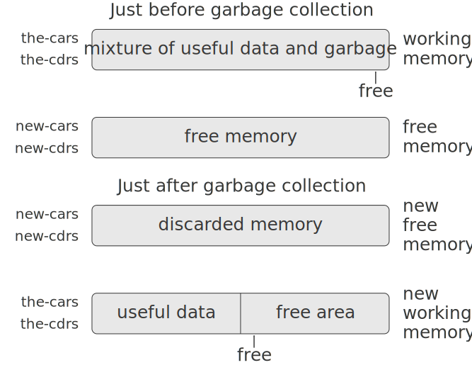

# 5.3.2 Maintaining the Illusion of Infinite Memory
The representation method outlined in [5.3.1] solves the problem of implementing list structure, provided that we have an infinite amount of memory. With a real computer we will eventually run out of free space in which to construct new pairs.[^1] However, most of the pairs generated in a typical computation are used only to hold intermediate results. After these results are accessed, the pairs are no longer needed—they are garbage. For instance, the computation

```
(accumulate 
 + 
 0
 (filter odd? (enumerate-interval 0 n)))
```

constructs two lists: the enumeration and the result of filtering the enumeration. When the accumulation is complete, these lists are no longer needed, and the allocated memory can be reclaimed. If we can arrange to collect all the garbage periodically, and if this turns out to recycle memory at about the same rate at which we construct new pairs, we will have preserved the illusion that there is an infinite amount of memory.

In order to recycle pairs, we must have a way to determine which allocated pairs are not needed (in the sense that their contents can no longer influence the future of the computation). The method we shall examine for accomplishing this is known as garbage collection. Garbage collection is based on the observation that, at any moment in a Lisp interpretation, the only objects that can affect the future of the computation are those that can be reached by some succession of `car` and `cdr` operations starting from the pointers that are currently in the machine registers.[^2] Any memory cell that is not so accessible may be recycled.

There are many ways to perform garbage collection. The method we shall examine here is called stop-and-copy. The basic idea is to divide memory into two halves: “working memory” and “free memory.” When `cons` constructs pairs, it allocates these in working memory. When working memory is full, we perform garbage collection by locating all the useful pairs in working memory and copying these into consecutive locations in free memory. (The useful pairs are located by tracing all the `car` and `cdr` pointers, starting with the machine registers.) Since we do not copy the garbage, there will presumably be additional free memory that we can use to allocate new pairs. In addition, nothing in the working memory is needed, since all the useful pairs in it have been copied. Thus, if we interchange the roles of working memory and free memory, we can continue processing; new pairs will be allocated in the new working memory (which was the old free memory). When this is full, we can copy the useful pairs into the new free memory (which was the old working memory).[^3]

## Implementation of a stop-and-copy garbage collector
We now use our register-machine language to describe the stop-and-copy algorithm in more detail. We will assume that there is a register called `root` that contains a pointer to a structure that eventually points at all accessible data. This can be arranged by storing the contents of all the machine registers in a pre-allocated list pointed at by `root` just before starting garbage collection.[^4] We also assume that, in addition to the current working memory, there is free memory available into which we can copy the useful data. The current working memory consists of vectors whose base addresses are in registers called `the-cars` and `the-cdrs`, and the free memory is in registers called `new-cars` and `new-cdrs`.

Garbage collection is triggered when we exhaust the free cells in the current working memory, that is, when a `cons` operation attempts to increment the `free` pointer beyond the end of the memory vector. When the garbage-collection process is complete, the `root` pointer will point into the new memory, all objects accessible from the `root` will have been moved to the new memory, and the `free` pointer will indicate the next place in the new memory where a new pair can be allocated. In addition, the roles of working memory and new memory will have been interchanged—new pairs will be constructed in the new memory, beginning at the place indicated by `free`, and the (previous) working memory will be available as the new memory for the next garbage collection. Figure [5.15](#Figure5.15) shows the arrangement of memory just before and just after garbage collection.

<div id="Figure5.15" markdown>
<figure markdown>
  
  <figcaption markdown>
  Figure 5.15: Reconfiguration of memory by the garbage-collection process.
  </figcaption>
</figure>
</div>

The state of the garbage-collection process is controlled by maintaining two pointers: `free` and `scan`. These are initialized to point to the beginning of the new memory. The algorithm begins by relocating the pair pointed at by `root` to the beginning of the new memory. The pair is copied, the `root` pointer is adjusted to point to the new location, and the `free` pointer is incremented. In addition, the old location of the pair is marked to show that its contents have been moved. This marking is done as follows: In the `car` position, we place a special tag that signals that this is an already-moved object. (Such an object is traditionally called a broken heart.)[^5] In the `cdr` position we place a forwarding address that points at the location to which the object has been moved.

After relocating the root, the garbage collector enters its basic cycle. At each step in the algorithm, the `scan` pointer (initially pointing at the relocated root) points at a pair that has been moved to the new memory but whose `car` and `cdr` pointers still refer to objects in the old memory. These objects are each relocated, and the `scan` pointer is incremented. To relocate an object (for example, the object indicated by the `car` pointer of the pair we are scanning) we check to see if the object has already been moved (as indicated by the presence of a broken-heart tag in the `car` position of the object). If the object has not already been moved, we copy it to the place indicated by `free`, update `free`, set up a broken heart at the object’s old location, and update the pointer to the object (in this example, the `car` pointer of the pair we are scanning) to point to the new location. If the object has already been moved, its forwarding address (found in the `cdr` position of the broken heart) is substituted for the pointer in the pair being scanned. Eventually, all accessible objects will have been moved and scanned, at which point the `scan` pointer will overtake the `free` pointer and the process will terminate.

We can specify the stop-and-copy algorithm as a sequence of instructions for a register machine. The basic step of relocating an object is accomplished by a subroutine called `relocate-old-result-in-new`. This subroutine gets its argument, a pointer to the object to be relocated, from a register named `old`. It relocates the designated object (incrementing `free` in the process), puts a pointer to the relocated object into a register called `new`, and returns by branching to the entry point stored in the register `relocate-continue`. To begin garbage collection, we invoke this subroutine to relocate the `root` pointer, after initializing `free` and `scan`. When the relocation of root has been accomplished, we install the new pointer as the new `root` and enter the main loop of the garbage collector.

```
begin-garbage-collection
  (assign free (const 0))
  (assign scan (const 0))
  (assign old (reg root))
  (assign relocate-continue 
          (label reassign-root))
  (goto (label relocate-old-result-in-new))
reassign-root
  (assign root (reg new))
  (goto (label gc-loop))
```

In the main loop of the garbage collector we must determine whether there are any more objects to be scanned. We do this by testing whether the `scan` pointer is coincident with the `free` pointer. If the pointers are equal, then all accessible objects have been relocated, and we branch to `gc-flip`, which cleans things up so that we can continue the interrupted computation. If there are still pairs to be scanned, we call the relocate subroutine to relocate the `car` of the next pair (by placing the `car` pointer in `old`). The `relocate-continue` register is set up so that the subroutine will return to update the `car` pointer.

```
gc-loop
  (test (op =) (reg scan) (reg free))
  (branch (label gc-flip))
  (assign old 
          (op vector-ref)
          (reg new-cars)
          (reg scan))
  (assign relocate-continue 
          (label update-car))
  (goto (label relocate-old-result-in-new))
```

At `update-car`, we modify the `car` pointer of the pair being scanned, then proceed to relocate the `cdr` of the pair. We return to `update-cdr` when that relocation has been accomplished. After relocating and updating the `cdr`, we are finished scanning that pair, so we continue with the main loop.

```
update-car
  (perform (op vector-set!)
           (reg new-cars)
           (reg scan)
           (reg new))
  (assign  old 
           (op vector-ref)
           (reg new-cdrs)
           (reg scan))
  (assign  relocate-continue
           (label update-cdr))
  (goto (label relocate-old-result-in-new))
update-cdr
  (perform (op vector-set!)
           (reg new-cdrs)
           (reg scan)
           (reg new))
  (assign  scan (op +) (reg scan) (const 1))
  (goto (label gc-loop))
```

The subroutine `relocate-old-result-in-new` relocates objects as follows: If the object to be relocated (pointed at by `old`) is not a pair, then we return the same pointer to the object unchanged (in `new`). (For example, we may be scanning a pair whose `car` is the number 4. If we represent the `car` by `n4`, as described in [5.3.1], then we want the “relocated” `car` pointer to still be `n4`.) Otherwise, we must perform the relocation. If the `car` position of the pair to be relocated contains a broken-heart tag, then the pair has in fact already been moved, so we retrieve the forwarding address (from the `cdr` position of the broken heart) and return this in `new`. If the pointer in `old` points at a yet-unmoved pair, then we move the pair to the first free cell in new memory (pointed at by `free`) and set up the broken heart by storing a broken-heart tag and forwarding address at the old location. `Relocate-old-result-in-new` uses a register `oldcr` to hold the `car` or the `cdr` of the object pointed at by `old`.[^6]

```
relocate-old-result-in-new
  (test (op pointer-to-pair?) (reg old))
  (branch (label pair))
  (assign new (reg old))
  (goto (reg relocate-continue))
pair
  (assign  oldcr 
           (op vector-ref)
           (reg the-cars)
           (reg old))
  (test (op broken-heart?) (reg oldcr))
  (branch  (label already-moved))
  (assign  new (reg free)) ; new location for pair
  ;; Update free pointer.
  (assign free (op +) (reg free) (const 1))
  ;; Copy the car and cdr to new memory.
  (perform (op vector-set!)
           (reg new-cars)
           (reg new)
           (reg oldcr))
  (assign  oldcr 
           (op vector-ref)
           (reg the-cdrs)
           (reg old))
  (perform (op vector-set!)
           (reg new-cdrs)
           (reg new)
           (reg oldcr))
  ;; Construct the broken heart.
  (perform (op vector-set!)
           (reg the-cars)
           (reg old)
           (const broken-heart))
  (perform (op vector-set!)
           (reg the-cdrs)
           (reg old)
           (reg new))
  (goto (reg relocate-continue))
already-moved
  (assign  new
           (op vector-ref)
           (reg the-cdrs)
           (reg old))
  (goto (reg relocate-continue))
```

At the very end of the garbage-collection process, we interchange the role of old and new memories by interchanging pointers: interchanging `the-cars` with `new-cars`, and `the-cdrs` with `new-cdrs`. We will then be ready to perform another garbage collection the next time memory runs out.

```
gc-flip
  (assign temp (reg the-cdrs))
  (assign the-cdrs (reg new-cdrs))
  (assign new-cdrs (reg temp))
  (assign temp (reg the-cars))
  (assign the-cars (reg new-cars))
  (assign new-cars (reg temp))
```

[^1]:   
    This may not be true eventually, because memories may get large enough so that it would be impossible to run out of free memory in the lifetime of the computer. For example, there are about ${3\cdot10^{\mathrm{13}}}$, microseconds in a year, so if we were to cons once per microsecond we would need about ${10^{\mathrm{15}}}$ cells of memory to build a machine that could operate for 30 years without running out of memory. That much memory seems absurdly large by today's standards, but it is not physically impossible. On the other hand, processors are getting faster and a future computer may have large numbers of processors operating in parallel on a single memory, so it may be possible to use up memory much faster than we have postulated.

[^2]:
    We assume here that the stack is represented as a list as described in section [5.3.1], so that items on the stack are accessible via the pointer in the stack register.

[^3]:
    This idea was invented and first implemented by Minsky, as part of the implementation of Lisp for the PDP-1 at the MIT Research Laboratory of Electronics. It was further developed by Fenichel and Yochelson (1969) for use in the Lisp implementation for the Multics time-sharing system. Later, Baker (1978) developed a ''real-time'' version of the method, which does not require the computation to stop during garbage collection. Baker's idea was extended by Hewitt, Lieberman, and Moon (see Lieberman and Hewitt 1983) to take advantage of the fact that some structure is more volatile and other structure is more permanent. 

    An alternative commonly used garbage-collection technique is the mark-sweep method. This consists of tracing all the structure accessible from the machine registers and marking each pair we reach. We then scan all of memory, and any location that is unmarked is ''swept up'' as garbage and made available for reuse. A full discussion of the mark-sweep method can be found in Allen 1978.

    The Minsky-Fenichel-Yochelson algorithm is the dominant algorithm in use for large-memory systems because it examines only the useful part of memory. This is in contrast to mark-sweep, in which the sweep phase must check all of memory. A second advantage of stop-and-copy is that it is a compacting garbage collector. That is, at the end of the garbage-collection phase the useful data will have been moved to consecutive memory locations, with all garbage pairs compressed out. This can be an extremely important performance consideration in machines with virtual memory, in which accesses to widely separated memory addresses may require extra paging operations.

[^4]:
    This list of registers does not include the registers used by the storage-allocation system -- `root`, `the-cars`, `the-cdrs`, and the other registers that will be introduced in this section.

[^5]:
    The term broken heart was coined by David Cressey, who wrote a garbage collector for MDL, a dialect of Lisp developed at MIT during the early 1970s.

[^6]:
    The garbage collector uses the low-level predicate `pointer-to-pair?` instead of the list-structure `pair?` operation because in a real system there might be various things that are treated as pairs for garbage-collection purposes. For example, in a Scheme system that conforms to the IEEE standard a procedure object may be implemented as a special kind of ''pair'' that doesn't satisfy the `pair?` predicate. For simulation purposes, `pointer-to-pair?` can be implemented as `pair?`.

[5.3.1]: {{ config.extra.homepage_sicp }}/chapter_5/chapter_5_3/5.3.1/
